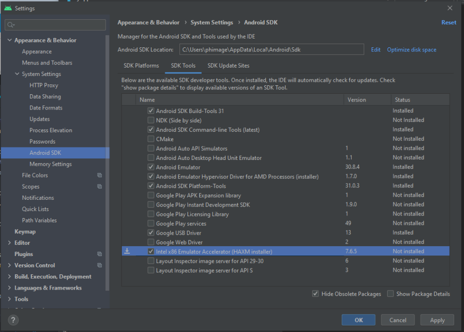

## Debug from your Android device

To make sure your development machine and your phone are linked, only one action is needed on the smartphone and another one in the [project editor](from-project-editor.md).

On your device, you need to [enable **USB Debugging**](https://developer.android.com/studio/debug/dev-options#enable) in the Developer Options settings.

:::tip 

If you can’t find the Developer Options item in your settings, simply click 7 times on the build number.

:::

If you can’t find it or if you don’t understand it, simply read [this Android user guide](https://developer.android.com/studio/debug/dev-options), which explains how to do it depending on the Android versions.

:::note notes

- To connect and debug with a Google device using Windows, you need to install the .

- If you're developing on Mac OS X or Linux, then you shouldn't need a USB driver. 

- For the other devices, download and manually install a  corresponding to your device.

:::

### Android studio configuration

For Windows developers, you also need to configure your Android Studio from the SDK Tools tab. So make sure you have checked and installed the following elements:

- **Android SDK Build Tools 31**
- **Android SDK Command-line Tools (latest)**. By selecting this checkbox, you will be able to visualize all your virtual devices directly from the 4D mobile Project Editor.
- **Android Emulator**
- **Android SDK Platform Tools**
- **Google USB driver**
- **Intel x86 Emulator Accelerator (HAXM installer)**

