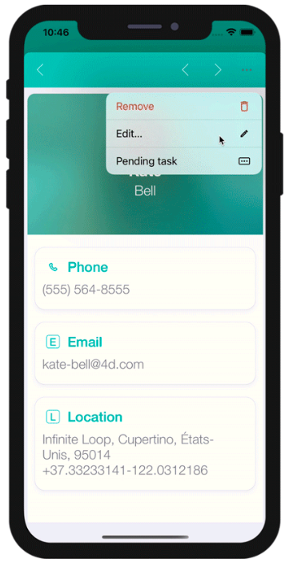
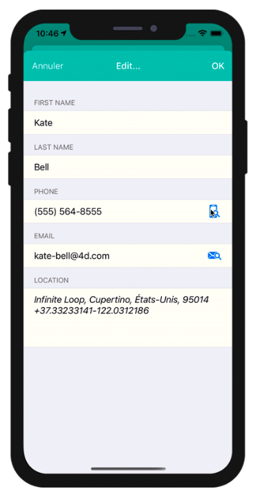
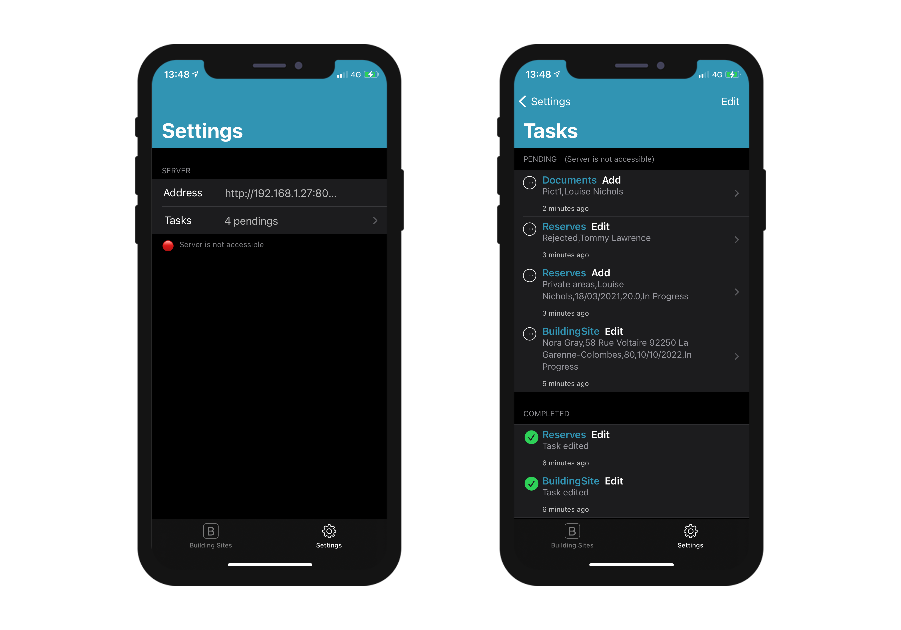

The 4D Mobile Project editor allows you to create actions to include in your mobile app. 

You can use [preset actions](#preset-actions) or [custom actions](../tutorials/actions/define-first-action.md) and [define their parameters](#add-parameters-to-your-actions). 

On the 4D side, you can execute 4D code in the [On Mobile App Action](../4d/on-mobile-app-action.md) database method.

Actions are automatically available in the [mobile interface](#mobile-app-side).


## Project Editor Side

### Create your action

You can create a new action by clicking on the + button at the bottom of the Actions table. A new line will appear in the Actions table.

Next you'll need to define the following:

* **Names:** The action name to use in the [On Mobile App Action](../4d/on-mobile-app-action.md) database method to trigger your 4D code.
* **Icons:** The icon to choose from your icon library. You can also [add your own icon](./labels-and-icons.md#adding-custom-icons).
* **Short and long Labels:** The labels for the actions to display in your app.
* **Table:** The table on which you want to apply the action.
* **Scope:** Where to use the action, an **entity** or a **table**.


:::note note

You can sort the **Names** with a drag-and-drop. This operation will set the order in which they will appear in the app's menu.

:::

### Add parameters to your action

You can add **action parameters** and **edit** data directly from your app.

For each parameter, you can edit the following properties:

* Name
* Long label
* Short label
* [Input control](#built-in-input-controls)
* Mandatory option
* Default value

Depending on the selected input control, you can define the following additional properties:

* Input constraints (minimum or maximum values)
* Placeholder
* [Data Source](#dynamic-choice-lists)

:::info

By default, the Input Control menu displays **selectionControls**. This is a filter for selection controls, depending on their "format" property. To select a format, you must have [created](#selection-input-controls) at least one selection input control with this format. 

::: 


You are free to change the order of parameters using drag and drop.


## Preset actions

4D mobile projects include the following (predefined) preset actions to manage your app content:

* Add 
* Edit 
* Delete 
* Share
* Sort
* Open URL

### Add action

4D mobile projects makes the **Add actions** creation process very simple.

The only thing you need to do is select the **Add action for** option, accessible from the **+ button** at the bottom of the Actions table. 


Then just **select the table** you want to link to this add action.

This will **automatically create** all the parameters for you in the Project Editor. In the generated app, this will allow you to edit each field value.

For those kind of action, you will see that all **properties** are already filled in for your convenience at the right side of the parameter's list.


### Edit action

**Edit actions** creation follows the same process as the Add actions, with the exception that you will not be able to define default values from the Actions section.


### Delete action

**Delete action** creation follows the same process as the Edit action. The only difference is that this action allows you to remove an entity.

To create a Delete action, select the **Delete action for** option accessible from the **+ button** at the bottom of the Actions table.

This type of action should be used with caution.


### Share action

Selecting the **Share action** will allow your mobile users to share content with other users. You just need to select the scope:

- **entity**: to share content from a detail form
- **table**: to share a list form

See the [Deep Linking](../special-features/deep-linking.md) page for more details.

### Sort action

**Sort actions** are useful to:

- define a default sort order for the table list forms 
- allow your mobile users to choose a list sort order

When you create a sort action for a table, you need to select the first field on which the sort will be done:


The field is added to the Sort Criteria list. An ascending sort order is set by default, but you can change it using the **Sort order** menu.

You can sort entities in more than one field. Each field you sort is referred to as a sort level. For example, the results of a two-level ascending sort of the `lastName` and `firstName` fields would produce a list such as this: 

```4d
Aardvark, Anthony
Aardvark, Artemis
Aardvark, Arthur
...
Zygote, Elena
Zymosian, Elmer
```

To add one or more sort level(s) in the Sort Criteria list, select the **+** button under the list and configure each level:


#### Sort order menu on the mobile app

When you define more than one sort action for a table, mobile users automatically benefit from a **sort** menu. It contains all the predefined sort actions:


> When only one sort action is defined for a table, the **sort** menu is not displayed on the mobile app side.

### Open URL action

The **Open URL action** allows your mobile users to open an url from their mobile app. This action will display a web page served by 4D Server in a web area from within the mobile app.

When you select this action, you have to define the path that will be opened:


You can only define a path starting with `/`, i.e. relative to the [current 4D web folder](https://developer.4d.com/docs/WebServer/webServerConfig.html#root-folder). 

This action can be set for any table and any scope (Table or Current entity). Like other actions, the Open URL action will be automatically available in the [mobile app interface](#mobile-app-side) (short or long label). 

:::note

To close the web page and get back to the mobile app interface, use the `$4d.mobile.dismiss()` function from within the page (see below). 

:::

#### Web Server Side

The request sent to the server contains the context of the app (current entity and/or dataclass) in the `X-QMobile-Context` header. The content of this header is formatted in JSON and encoded in base64. 

:::tip

You can get the context information already decoded as object using the [**4D Mobile App Server**](https://github.com/4d/4D-Mobile-App-Server#4d-mobile-app-server) component and its [WebHandler class](https://github.com/4d/4D-Mobile-App-Server/blob/main/Documentation/Classes/WebHandler.md).

:::

Context information can be processed in the web page to return through standard 4D web server features:

- [.shtml template pages](https://developer.4d.com/docs/WebServer/templates.html) 
- [On Web Connection database method](https://developer.4d.com/docs/WebServer/httpRequests.html#on-web-connection).


#### Web Area Side

For your page to interact with the mobile app, some javascript code is automatically provided in the `$4d.mobile` object. This object contains the following properties and functions:

|Property|||Type|Description|
|---|---|---|---|---|
|$4d.mobile|.action|.name|string|name of the action|
|||.label|string|label of the action|
|||.shortlabel|string|short label of the action|
||.dismiss()||Function| closes the native web view|
||.status(message)||Function|shows a message in native app for the user <br/>message: string<br/>message: object with "message" (or "statusText") and "success" (or "level") keys|
||.logger|.log(level, message : string)|Function|shows a message in native app for the developer|
|||.info(message : string)|Function|shows a message in native app for the developer|
|||.info(message : string)|Function|shows a message in native app for the developer|
|||.warning(message : string)|Function|shows a message in native app for the developer|
|||.error(message : string)|Function|shows a message in native app for the developer|
|||.debug(message : string)|Function|shows a message in native app for the developer|
|||.verbose(message : string)|Function|shows a message in native app for the developer|


:::info See also

Blog post: [4D for Mobile : Display Web Pages in your Mobile Apps](https://blog.4d.com/4d-for-mobile-di…your-mobile-apps/)

:::


### On Mobile App Action

The [`On Mobile App Action`](../4d/on-mobile-app-action.md) database method is available to call all of your 4D methods. 

After creating all of your actions, just click on the **Create** button from the Actions table to automatically generate a *Case of* code block that includes all your action names in the *On Mobile App Action* method.

:::note notes

- You can refresh the selection after executing an action using `$result.dataSynchro:=True`.
- You can notify the app user when action has been executed using `$result.statusText:="Message you want to display"`.
- You can also decide to force close the Edition form using `$result.close:=True`.

:::


## Built-in input controls

Input controls define how information will be entered by the user in the mobile app, and also how it will be rendered. The Project editor provides basic input controls for regular data types. These controls are built-in and can be directly selected in the "Input Control" menu. 

You can also define [custom input controls](#custom-input-controls) (see below).

Available built-in input controls depend on the data type:

|Data type|Input controls|Description|
|---|---|---|
|Text|Default|Capitalize the first letter of a string|
||Mail Address|Optimized keyboard for email entry|
||Phone Number|Keypad for entering telephone numbers|
||Account|Optimized keyboard for username entry|
||Password|Optimized to handle passwords|
||URL|Optimized keyboard for URL entry|
||Zip Code|Optimized keyboard for zip code entry|
||Text area|Includes multiple lines of text in a single field|
||Barcode|Extract barcode associated value. Supported formats : EAN8, EAN13, Code 39, Code 93, Code 128, QR Code, UPC, PDF417|
|Number|Default|Numbers with decimals|
||Integer|Numbers without decimals|
||Scientific|Scientific Notation|
||Percentage|Percent Notation|
||Spell Out|Convert numbers into strings|
|Date|Default|Nov 23, 1937|
||Short Date|11/23/37|
||Long Date|November 23, 1937|
||Full Date|Tuesday, November 23, 1937|
|Time|Default|3:30 PM|
||Duration|2 hours 30 minutes|
|Boolean|Default|Convert numbers into strings|
|Time|Default|3:30 PM|
||Duration|2 hours 30 minutes|
|Time|Default||
||Check mark||
|Image|Default||
||Signature|Allow to sign with the finger|


## Custom input controls

You can add custom input controls to your mobile project to highly customize interactions with the user. There are two categories of custom input controls:

- [**selection**](#selection-input-controls) - used to display a list of values to select (static or dynamic).
- [**action**](#action-input-controls) - contains Swift ot Kotlin code and can do any relevant action. 

You can create custom input controls for both categories. Note that you can also download **action** input controls from the [Input control Github gallery](https://4d-go-mobile.github.io/gallery//#/type/input-control).

### Defining custom input controls

A custom input control is associated to a `**manifest.json**` file and (optionally) Swift or Kotlin source code. The custom input control files must be stored into a subfolder at the following location:

`myProject/Resources/Mobile/inputControls/`

The `manifest.json` file contains different attributes such as **name** and **type**, depending on the input control type (see below).


### Selection input controls

Selection input controls display formatted elements (values, pictures) in your mobile apps. These elements are automatically included in your action form, more specifically in a choice list, in order to select one of the values and to use it as a parameter. 

These choice lists can be either **static** or **dynamic**.

#### Static choice lists

**Static** choice lists (predefined choices hard coded in json) must be located in a [`manifest.json` file in the "inputControls" folder](#defining-custom-input-controls). They are defined by several elements, as follows: 

|Property ||Type|Description|
|---|---|---|---|
|**"name"**||	text|	action input control name|
|Optional **"binding"**||	text|	"imageNamed" to bind on images (Images must be in a subfolder "images" in the action formatter folder)|
|**"choiceList"**||	object|	an object or collection to define a list of key(data sent to server)/value(displayed value to the user)|
|**"type"**||text or collection|	one text or a collection of text to define a type (text, integer, boolean) of input control|
|Optional **"format"**||	text|to select interface: "push" (default if not defined), "segmented", "popover", "sheet", "picker"|
|Optional **"assets"**||object|	to adjust the display size (width and height)|
||**"size"**|object or integer|if integer, pass a single value to create a square image; if object, pass the following attributes: <li>"width" (integer)</li><li>"height" (integer)</li>|


Here is an example of a manifest.json file containing the contact information of a company's subsidiaries, that can be used as a static choice list:

```json
{
    "name": "choiceListSheet",
    "type": [
        "text"
     ],
    "format": "sheet",
    "choiceList": {
        "1":"Paris",
        "2":"Tokyo",
        "3":"Sydney",
        "4":"San Jose",
        "5":"Rabat",
        "6":"Eching"
     }
}
```

#### Dynamic choice lists

**Dynamic** choice lists are based on datasource (choices depending on the database content). This method enables you to get data very fast by filling a form field using helper modules. Not only will your lists be directly accessible from your mobile app, they will also be constantly updated. The [`manifest.json` file](#defining-custom-input-controls) is composed of the following elements:

|Property|Type|Description|
|---|---|---|
|**"name"**|text|input control name|
|**"choiceList"**|	object|	an object that contains "dataSource" (see table below)|
|**"type"**|text or collection|	one text or a collection of text to define a type (text, integer, boolean) of input control|
|Optional **"format"**|text|to select interface: "push" (default if not defined), "segmented", "popover", "sheet", "picker"|

|Property||Type|Description|
|---|---|---|---|
|**"dataSource"**||object|an object that contains "dataClass", "field" and optional "entityFormat"| 
||**"dataClass"**|text|	table name|
||**"field"**|text|	used to extract data to send to server|
||Optional **"sort"**|object / collection / text|(sort order ascending by default) can be an object that contains **"field"**(sort criteria/fieldName), and optional **"order"**; or a collection of field names; or a field name|
||Optional **"search"**|	boolean / array	|can be an array that contains field to use for search|
||Optional **"entityFormat"**|text|	for the display value (if no format we use the extracted data from field)|

**Note:** When the choice list is extensive, the optional "search" element becomes available.  
 
Here is an example of a dynamic choice list:

```json
{
    "name": "datasourcePush",
    "type": [
        "text"
    ],
    "format":"push",

    "choiceList": {
        "dataSource": {
            "dataClass": "Contact",
            "field": "LastName",
            "entityFormat": "%FirstName% %LastName% - %Job%",
            "search": "LastName",
            "sort": {"field": "LastName", "order":"descending"} 
        }
    }
}
```


On the Project editor side, once you select your **Input control** format, the **Data Source** will be selectable from a filtered list based on the format you have selected. Your app will then be updated and ready-to-use!

The various formats are illustrated in this animation:


 

### Action input controls

You can easily interact with native apps by using custom input controls, which follow the same logic as [Labels & Icons custom formatters](labels-and-icons.md) with native code. 

To do so, you can create your own input controls with native code, or you can download input controls from our [Github gallery](https://4d-go-mobile.github.io/gallery/#/type/input-control), depending on what you need for your app. Drop them into the "inputControls" folder (`mybase/Resources/mobile/inputControls`). They will then be available and selectable from the project editor input controls menu, in the parameter properties of the action.

The [`manifest.json` file](#defining-custom-input-controls) is composed of the following attributes:

|Property|Type|Description|
|---|---|---|
|**"name"**|text|input control name|
|Optional **"inject"**|	boolean|"inject" to indicate that when generating the app with this formatter, some source code in Sources must be injected in the final project |
|**"type"**|text or collection|	one text or a collection of text to define a type (text, integer, boolean) of input control|
|Optional **"capabilities"** |object|	capabilities elements to add some information, some optional according to the needs (map, photo, location, etc.)|
|**"target"** |text or collection|	he platform supported by your input control ("ios", "android")|

For example, if you want to get a client's phone number from your mobile contact list, the *phoneContact* input control template enables you to automatically fill your client's phone number field.




Bear in mind that all input controls from the gallery are open source and available on Github. So feel free to share your own input controls or your feedback on the [4D Forum](https://discuss.4d.com/). 

:::info

An example of Kotlin input control definition is provided in [this tutorial](../tutorials/actions/create-kotlin-input.md).

:::


## Offline mode actions

The user of an app can draft, store and queue action requests, even if they are working offline (adding a customer's phone number, uploading a picture, printing an invoice or a quote, deleting an address, etc.). All these tasks are placed in the Pending actions list until the network is accessible. Once the user is online, all pending actions are consistently synchronized, executed and then visible in the Completed actions list.

Pending tasks can be visualized and opened from:

•	*The Settings screen*

It displays a summary and a history of all pending and completed tasks.



•	*The List & Detail forms*

They display all the tasks related to the table or to the entity that you are currently viewing.


:::note notes

- The "Share" predefined action is only executable online
- Actions are editable while pending, but they can no longer be modified once they switch to the "Completed" mode.

:::

### Update pending tasks that failed

Due to your server business logic, some tasks could be rejected. For mobile users, it is then possible to edit and to retry sending the relevant pending tasks. To do so, you can display a status text describing, in the "Complete" actions history, the reason of the failure. For example, you can reject an action sent by a mobile user to the server and inform him that the operation has failed. In that case, you can set the `success` value to `False` and provide a message in `statusText`, as follows:

```4d
 $response:=New object("success"; False; "statusText"; "Operation failed"))
```

 You can even add some errors by action parameters for the `alphaField` parameter, for example:
 
```4d
$response.errors:=New collection(New object("parameter"; "alphaField"; "message"; "Alpha field must contains a valide value")
```
 

## Mobile app Side

In your mobile app, actions are available in different ways in your List and Detail forms, depending on the templates you select in the Forms section. 

### Table List forms

* **Entity action:** Swipe left on a cell to display the available actions in a List form. A "More" button is displayed if you've defined more than three actions per entity.


* **Table actions:** A generic actions button is available in the navigation bar to display a list of available table actions.


:::tip

Actions will be displayed in the same order as defined in the Action section.

::: 

### Collection List forms

* **Entity action:** Depending on the template, actions are displayed by clicking on a generic button or by maintaing the pressure on a cell.


* **Table actions:** Like the Table List forms, a generic Actions button is available in the navigation bar to display a list of availble table actions.


### Detail forms

As with Table actions in List forms, a generic Actions button is available in the navigation bar to display all your entity actions in a list. 


### Edition forms

If you have created an Edit or an Add action, as soon as you select it from the action list, an **Edition form** will appear.


From here, you can:

* edit all of your fields by selecting them, and
* validate or cancel your modifications using the **Done** or **Cancel** buttons (available in the navigation bar).

For your convenience, the Edition form includes a few **special features**:

* The keyboard type depends on the selected parameter type in the Action section.
* You can go to the next or previous field using the arrow on top of the keyboard.
* The keyboard can be closed by touching anywhere outside of a field.
* Indication is given to the user when a value is not valid.
* The view focuses on empty mandatory fields when the user clicks the Done button.

## Where to go from here?

See [this tutorial](../tutorials/actions/getting-started.md) that will guide you through the **action definition process**.

See [this tutorial](../tutorials/actions/create-kotlin-input.md) for an example of custom **Kotlin input control definition**.