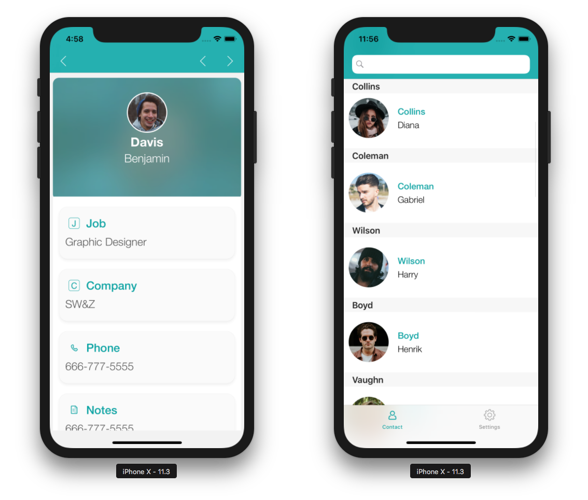

You can test your app at any moment during the development, thanks to the Simulator located on the BUILD tab of the Project Editor.

Let’s take a closer look at the Build tab options:

* **Build and Run:** Launches the app in the Simulator.

* **iPhone X:** The default Simulator. Clicking here will reveal a dropdown list with all available simulators.

* **Project:** Reveals a dropdown list where you can **open the project folder** or **product folder**, or **open the product with Xcode**. This dropdown list is useful for [debug operations](../debug/from-project-editor). 

* **Install:** Installs the application on a connected device (see [Installing on your iOS device](../deployment/testing-on-your-device)).

## Using the Simulator

You can use the Simulator by following these steps.

1. Select your device.

In the BUILD tab of  the Project Editor, select an iOS or Android device to use for running your app.

2. Click on the **Build and Run** button.

3. Test your app.

Test navigating between the list and detail forms in your app.

 
