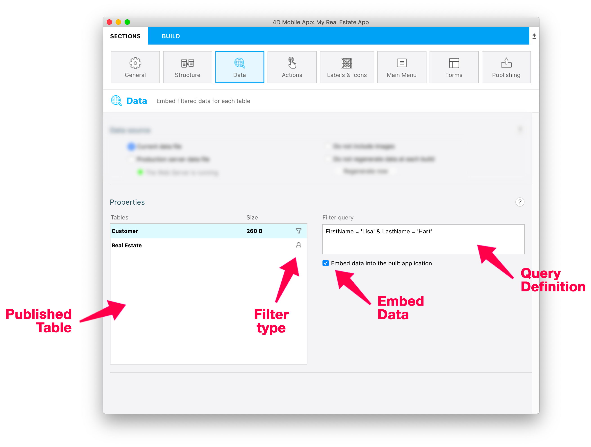
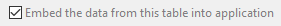

This page is used to configure the data that will be handled by your mobile app. It allows you to:

* select the source of data to include in your app (**Current data file** or **Production server data file**) 
* define which set of data should be preloaded and when to regenerate it,
* filter data to include in your app depending on **filter queries** and **user information**. 


## Data source

This panel allows you to configure the source of data handled by your app.

### Data file

Select the data file from which to get the data that will be handled by your app:

- **Current data file**: the data is taken from the current data file of the 4D project. This option is useful in the development phase. Since it requires that the Web server is launched, a **Start Web Server** button is displayed if it is not running.  

- **Production server data file**: the data is taken from a production server running the 4D project over the network. The **Production URL** must be entered from the [**Publishing** page](publishing.md) if you choose this option. If not defined, you can click on the **Set the Server URL** button to open the Publishing page. This option requires that you select explicitely the `key.mobileapp` security file (see below). 

### Selecting the `key.mobileapp` file

To secure access to the data to embed, a `key.mobileapp` file is automatically generated by the 4D mobile editor in the **MobileApps** folder when the data file is selected. This key must be correctly installed to allow data dumping. It is required when:

- the app is [built](build-panel)
- you click on the [**Regenerate now**](#regenerate-now) button.

:::info

The **MobileApps** folder is automatically created in the 4D project's [data folder](https://developer.4d.com/docs/en/Project/architecture.html#data-folder). 

::: 

When you work with the **Current data file**, the `key.mobileapp` file is automatically selected in the data folder of the local project.

When you work with the **Production server data file**, you need to copy from the server and select the remote `key.mobileapp` file:

1. On the production server machine, copy the `key.mobileapp` file from the `/Data/MobileApps` folder of the server application project.

2. In the mobile project editor, click on the **Locate the key...** button:


3. Select the `key.mobileapp` file copied from the server.

It is recommended to copy the file in the `/Data/MobileApps` folder of the local project.

:::info

This key is only necessary to access data to be embedded in the app. Subsequent accesses to server data from the apps are ```[authenticated at the request level](publishing.md/authentication)```. 

:::

### Do not include images

Embedding images from the data in your app can be time consuming, especially in the development phase. Checking this option can save a considerable amount of time when building your app.

### Do not regenerate data at each build

By defaut, each time you build your app, preloaded data (if any) are regenerated from the data file. In the development phase, you can save time by selecting this option. 

### Regenerate Now

This button regenerates the data to preload from the data file. It allows you to control the data generation during the development phase, specially when the **Do not regenerate data at each build** is checked. 

:::note

This button requires a valid `key.mobileapp` file if you use the [production server data file](#data-file). 

::: 


## Properties



In this area, you can:

- select tables from which to get embedded (preloaded) data
- define **filter queries** for each table. Filter queries are automatically applied when the app access data, in order to only get a selection of records.   

By default, if you do not define a filter query for a table, all of its records are embedded. 


### Tables

You can define one filter query per table. This list allows you to:

- select the table for which you want to add or edit a filter query
- see the size of embedded data if the [embed option is selected](#embed-the-data-from-this-table). This information is not available if table data access uses a filter query based upon user information since it depends on the user.
- see if the table is associated to a filter query  or a filter query with user information .


### Embed the data from this table 



When this option is checked (default), the editor will preload data of the selected in the mobile app when it is built or when [data are regenerated](#do-not-regenerate-data-at-each-build). This option accelerates data access from the mobile app since it only requires updates and not full downloads. It is particularly suited for stable data like cities or countries. 

You can uncheck the option if preloading the table data is not accurate.  

This option is not available if table data access uses a filter query based upon user information since it depends on the user. In this context, the button is replaced by the **Edit authentication method...** button that opens the [On Mobile App Authentication](https://doc.4d.com/4Dv19/4D/19/On-Mobile-App-Authentication-database-method.301-5392844.en.html) method in which you can process user information. 


### Filter queries

You can define one filter query per table. When a table is selected, click in the **Filter query** area, a set of menus is then displayed above the area:


To define a query:

1. Enter your query in the dedicated field by typing it directly in the query area or using the **Fields**, **Comparators** and **Operators** menus. 

A query uses the following syntax:

```
field comparator value {logicalOperator field comparator value}   
```


2. Validate your query by clicking on the **Validate** button. This must be done each time you modify it (a query that has been edited and not validated appears in red in the query editor). 

When a query filter is valid, an icon appears near the table name ( for static filters and  for filters with user information).


:::info

Refer to the [?filter REST documentation](https://developer.4d.com/docs/en/REST/filter.html) for a detailed description of query syntaxes. The string entered in the **Filter query** area is directly passed as parameter to the `$filter=` REST command.

:::


#### Example

If you select a table that contains a `FirstName` field and a `LastName` field, you can write in the **Filter query**:

```4d
FirstName = 'Lisa' & LastName = 'Hart'
```

This query gets only the records that include "Lisa" as FirstName and "Hart" as LastName.


### Filter queries with user information

You can define [filter queries](#filter-queries) where the *value* parameter depends on user information that is returned by the [`On Mobile App Authentication` database method](https://doc.4d.com/4Dv19/4D/19/On-Mobile-App-Authentication-database-method.301-5392844.en.html) of the 4D project. 

To specify that the query depends on user information, just add **`:`** and a custom key value in the query.


For example, you can define filter queries such as:

```
Name = :name
employee.level > :level
cityName = :city
```
... where `:` preceeds variables that will be automatically filled by the mobile app depending on values returned by the `On Mobile App Authentication` database method in the `userInfo` object. The variables must exist as custom property names in the `userInfo` object.

Here is how it works:

1. When the mobile app sends a request for data, the `On Mobile App Authentication` database method is automatically called and gets information from the app in its *$1* object parameter, in particular the `email`, but also the `device` or the `language`.
2. The database method queries the 4D datastore to get appropriate information with regard to the business rules and can return any value as a custom property of the `userInfo` object. For example:

```4d
$id:=ds.Salesperson.query("email == :1";$1.email).first().id 
	//gets the id value of the salesperson from its email
If($id#null)
	$Obj_response.userInfo:=New object("id";$id) //stores id in the userInfo to return 
End if  
...
$0:=$Obj_response
```
3. The mobile app automatically manages a `userInfo` object per user.
In our example, the "id" custom property is available in the returned objet. Thus, you can write as the "Customers" table filter query:

```4d
salespersonid = :id
```

When the mobile app will access data from the "Customers" table, only customers belonging to the logged salesperson will be displayed. 

:::tip tutorial

See the [**Define a filter query**](../tutorials/filter-queries/define-filter-query) tutorial for a complete example of filter query with user info in a mobile app. 

:::