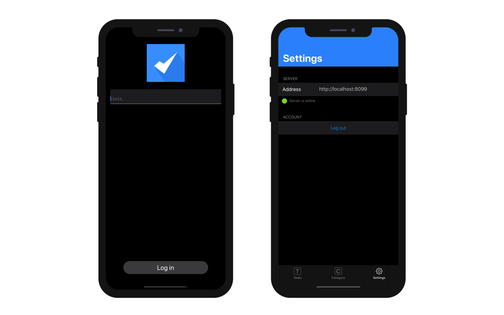

This page gives you access to your app's publishing settings and special mobile features:


## Production URL

URL of the Web Server on which mobile apps will connect to read and write data, in production context. You can enter any valid address, i.e.:

```
https://my.wesbsite.com
http://my.website.com:9200
www.website.com/mobile
```

:::info

During the development phase, you can leave this area empty and set the [Data source](data.md) to **Current data file**.

:::


## Web Server Settings

The **Edit...** button opens the **Web** page of the 4D settings dialog box. Use this page to define the following settings to embed in the mobile app:

- **Enable HTTP** option and **HTTP port**.
- **Enable HTTPS** option and **HTTP port**.

:::note

If both HTTP and HTTPS are enabled, HTTP is used.

:::

Activating the HTTPS port requires that you installed a valid [TLS certificate](https://developer.4d.com/docs/en/Admin/tls.html). You can create test certificates with 4D.

These settings are taken into account only if the [production URL](#production-url) is defined. Otherwise, the local IP address is used.

:::note

The Simulator always works locally (127.0.0.1 or localhost).

::: 


## Features

This area allows you to select and configure several mobile app's special features:

- Authentication
- Push notifications
- Deep linking

 

## Authentication

* **Authorized User:** Check the **Login required** option to display a login form when the app starts.

* **Guest:** Leave the **Login required** option unchecked. No login form will appear when the app starts.

## Authentication Method

### On Mobile App Authentication Database Method

* **Development**: The authentication method allows you to use the app locally. 
* **Deployment**: You must create/edit the [*On Mobile App Authentication*](https://doc.4d.com/4Dv17R3/4D/17-R3/On-Mobile-App-Authentication-database-method.301-3906587.en.html) database method to authorize specific emails or devices, even in Guest mode.

A template is available to obtain all necessary information about the session, as well as user information (email address, app information, device, team ID, etc.)

You can customize this method according to your needs! 

### Session Management

When a user opens the app for the first time, a session file is created and stored next to the current data file in the MobileApps folder. 

The session files are organized and grouped by app folder. The Team ID and app bundle ID are concatenated to create the app folder names.

Here is an example of a 4D for iOS-generated session file:

```json
{
"application":{
  "id":"com.contactApp.Contact",
  "name":"Contact",
  "version":"1.0.0"
},
"team":{
  "id":"UTT7VDX8W5"
},
"language":{
  "id":"en_US",
  "code":"en",
  "region":"US"
},
"email":"",
"device":{
  "description":"iPhone X",
  "version":"11.3",
  "id":"0DC5132E-1EF4-407C-A832-5FE33D818AF3",
  "simulator":true
},
"send":"link",
"session":{
  "id":"7023d9205074199d1c16fc00d24354e778137675",
  "ip":"::ffff:192.168.5.4"
},
"status":"accepted",
"token":"eyJhcHBOYW1lSUQiOiJjb20uY29udGFjdEFwcC5Db250YWN0IiwiaWQiOiI3MDIzZDkyMDUwNzQxOTlkMWMxNmZjMDBkMjQzNTRlNzc4MTM3Njc1IiwidGVhbUlEIjoiVVRUN1ZEWDhXNSJ9"
}

```

If you want the ability to manually validate the first login for every user session, you must change the "accepted" default status to "pending" by adding ```$response.verify:=True``` to the [*On Mobile App Authentication*](https://doc.4d.com/4Dv17R3/4D/17-R3/On-Mobile-App-Authentication-database-method.301-3906587.en.html) database method.


### Mobile Session Management Component

Sessions can be managed by the **MOBILE SESSION MANAGEMENT**:

<div markdown="1" style={{textAlign: 'center', marginTop: '20px', marginBottom: '20px'}}>
<a class="button"
href="https://github.com/4d/Mobile-Session-Management/releases/latest">MOBILE SESSION MANAGEMENT component</a>
</div>

* Download and unzip the zip file
* Go to Build / Components file and get the MOBILE SESSION MANAGEMENT.4dbase
* Create a **Components** folder next to the 4D database with the app's data. 
* Place the **MOBILE SESSION MANAGEMENT** component in the newly created **Components** folder.
* Restart 4D.  
* Click on the Execute button from the toolbar
* In the 4D Methods Explorer, select the **MOBILE SESSION MANAGEMENT** method and click on the **Execute** button. 
* The Apps window will appear displaying all of your apps: 


* Right click on a session to reveal the session file in the Finder or delete it.
* You can change and define the session status for each device: accepted or pending


* The **Push** button will update the session in memory.
* The **Refresh** button updates the session list. 

## How it looks on a device

### Settings screen

A Settings screen is available from the tab bar. You can also find it from the More tab if necessary (*i.e.*, your app has more than four tables).

Settings allows you to:

* Consult your remote URL and it's state
* Log out (if connected as an Authorized User)




### Reset remote url

You can easily update your remote url from iPhone Settings :

* Open your iPhone Settings
* Select the app you want the remote url to be updated
* Switch on the "Reset server address" option


* Then restart your app to reset the server address 
* And finally define the new remote url

