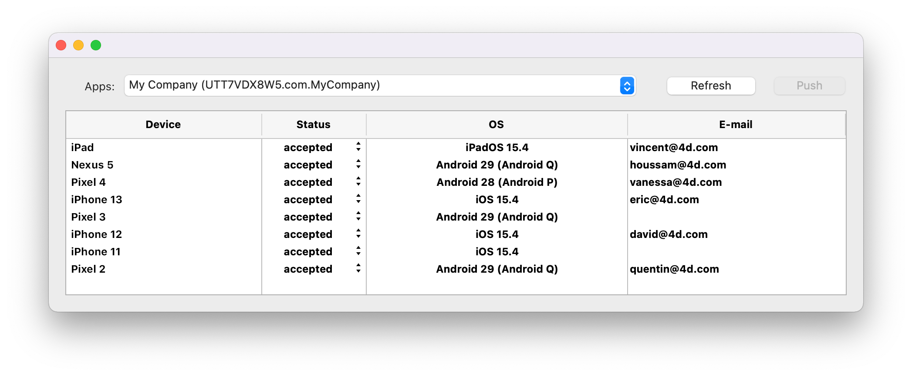
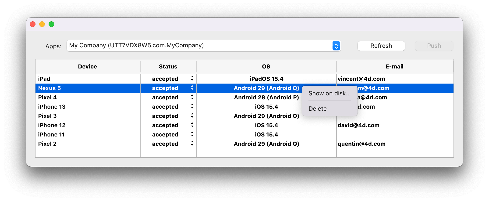

## Session file

When a user opens the app for the first time, a session file is created and stored next to the current data file in the MobileApps folder. 

The session files are organized and grouped by app folder. The Team ID and app bundle ID are concatenated to create the app folder names.

Here is an example of a 4D for iOS-generated session file:

```json
{
"application":{
  "id":"com.contactApp.Contact",
  "name":"Contact",
  "version":"1.0.0"
},
"team":{
  "id":"UTT7VDX8W5"
},
"language":{
  "id":"en_US",
  "code":"en",
  "region":"US"
},
"email":"",
"device":{
  "description":"iPhone X",
  "version":"11.3",
  "id":"0DC5132E-1EF4-407C-A832-5FE33D818AF3",
  "simulator":true
},
"send":"link",
"session":{
  "id":"7023d9205074199d1c16fc00d24354e778137675",
  "ip":"::ffff:192.168.5.4"
},
"status":"accepted",
"token":"eyJhcHBOYW1lSUQiOiJjb20uY29udGFjdEFwcC5Db250YWN0IiwiaWQiOiI3MDIzZDkyMDUwNzQxOTlkMWMxNmZjMDBkMjQzNTRlNzc4MTM3Njc1IiwidGVhbUlEIjoiVVRUN1ZEWDhXNSJ9"
}

```

If you want the ability to manually validate the first login for every user session, you must change the "accepted" default status to "pending" by adding `$response.verify:=True` to the [*On Mobile App Authentication*](https://doc.4d.com/4Dv19/4D/19/On-Mobile-App-Authentication-database-method.301-5392844.en.html) database method.


## Mobile Session Management Component

Sessions can be managed by the **Mobile Session Management** component:

<div style= {{ textAlign: "center", marginTop: "20px", marginBottom: "20px" }}>
<a className="button button--primary"
href="https://github.com/4d/Mobile-Session-Management/releases/latest">Mobile Session Management component</a>
</div>

1. Download and unzip the zip file
2. Go to Build / Components file and get the MOBILE SESSION MANAGEMENT.4dbase
3. Create a **Components** folder next to the 4D project with the app's data. 
4. Place the **MOBILE SESSION MANAGEMENT** component in the newly created **Components** folder.
5. Restart 4D. 
6. Click on the **Execute** button from the toolbar
7. In the 4D Methods Explorer, select the **MOBILE SESSION MANAGEMENT** method and click on the **Execute** button. 
8. The Apps window will appear displaying all of your apps: 



* Right click on a session to reveal the session file in the Finder or delete it.
* You can change and define the session status for each device: accepted or pending




* The **Push** button will update the session in memory.
* The **Refresh** button updates the session list. 


