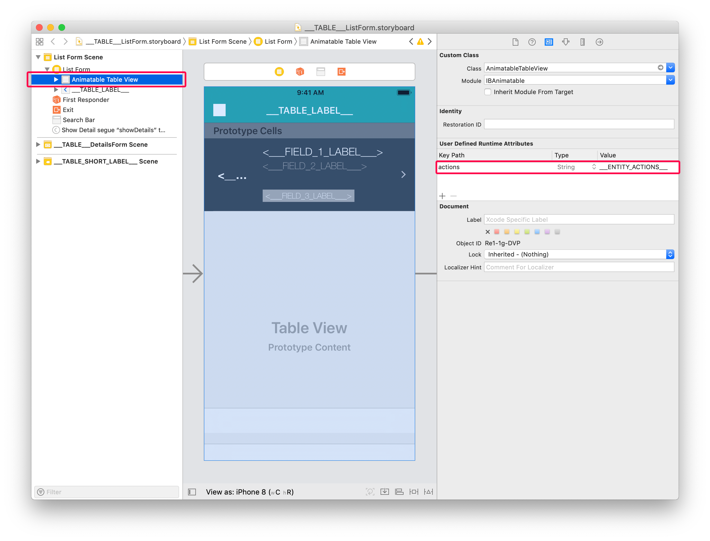
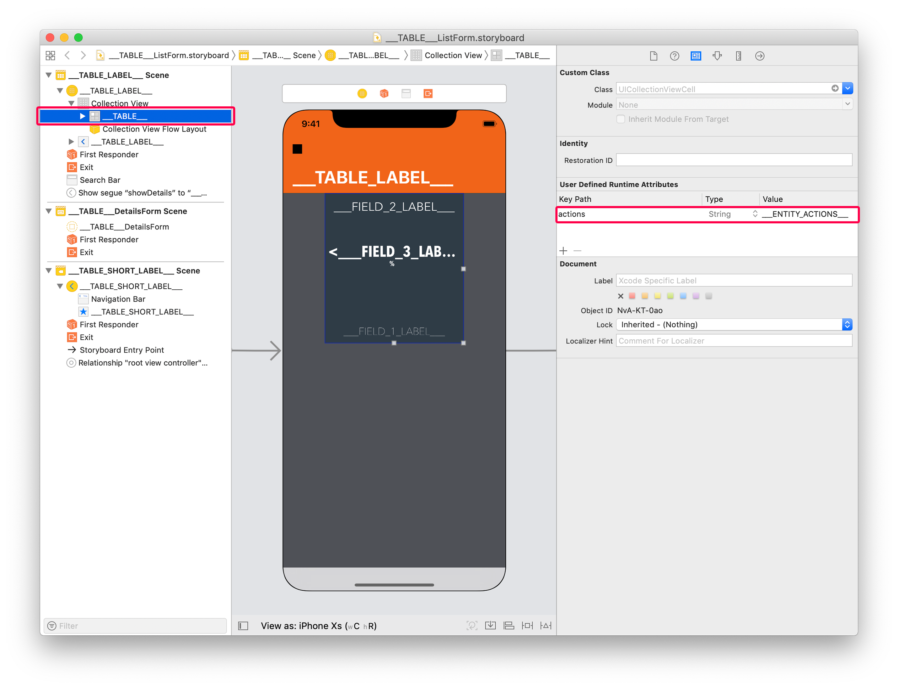

> **OBJECTIVES**
>
> Add actions to custom List and Detail forms templates.

> **PREREQUISITES**
>
> Click ```[here](prerequisites.html)``` to see what you'll need to get started!

In this tutorial, we are going to see how easy it can be to **add actions to custom templates**.

## STEP 1. Download the Starter project

To begin, download the **Starter project**, which includes:

* two custom List form templates (TasksList and TasksCollection)
* a custom Detail form template (TasksDetail)
* a Tasks.4dbase file

<div className="center-button">
<a class="button button--primary"
href="https://github.com/4d-go-mobile/tutorial-AddingActionToTemplates/archive/1dc5aecfbea62a9999d571cb1a956f1ef6983111.zip">Download</a>
</div>

## STEP 2. Add custom templates to 4D for iOS Project

First, drop:

* **TasksList** and **TasksCollection** template folders in *Tasks.4dbase/Resources/Mobile/form/list* folder 


* **TasksDetail** template folders in *Tasks.4dbase/Resources/Mobile/form/detail folder*


## STEP 3. Add actions in List forms

Two types of actions are available: 
* table actions
* entity actions 

Let's first open the ```list/TasksList/Sources/Forms/Tables/___TABLE___/___TABLE___ListForm.Storyboard``` file.

### Add actions to TasksList custom template

#### A. Add Table action Tag

Select the **List form Controller** and add this line in the **User Defined Runtime Attributes** (Identity inspector):

* Key Path: ```actions```
* Type: ```String```
* Value: ```___TABLE_ACTIONS___```


#### B. Add Entity action Tag

Select the Animatable Table View and add this line in the **User Defined Runtime Attributes** (Identity inspector):

* Key Path: ```actions```
* Type: ```String```
* Value: ```___ENTITY_ACTIONS___```



Your custom template is ready to display actions! 

You can select the TaskList custom template from the **Forms section** and add the following fields:


Now let's add action tags to the TasksCollection custom template

### Add actions to TasksCollection custom template

To do so, open the ```list/TasksCollection/Sources/Forms/Tables/___TABLE___/___TABLE___ListForm.Storyboard``` file.

#### A. Add Table action Tag

The process is quite as similar as TasksList custom template's process.

Select the **List form Controller** and add this line in the **User Defined Runtime Attributes** (Identity inspector):

* Key Path: ```actions```
* Type: ```String```
* Value: ```___TABLE_ACTIONS___```


#### B. Add Entity action Tag

For entity, the way you display actions is quite different than TableView: swipe action are not really adapted to CollectionViews.

So with collection views, the best way to display actions is to use a **long pressure** gesture on the cells you want to interact with.

For that, select the collectionView cell and add this line in the **User Defined Runtime Attributes** (Identity inspector):

* Key Path: ```actions```
* Type: ```String```
* Value: ```___ENTITY_ACTIONS___```



To optimize the interaction rendering, you can add a scale effect with a haptic feedback adding the following line in the **User Defined Runtime Attributes** (Identity inspector):

* Key Path: ```touch.zoomScale```
* Type: ```Number```
* Value: ```0,96``` (adapt the scale ratio depending on the result you want to get)

You can select the TasksCollection custom template from the **Forms section** and add the following fields:


## STEP 4. Add actions in Detail forms
 
In Detail forms, you can use the **generic button** in the navigation bar or **create easily your own custom action button**. In both cases, you have to add tags.

For generic button embedded in the navigation bar, select the Controller and add this line in the **User Defined Runtime Attributes** (Identity inspector):

* Key Path: ```actions```
* Type: ```String```
* Value: ```___ENTITY_ACTIONS___```


In our tutorial, we want to build our own generic button. For that, open the ```detail/TasksDetail/Sources/Forms/Tables/___TABLE___/___TABLE___DetailsForm.storyboard``` file.

Open it, select the button at bottom right and add this line in the **User Defined Runtime Attributes** (Identity inspector):

* Key Path: ```actions```
* Type: ```String```
* Value: ```___ENTITY_ACTIONS___```


As you can see, a few visual buttons are missing in the Storyboard file. You can actually find those visuals in the  **Resources folder** template. They will be included in the project during the build process.

For example for the **moreButton.imageset**:


You can select the TasksDetail custom template from the **Forms section** and add the following fields:


Congratulations, your Tasks iOS app is now complete and includes actions in List form and Detail form !


Download the completed project: 

<div className="center-button">
<a className="button button--primary"
href="https://github.com/4d-go-mobile/tutorial-AddingActionToTemplates/releases/latest/download/tutorial-AddingActionToTemplates.zip">Download</a>
</div>


