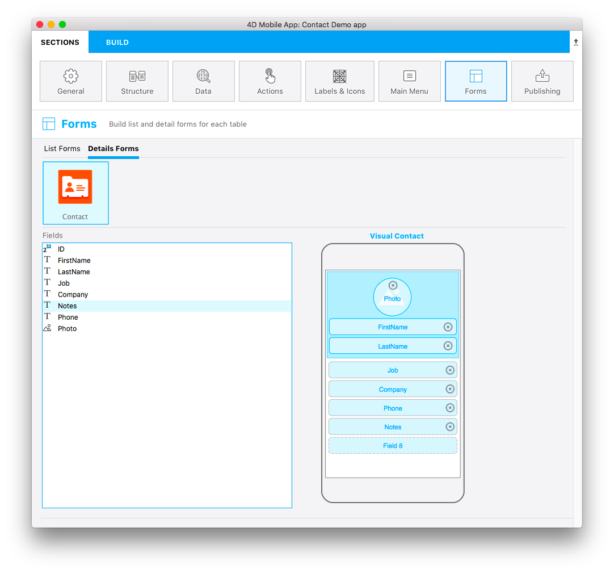

Welcome to the 4D mobile application builder. This tutorial will let you dive right into mobile development for iOS and Android with 4D. 

:::note Reminder

Before starting, please check that your configuration meets hardware and software [requirements](../getting-started/requirements.md) for 4D mobile project development.  

:::

**Scenario:** You are a commercial business manager and you want to consult your contact information on the go. We are going to create a mobile directory app for iOS and/or Android to search for contact names from a list and then view the details of each contact. We'll call it "Contact". 

## STEP 1. Download the Starter project

Download and unzip our 4D Starter project, which contains a database file and a project icon (but no mobile project yet).  

<a className="button button--primary" href="https://github.com/4d-go-mobile/tutorial-ContactApp/archive/acbb699c3c9d9edd3a8bbb715e87c17140b7e15f.zip">Starter project</a>

## STEP 2. Create the mobile project

Launch your 4D application and select "Contact.4DProject". It contains a very simple database structure using a single table.

Go to **New > Mobile project**. In the Welcome screen, give your mobile project a name. 

Click **Continue**.

Additional components are required to develop an Android project. Click **OK** to download them:

## STEP 3. General page

Here, you configure your app's primary information:

* **Target:** Mobile platform(s) to build
 
:::note

If you are on Windows, only **Android** is available. If you are on macOS, you can select both **Android** and **iOS** targets. 

:::

* **Organization:** Name of your company and identifier of the application.
* **Product:** 
	* **Name:** Name of the application. Let’s call this one "Contact".
	* **ID:** (Bundle ID) this area is automatically generated as a composition of your organization identifier and product name.
	* **Version** and **Copyright:** Leave the version as 1.0 and define your app's copyright. 
	* **Icons:** Select a target OS and drag and drop icons for your app into the area.
* **Developer:** 
	- **Name:** Automatically filled from the user name on your computer. 
	- **Team**: Developer team reference from your developer account. You can leave it empty to build your application on the Simulator only.

## STEP 4. Structure page

This is where you define the subset of data to expose to mobile devices. Select the table(s) in the left area and the field(s) in the right area. 

For our example, select **ID**, **First Name**, **Last Name**, **Job**, **Company**, **Phone**, **Notes**, and **Photo**.

> We highly recommend publishing your primary key in order to identify each record of the database.

## STEP 5. Labels & Icons page

:::note

[**Data**](project-definition/data.md) and [**Actions**](project-definition/actions.md) pages allow to configure your app's data and to trigger code on the server. To keep this example simple, we will use default behaviors. 

:::

Select **Labels & Icons** page. Here you can define some labels and icons that will be used throughout the app for the tables, fields, and relations. 

* Short labels and long labels are automatically used by the app depending on the available space. 
* To define a table icon, click on the **Icons** column for the table. The icon library appears and you can select an icon to illustrate the table or field. You can also opt to leave the icon column empty, a default icon will be generated. 
* Select at least one icon for your fields: the editor will generate default icons for all remaining fields. You can also simply leave all fields empty to not display any field icons. 

## STEP 6. Forms

We're almost done, but we still need to decide on the app's layout. There are both List and Details forms to choose from.

* Select a List form template to display your table as a list. For our Contact app, let’s use the **Profile** template.

At this point, the bottom of the configuration window has changed from template selection to content definition.
 
* Drag and drop the fields you want displayed onto the template, <i>i.e.</i>, Last Name into the search and Title fields. The Search and Section fields are optional, leave the Section field empty for the moment.

And finally, we'll define the Detail form. 

* Select a template that is best suited for your app. For our Contact app, let’s use the **Visual Contact** template.

* Drag and drop the content onto the appropriate places on the detail form template, <i>i.e.</i>, First Name, Last Name, and Photo.

## STEP 7. Build the app

Now the fun part! It's time to build your app and test it on the Simulator to see the final result!

* Click the **Build** tab.
* Select a device to use as a Simulator by clicking on the device button.
* Click  **Build and Run**.
* Wait a few seconds and... voila! Your mobile app is alive!

## Where to go from here?

We've covered basic app creation in this tutorial, and you should now be able to create simple apps on your own. Of course, many other options and features are available. Right now, you can click on **Final Project** below to download the final Contact app.

<a className="button button--primary"
href="https://github.com/4d-go-mobile/tutorial-ContactApp/releases/latest/download/tutorial-ContactApp.zip">FINAL PROJECT</a>

