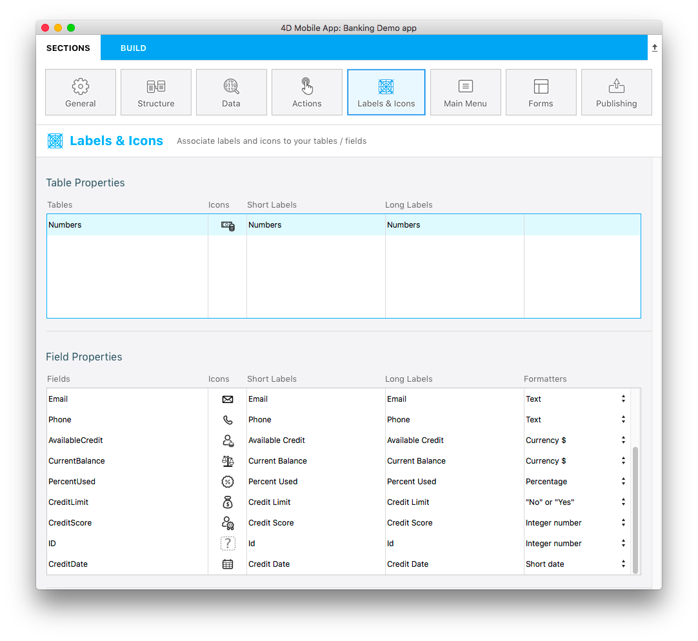

> **OBJECTIVES**
>
> Use built-in data formatters.

In this tutorial, we'll show you how to apply built-in [data formatters](../../project-definition/labels-and-icons.md#data-formatters) to your fields.

## Download the Starter project

Let's get started by downloading the Starter project:

<a className="button button--primary"
href="https://github.com/4d-go-mobile/tutorial-DataFormatter/releases/latest/download/tutorial-DataFormatter.zip">Download</a>

## Open mobile project

Go to **Labels & Icons** in Sections, you'll see that a Formatters column is available in the Field Properties:

From here, you can select specific formats depending on your needs. You can choose between multiple built-in formats:

- **Text**: Text
- **Date**: Date, Short date, Long date, Full date
- **Time**: Time, Short time, Duration, Integer number
- **Boolean**: "No" or "Yes", "False" or "True"
- **Integer**: Integer number, Decimal number, Real number, Percentage, Ordinal number, Currency $, Currency €, Currency ¥, Spell Out

Let's define the Available Credit field as a Currency:

Let's do the same process for all of the other fields:

* Set Current Balance as a **Currency $**
* Set Percent Used as a **Percentage**
* Set Credit Limit as a **No or Yes**
* Set Credit Date as a **Short Date**

## Build and Run your project

Here is the final result in your iOS app with a Tasks list form and a Numbers detail form selected.

You're done! Your fields are well formatted according to its defined type in **Labels & Icons**.