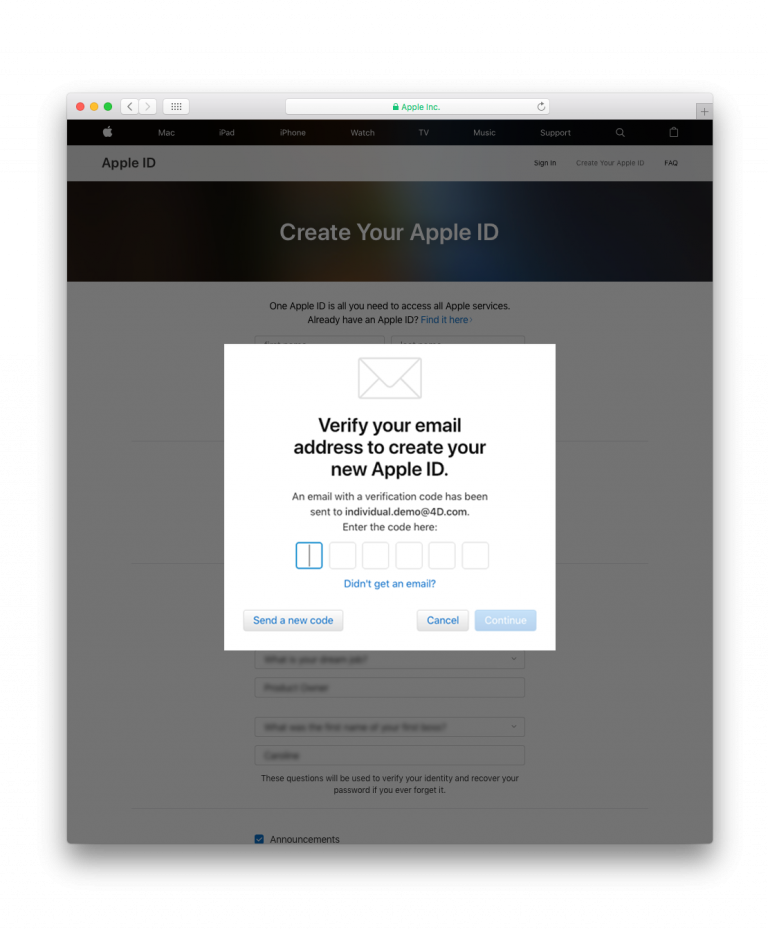
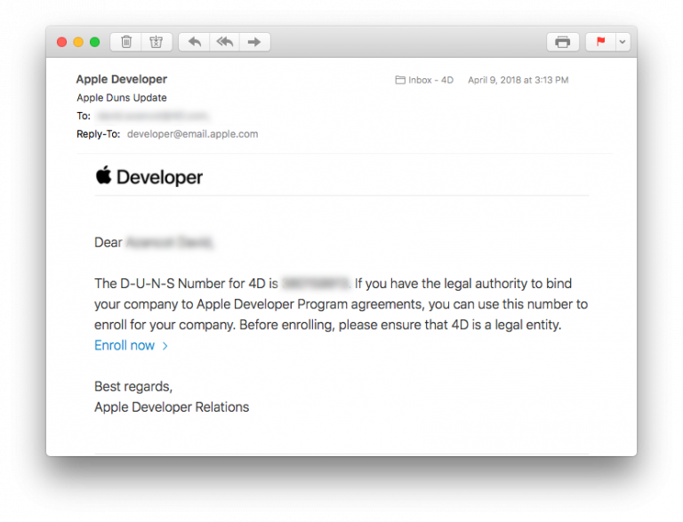
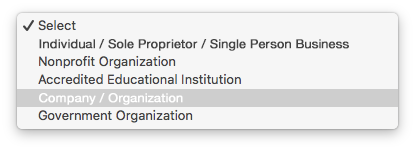
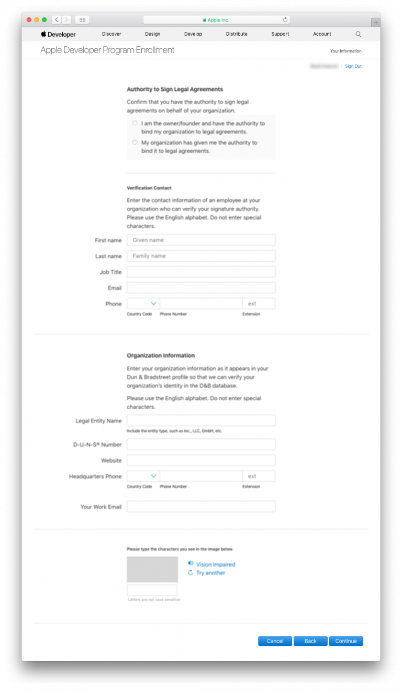
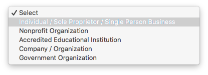

> **OBJECTIVES**
>
> Choose the appropriate Apple Developer Program.

You must have a valid Apple Developer account to **distribute an iOS app**. Apple offers two developer programs:

* **[Apple Developer Program](https://developer.apple.com/programs/)** **for organization** or **for individual** – $99/year 
* **[Apple Enterprise Developer Program](https://developer.apple.com/programs/enterprise/)** – $299/year

The main difference between the two programs is:

* **Apple Developer Program (for organization or individual)**: Allows you to distribute app(s) **on the App Store**.

* **Apple Developer Enterprise Program**: Provides resources ONLY for developing and distributing **proprietary, in-house apps** to employees.

For **test purposes** you can use a **Free Apple Developer Program**.

Here is a chart comparing the different levels of developer membership:

:::info

To enroll in any **Apple Developer Program**, your Apple ID must be associated with an email address using your organization’s domain name.

:::

:::info Free Apple Developer account

If you want to join the Apple Developer Program for free, you can create a free Apple ID and use it to access a limited set of developer-oriented privileges. Therefore, follow only Steps 1 and 2, then launch Xcode > Preferences > Accounts, Add your Apple ID and sign in !
:::

## STEP 1. Create your Apple ID

If you already have an Apple ID, go to [Step 2](#step-2-request-a-d-u-n-s-number).

Go the the [Apple ID creation page](https://appleid.apple.com/).

* Complete the form and security questions.
* You'll receive a verification code by email.
* Enter the verification code to validate your account creation.

* Once you have your Apple ID, you can continue to Step 3.

## STEP 2. Request a D-U-N-S Number

:::info

This step is not included for the **Apple Developer Program as an individual**.

:::

* If you already have a D-U-N-S Number, go to [Step 3](#step-3-register).

Request a D-U-N-S Number [here](https://developer.apple.com/enroll/duns-lookup/#/search)

* Complete the form.
* Click **Continue**.
* Check your email for the D-U-N-S Number.

## STEP 3. Register 

### Apple Developer Entreprise and Apple Developer as an organisation

You can register as a developer [here](https://developer.apple.com/programs/enterprise/enroll/).

* Click on the **Start your Enrollment** button.
* Read and accept the Apple Developer Agreement. 
* Click **Submit**.

### Apple Developer as an individual

* You can register as a developer [here](https://developer.apple.com/account/).

* Read and accept the Apple Developer Agreement. 
* Click **Submit**.

## STEP 4. Join 

:::info

This step is not included for the **Apple Developer Enterprise Program**.

:::

### Apple Developer Program as an Organisation

* You can sign up for the Apple Developer Program [here](https://developer.apple.com/enroll/enterprise/). 

### the Apple Developer Program as an Individual

* Click on **Join the Apple Developer Program** at the bottom of the page.

## STEP 5. Enroll 

### Apple Developer Program as an Organisation

* Click on the **Start your Enrollment** button.
* Select **Company / Organization** from the Entity Type dropdown list.
* Click **Continue**.

* Complete the form.
* Click **Continue**. 

* Apple has an internal verification process that usually takes up to six working days. Once Apple receives the enrollment request, they verify that you have the authority to bind your organization to the Apple Developer Program's legal agreements.
* Apple generally calls to verify that the main contact exists and has requested the Apple Developer Enterprise Program registration.
* You'll then receive another email inviting you to complete the enrollment process.

### Apple Developer Program as an individual

* Click on the **Start your Enrollment** button.
* Select **Individuals / Sole Proprietor / Single Person Business** from the Entity Type dropdown list.
* Click **Continue**.

* Complete the form
* Read and accept the Apple Developer Program License Agreement.
* Click **Continue**.

### Apple Developer Enterprise Program

* You can sign up for the Apple Developer Enterprise Program [here](https://developer.apple.com/enroll/enterprise/). 
* Click on the **Start your Enrollment** button.
* Select **Company / Organization** from the Entity Type dropdown list.
* Click **Continue**.

* Complete the form. 
* Click **Continue**.

## STEP 6. Apple verification

:::info

This step is  included only for the **Apple Developer Enterprise Program**.

:::

* Apple has an internal verification process that usually takes up to six working days. Once Apple receives the enrollment request, they verify that you have the authority to bind your organization to the Apple Developer Program's legal agreements.
* Apple generally calls to verify that the main contact exists and has requested the Apple Developer Enterprise Program registration.
* You'll then receive another email inviting you to complete the enrollment process.

## STEP 7. Complete your purchase

* Once your enrollment request has been accepted, you can then proceed to payment.

* When you have completed your purchase, you'll receive an email confirming your membership in the program.
 
Congratulations! You are now ready to deploy and publish your applications!
