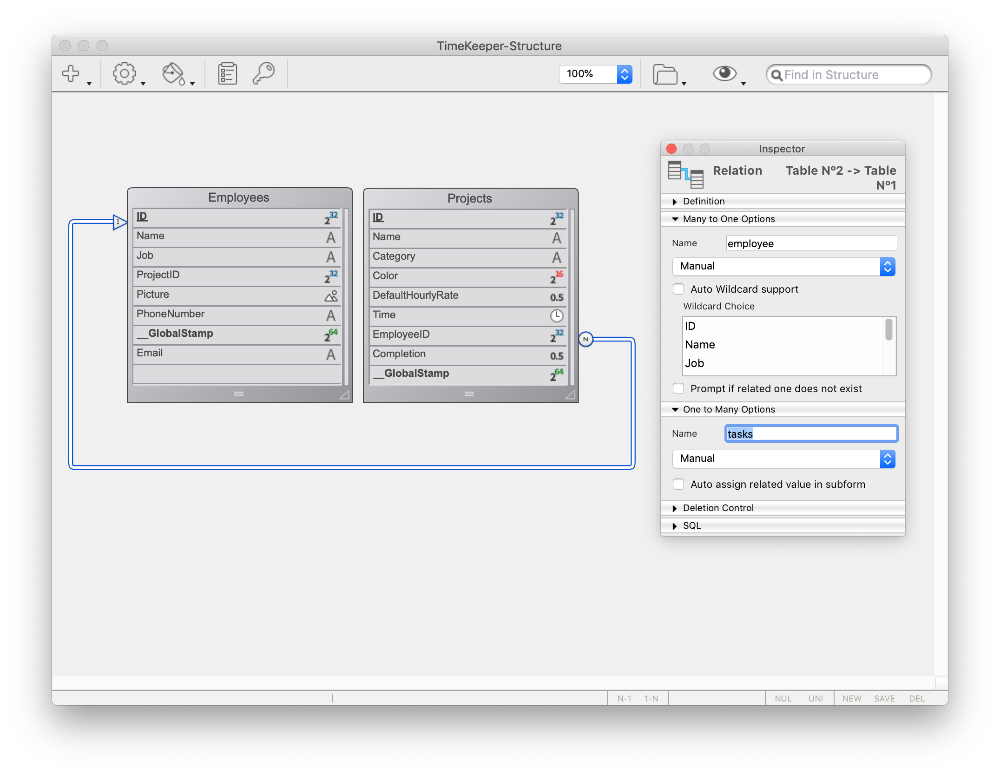
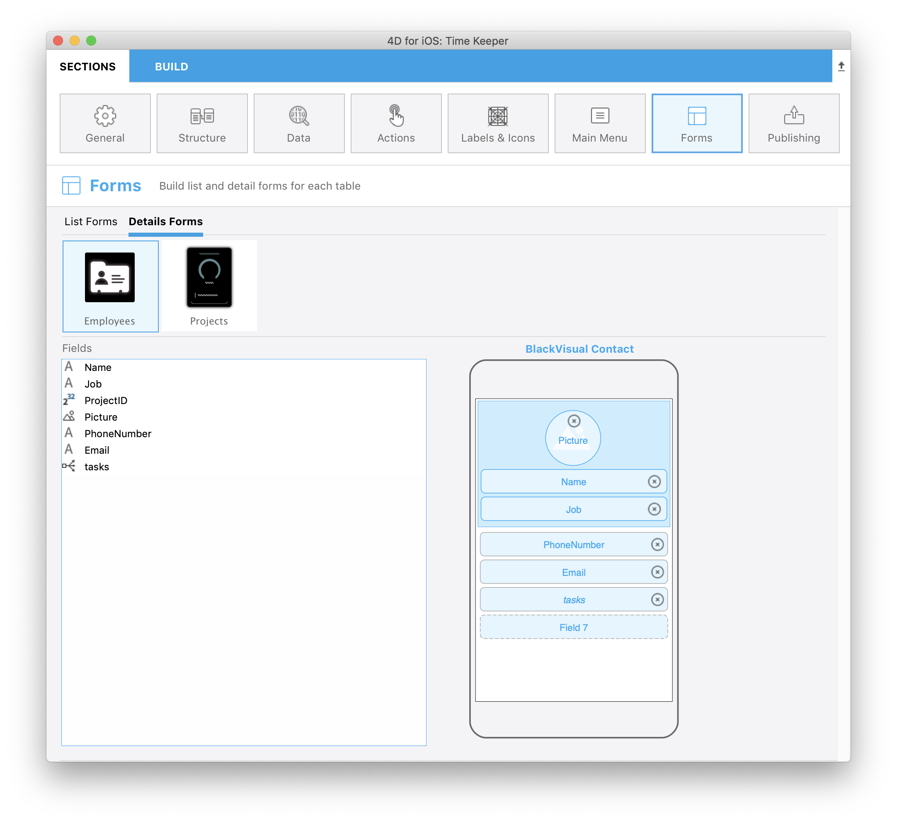

This tutorial will show you how easy it can be to include One to Many relations in 4D for iOS.

Let's get started by downloading the Starter project:

<a className="button button--primary"
href="https://github.com/4d-for-ios/tutorial-OneToManyRelations/archive/c006015afeb0e134d872152f53b8cd5e4dcb59bb.zip">Starter project</a>

In this tutorial, we are going to build a colorful **Task app** using 4D for iOS.

But first, let's have a look at the structure of our database:

As you can see, there is a One to Many link named **tasks** that we will use in our iOS app to display the employees'(**One**) tasks(**to Many**).

Now, go straight to Open menu > Mobile project... to select *Time Keeper* and go to the **Structure section**.

## Structure section

You can see the **tasks relation** we have seen earlier... Publish it !

This will now operate as any other field for the rest of the app creation process.

:::tip

On mouse over, a tip displays the table name originating the relation.

:::

## Labels & Icons section

The One to Many relation is now available in the **Labels and Icons** section.

It is important to know that including a One to Many relation will create a button into the genrated iOS app.

So, in the Labels & Icons section you will define:

* a button Label
* a button icon
* a title that will be displayed in the destination view (to indicate where you come from for example).

## Forms section

* Go to the Forms section and drop the *tasks* relation on the Employee Task Detail form.

## Build and Run

1. From the Employee List form, click on one employee 
2. This will open the employee's detail form, where you should see a new **Relation button** !
3. Click on this Relation button to display the employee's tasks. 

And voilà ! This is how One to Many relations work in 4D for iOS !

Download the completed project:

<a className="button button--primary"
href="https://github.com/4d-for-ios/tutorial-OneToManyRelations/releases/latest/download/tutorial-OneToManyRelations.zip">Completed project</a>

