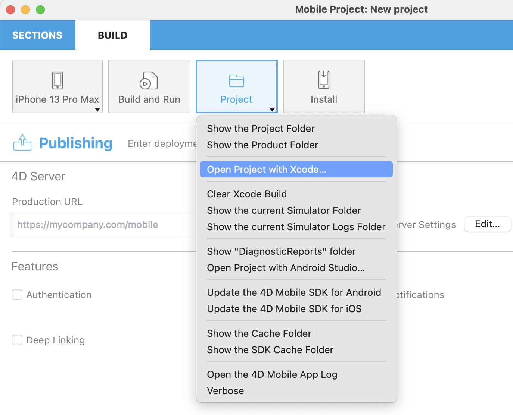

Puede suceder que encuentre problemas al utilizar el editor de proyectos 4D mobile o al usar su aplicación Android. La lectura de los archivos de historial puede ofrecer información útil en estos casos.

Para acceder a los archivos de historial, presione la tecla **Alt** y seleccione **Proyecto** en el panel CREAR del editor de proyectos:

Aparecen elementos del menú de depuración adicionales para el [simulador seleccionado en ese momento](../project-definition/build-panel#using-the-simulator):

* **Registros del Simulador Abierto**: donde se encuentra la carpeta `CrashReporter MobileInstallation`

* **Abrir los informes de diagnóstico del simulador**

* **Abrir la carpeta del simulador actual**

* **Abrir carpeta del simulador de aplicaciones**: abre un submenú para cada aplicación

## How to debug your app

Once your app is complete and the simulator’s result is satisfactory, you may want to test it on your smartphone, whether you're working on 4D for iOS or 4D for Android..

To do so, in the Project editor, make sure you have plugged your smartphone, then select your physical device from the list and click on the “Build and Run" button.

:::nota

The **Update the list of devices...** button enables to refresh the list of available devices.

:::

4D shall then build the application and install it on the connected device.

:::nota

If you're an Android developer, you need to add an extra step to the debug process. More details [here](from-your-android-device-and-android-studio.md).

:::
