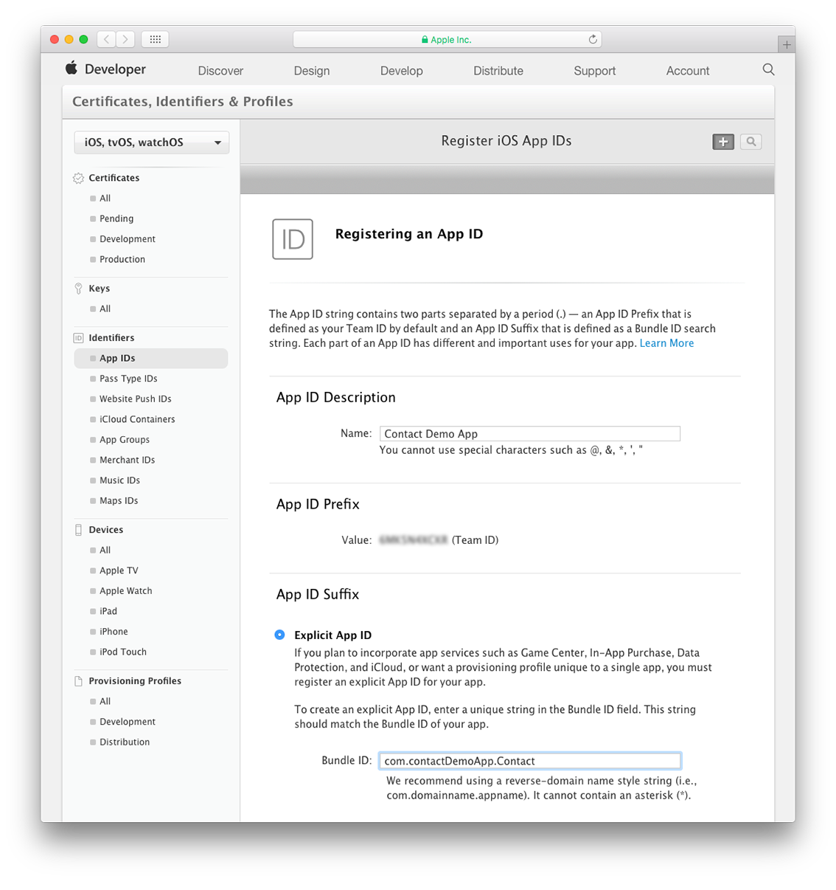
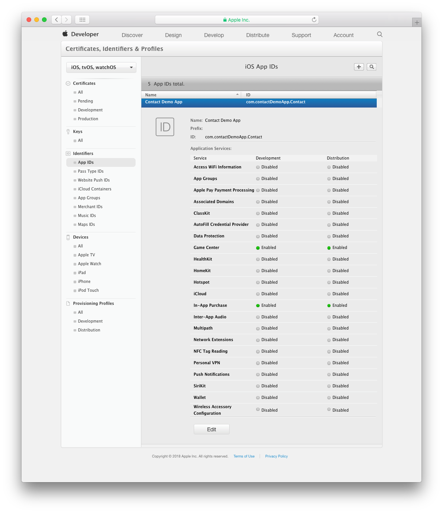
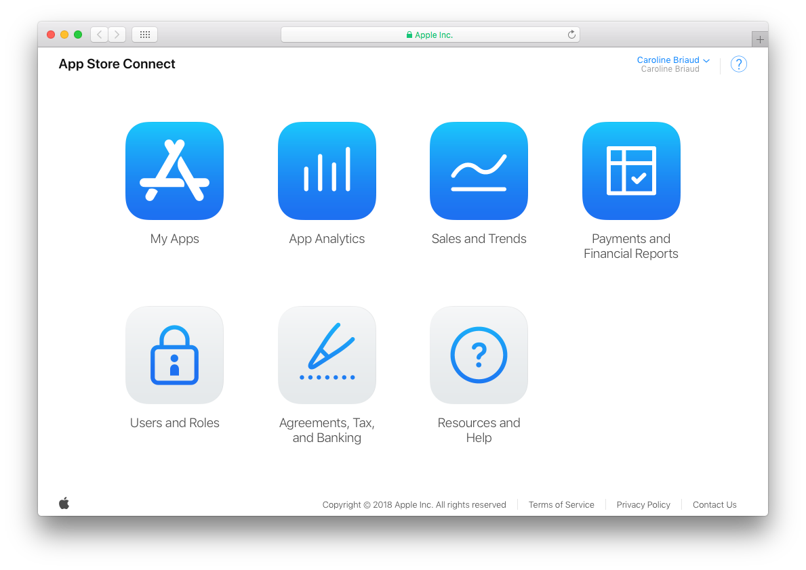
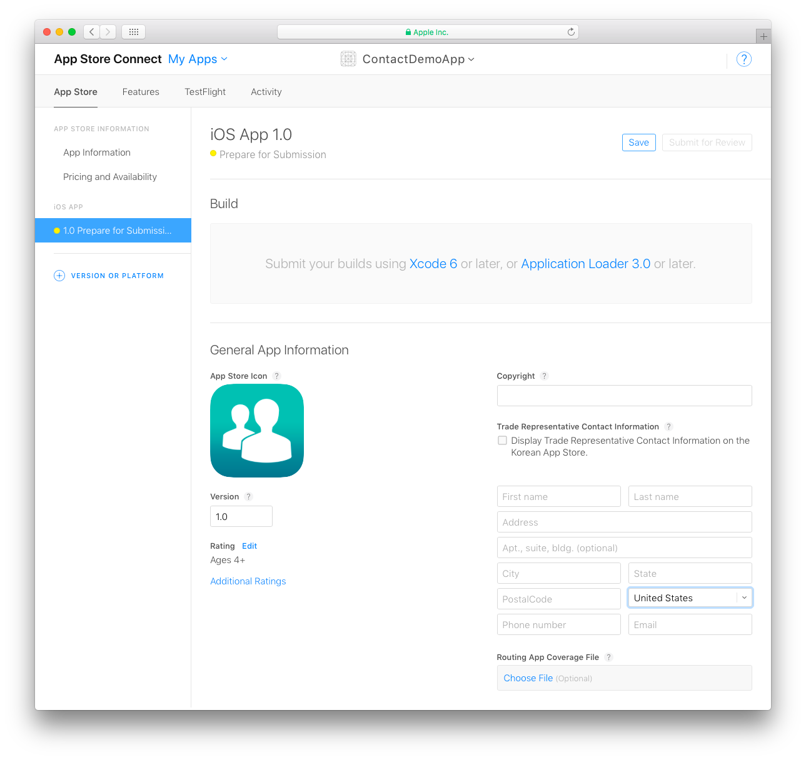
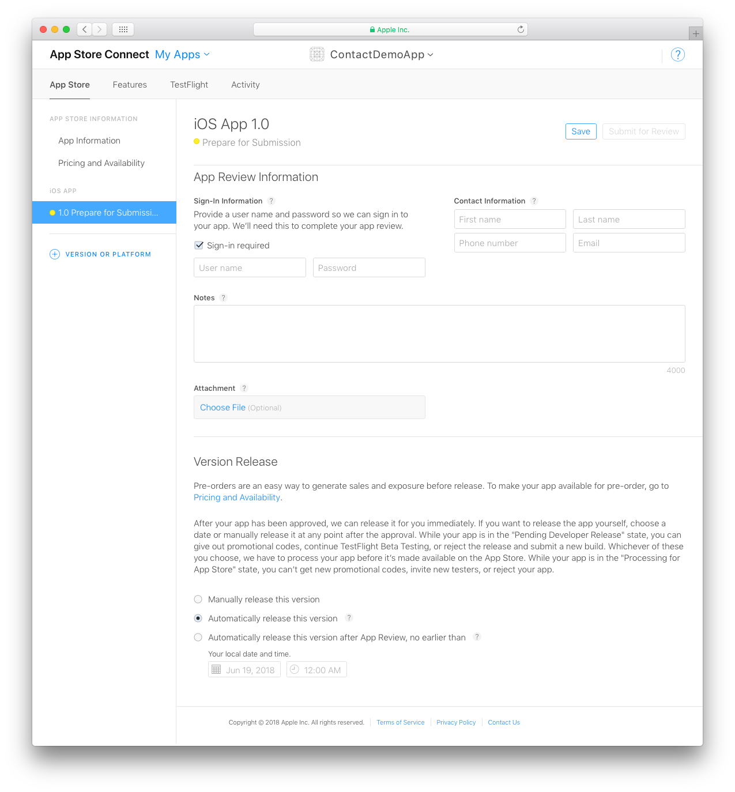

> **OBJECTIVES**
> 
> * Crear un identificador de aplicación en su cuenta desarrollador
> * Create your app in App Store Connect

> **PREREQUISITES**
> 
> * [Apple Developer Program for organization](../tutorials/developer-program/register-apple-developer-program-organization) or
> * [Apple Developer Program as an individual](../tutorials/developer-program/register-apple-developer-program-individual)

## PASO 1. Crear una identificación de aplicación

#### ¿Qué es un identificador de aplicación?

*Un identificador de aplicación es una cadena compuesta de dos partes que se utiliza para identificar una o más aplicaciones de un solo equipo de desarrollo. La cadena consta de un Team ID y de un Bundle ID, con un punto (.) que separa las dos partes (por ejemplo, TeamID.BundleID).*

> **NOTE**
> 
> * If you have chosen an Apple Developer Account as an individual, your account is available immediately and you can create your App ID.
> * If you have chosen an Apple Developer Account as an organization, you must wait for Apple validation to create your App ID.

Para crear su identificador de aplicación, seleccione [Certificates, IDs & Profile](https://developer.apple.com/account/ios/identifier/bundle) desde su cuenta de desarrollador.

* Haga clic en el signo "+" junto a *Register iOS App IDs* para agregar un nuevo identificador de aplicación.

* Defina el nombre y el Bundle ID de su aplicación.

* Defina los servicios de aplicación ("App Services") a incluir en su aplicación

* Confirme su identificador de aplicación haciendo clic en **Register**.

## PASO 2. Inicie sesión en la App Store Connect

* Conéctese a su [cuenta App Store Connect](https://appstoreconnect.apple.com)
* Haga clic en **My Apps**.

## PASO 3. Cree una nueva aplicación iOS

Haga clic en el signo **"+"** en la esquina superior izquierda para crear una nueva aplicación iOS.

Agregue la siguiente información:

* **Platforms**: seleccione iOS.
* **Name**: el nombre de su aplicación.
* **Primary language**: el idioma principal de su aplicación.
* **Bundle ID**: seleccione el Bundle ID de su aplicación de la lista desplegable.
* **SKU**: un identificador único para su aplicación (se mantiene privado y no es visible para los usuarios)
* **Limit User Access (opcional)**: le permite limitar el acceso a su aplicación a los usuarios con roles de administrador, desarrollador, comercial o ventas.

> **NOTE**
> 
> If your Bundle ID is not available, it may already be used by another app in the App Store. You'll need to change yours in your Xcode project.

## PASO 4. Información sobre la aplicación

En App Store Connect > App Information:

* Defina la "Privacy Policy URL" de su aplicación (opcional).
* Introduzca un subtitulo para su aplicación. Aparecerá debajo del nombre de su aplicación en la App Store en iOS 11.
* Seleccione una categoría primaria y secundaria (opcional) en la cual aparecerá su aplicación.

## PASO 5. Precios y disponibilidad

Aquí es donde se define el precio de su aplicación.

> **TIPS**
> 
> You can define limited-time discounts by specifying start and end dates.

## PASO 6. Preparación para la inscripción

En **Version Information**, agregue todos los recursos de su aplicación que desee incluir en la App Store:

> **TIPS**
> 
> Puede generar todas sus capturas de pantalla en el simulador (File > New Screen Shot).

* Añada las capturas de pantalla de su aplicación. Las capturas de pantalla para el iPhone 5.5 "Super Retina Display y iPad 12.9" Retina Display son obligatorias. Para más detalles, ver [Screenshot specifications](https://help.apple.com/app-store-connect/#/devd274dd925).

* Desplácese hacia abajo y defina las **Keywords** (palabras claves) y complete la **Description** (esto es lo que los usuarios verán en la App Store).
* Puede compartir actualizaciones de su aplicación, incluidas nuevas promociones, próximas funcionalidades o contenido, ofertas por tiempo limitado u otros eventos dentro de su aplicación. También agregue un **Promotional Text** que aparecerá arriba de su descripción en la App Store (para clientes con dispositivos que funcionan con iOS 11 o con versiones posteriores).
* Ingrese un **Support URL** que incluya información de soporte para su aplicación. Esta URL estará visible en la App Store.
* **Marketing URL** es opcional. Esto puede dirigir a los usuarios a un sitio web de marketing para su aplicación.

En la sección **iOS App**:

Localice las versiones de su producto en **Build**.

* En el área **General App Information**, ingrese los derechos de autor, la versión y la información de contacto del representante comercial de su aplicación.
* El icono de su aplicación se incluye en el proyecto 4D for iOS generado.
* La calificación ("rating") es una propiedad requerida para los controles parentales de la App Store. Haga clic en Editar y seleccione la categoría de edad apropiada para su aplicación.

Las secciones **App Review Information** y **Version Release** contienen información requerida por la App Store. La información suministrada aquí no será vista por los usuarios.

* **App Review Information**: información de contacto y seguridad confidenciales.
* **Version Release**: especifica una publicación automática o manual.
* Finalmente, haga clic en **Save**.
