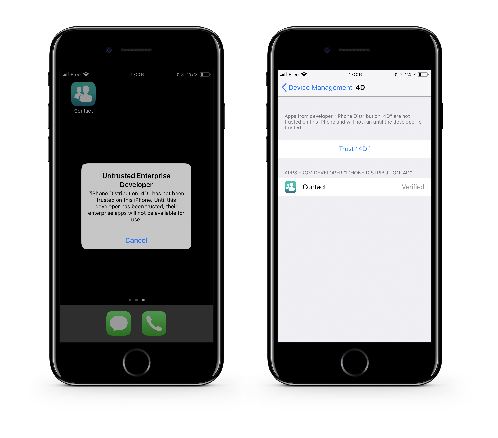

> **OBJECTIVES**
> 
> Upload your app to a secured server.


## PASO 1. Suba su aplicación

Suba su aplicación a un servidor seguro:

* recursos (imagen de visualización e imagen de tamaño completo)
* `manifest.plist` file
* `.ipa` file

Puede utilizar cualquier servicio de almacenamiento en la nube para distribuir su aplicación siempre que esté protegida (Dropbox, Google Drive, etc.).

:::note

Your asset and ipa URLs must match the URLs defined in your `manifest.plist` file.

:::

## PASO 2. Cree el enlace de instalación

Create an **ITMS Serices link** (iTUnes Music Store) with the full web address of your manifest file as a parameter:

```html
itms-services://?action=download-manifest&url=https://mywebserver.com/manifest.plist

```

This link can be used when sending emails, embedded in an html page, or even within a QR code.

Here is a simple example:


*The QR Code used for this documentation is not active.*

## PASO 3. Instale su aplicación en iOS

* Instale la aplicación haciendo clic en el enlace o escaneando un código QR


* Cuando abre por primera vez una aplicación empresarial que instaló manualmente, se mostrará una notificación que indica que el desarrollador de la aplicación no es de confianza en su dispositivo.

* Ignore este mensaje y haga clic en **Cancel**.

* En Reglas > General > Gestión de perfiles & Gestión de dispositivo, en el encabezado "Enterprise App", se lista el perfil del desarrollador.



* Introduzca el nombre del perfil del desarrollador para que sea reconocido como confiable.


* Luego puede ir a su aplicación y abrirla.

Congratulations... you can now distribute your app in-house.
