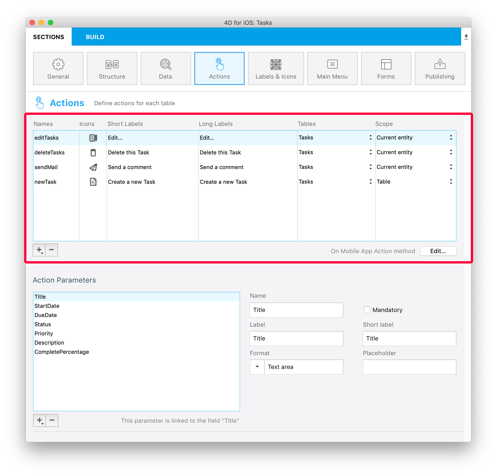
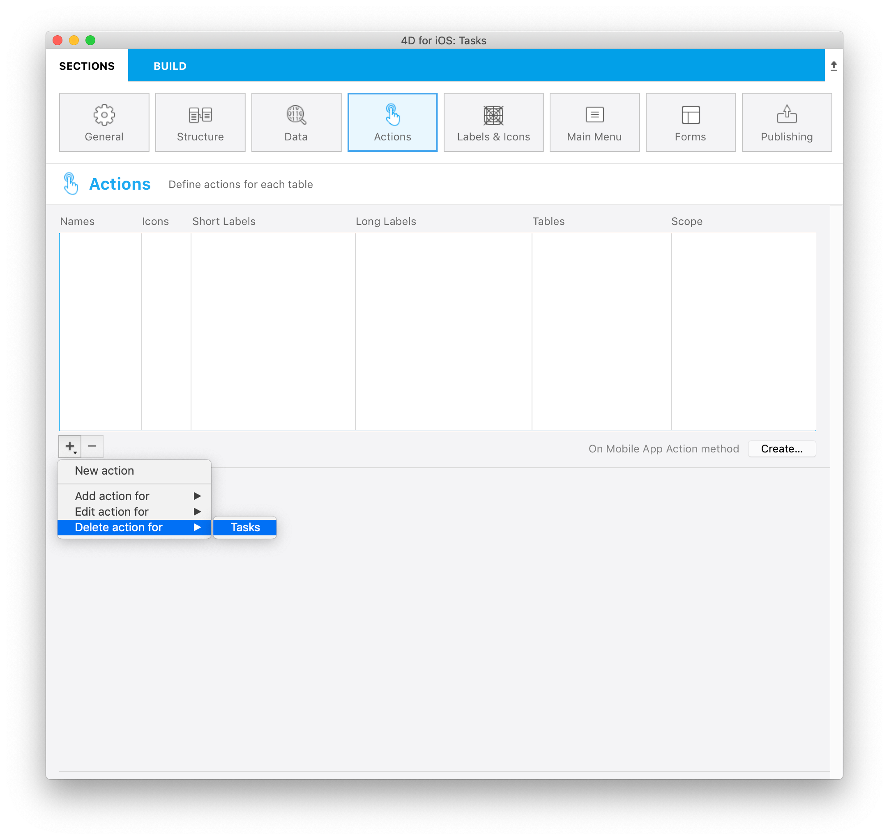

Esta sección le permite:

* crear acciones para ejecutar código 4D desde su aplicación iOS.
* definir y añadir parámetros a sus acciones.

## En el editor de proyectos

### Cree su acción

Puede crear una nueva acción haciendo clic en el botón + en la parte inferior de la tabla Acciones. Aparecerá una nueva línea en la tabla.

A continuación, deberá definir lo siguiente:

* **Nombres:** define el nombre de la acción a utilizar en el método base [On Mobile App Action](https://developer.4d.com/4d-for-ios/docs/en/actions.html#on-mobile-app-action) para lanzar su código 4D.
* **Iconos:** seleccione un icono para su acción de su librería de iconos. También puede agregar su propio icono siguiendo este [tutorial]`(using-icons.html)`.
* **Etiquetas cortas y largas: **las etiquetas para las acciones que se mostrarán en su aplicación.
* **Tabla:** seleccione la tabla en la que desea aplicar la acción.
* **Alcance:** seleccione si desea aplicar la acción en una **entidad** o en una **tabla**.



### Añada parámetros a su acción

Puede añadir los **parámetros de acción** y **editar** datos directamente desde su aplicación.

Para cada parámetro, puede editar las siguientes propiedades:

* Nombre
* Etiqueta larga
* Etiqueta corta
* Formato
* Restricciones de entrada (definir valores mínimos o máximos)
* Placeholder
* Definición de un campo obligatorio
* Valor por defecto


Puede cambiar el orden de los parámetros con solo arrastrar y soltar.

Estos son los diferentes **formatos** que puede seleccionar para un parámetro:

<table>

<tr>
<th colspan="2"  style={{textAlign: 'center'}}>TEXTO</th>
</tr><tr style={{textAlign: 'center'}}>
<th>Formato</th><th>Descripción</th>
</tr><tr>
<td>Texto</td><td>Poner en mayúscula la primera letra de una cadena</td>
</tr><tr>
<td>Correo electrónico</td><td>Teclado iOS optimizado para la entrada de correo electrónico</td>
</tr><tr>
<td>Número de teléfono</td><td>Teclado iOS para ingresar números de teléfono.</td>
</tr><tr>
<td>Cuenta</td><td>Teclado iOS optimizado para la entrada de correo electrónico</td>
</tr><tr>
<td>Contraseña</td><td>Optimizado para manejar contraseñas</td>
</tr><tr>
<td>URL</td><td>Teclado iOS optimizado para la entrada del URL</td>
</tr><tr>
<td>Código postal</td><td>Teclado iOS optimizado para la entrada del código postal</td>
</tr><tr>
<td>Área de texto</td><td>Incluye varias líneas de texto en un solo campo</td>
</tr><tr>
<td>Código de barras</td><td>Extraer el valor asociado al código de barras. Formatos soportados: EAN8, EAN13, Code 39, Code 93, Code 128, QR Code, UPC, PDF417</td>
</tr>
<tr>
<td colspan="2"></td>
</tr>

<tr>
<th colspan="2" style={{textAlign: 'center'}}>NÚMERO</th>
</tr><tr style={{textAlign: 'center'}}>
<th>Formato</th><th>Descripción</th>
</tr><tr>
<td>Número</td><td>Números con decimales</td>
</tr><tr>
<td>Entero</td><td>Números sin decimales</td>
</tr><tr>
<td>Científica</td><td>Notación científica</td>
</tr><tr>
<td>Porcentaje</td><td>Notación en porcentaje</td>
</tr><tr>
<td>Nombre en letras</td><td>Convierte los números en cadenas</td>
</tr>
<tr>
<td colspan="2"></td>
</tr>

<tr>
<th colspan="2" style={{textAlign: 'center'}}>DATE</th>
</tr><tr style={{textAlign: 'center'}}>
<th>Formato</th><th>Descripción</th>
</tr><tr>
<td>Fecha</td><td>Nov 23, 1937</td>
</tr><tr>
<td>Fecha corta</td><td> 11/23/37</td>
</tr><tr>
<td>Fecha larga</td><td>Noviembre 23, 1937</td>
</tr><tr>
<td>Fecha completa</td><td>Martes, 23 de noviembre 1937</td>
</tr><tr>
<td colspan="2"></td>
</tr>

<tr>
<th colspan="2" style={{textAlign: 'center'}}>HORA</th>
</tr><tr style={{textAlign: 'center'}}>
<th>Formato</th><th>Descripción</th>
</tr><tr>
<td>Hora</td><td>3:30 PM</td>
</tr><tr>
<td>Duración</td><td>2 horas 30 minutos</td>
</tr>
<tr>
<td colspan="2"></td>
</tr>

<tr>
<th colspan="2" style={{textAlign: 'center'}}>BOOLEANO</th>
</tr><tr style={{textAlign: 'center'}}>
<th>Formato</th><th>Descripción</th>
</tr><tr>
<td>Booleano</td><td></td>
</tr><tr>
<td>Marca de verificación</td><td></td>
</tr>

<tr>
<td colspan="2"></td>
</tr>
<tr>
<th colspan="2" style={{textAlign: 'center'}}>IMÁGENES</th>
</tr>
<tr>
<td>Firma</td><td>Permitir firmar con el dedo</td>
</tr>

</table>

## Acciones predefinidas

Los proyectos 4D mobile incluyen las siguientes acciones predefinidas para gestionar el contenido de su aplicación:

* Acción de edición
* Acción de añadir
* Acción de eliminar
* Compartir
* Ordenar

### Añadir acción

Los proyectos móviles 4D simplifican el proceso de creación de **acciones de adición**.

Lo único que debe hacer es seleccionar la opción **Acción de adición para**, accesible desde el **botón + ** en la parte inferior de la tabla Acciones.


Luego **seleccione la tabla** que quiere asociar a la acción añadir.

Esto **creará automáticamente** todos los parámetros en el Editor de proyectos. En la aplicación generada, esto le permitirá editar cada valor de campo.

Para ese tipo de acción, verá que todas las **propiedades** ya están completadas para su conveniencia al lado derecho de la lista de parámetros.


### Acción de edición

La creación de **acciones de edición** sigue el mismo proceso que las acciones de adición, con la excepción de que no podrá definir valores predeterminados desde la sección Acciones.


### Acción de eliminación

La creación de **acciones de eliminación ** sigue el mismo proceso que las acciones de edición. La única diferencia es que esta acción le permite eliminar una entidad.

Para crear una acción de eliminación, seleccione la opción **Acción de eliminación para**, accesible desde el **botón + ** en la parte inferior de la tabla Acciones.

Este tipo de acción debe utilizarse con precaución.



### Acción compartir

Selecting the **Share action** will allow your mobile users to share content with other users. You just need to select the scope:

- **entity**: to share content from a detail form
- **table**: to share a list form

See the [Deep Linking](../special-features/deep-linking.md) page for more details.

### Sort action

**Sort actions** are useful to:

- define a default sort order for the table list forms
- allow your mobile users to choose a list sort order

When you create a sort action for a table, you need to select the first field on which the sort will be done:


The field is added to the Sort Criteria list. An ascending sort order is set by default, but you can change it using the **Sort order** menu.

You can sort entities in more than one field. Each field you sort is referred to as a sort level. For example, the results of a two-level ascending sort of the `lastName` and `firstName` fields would produce a list such as this:

```4d
Aardvark, Anthony
Aardvark, Artemis
Aardvark, Arthur
...
Zygote, Elena
Zymosian, Elmer
```

To add one or more sort level(s) in the Sort Criteria list, select the **+** button under the list and configure each level:


#### Sort order menu on the mobile app

When you define more than one sort action for a table, mobile users automatically benefit from a **sort** menu. It contains all the predefined sort actions:


> When only one sort action is defined for a table, the **sort** menu is not displayed on the mobile app side.

### On Mobile App Action

The [On Mobile App Action]`(https://livedoc.4d.com/4D-Language-Reference-17-R5/Database-Methods/On-Mobile-App-Action-database-method.301-4286697.en.html)` database method is available to call all of your 4D methods.

After creating all of your actions, just click on the Create button from the Actions table to automatically generate a *Case of* code block that includes all your action names in the *On Mobile App Action* method.

:::note notes

- You can refresh the selection after executing an action using `$out.dataSynchro:=True`.
- You can notify the app user when action has been executed using `$out.statusText:="Message you want to display"`.
- You can also decide to force close the Edition form using `$out.close:=True`.

:::

## Offline mode actions

The user of an app can draft, store and queue action requests, even if he’s working offline (adding a customer's phone number, uploading a picture, printing an invoice or a quote, deleting an address, etc.).  All these tasks are placed in the Pending actions list until the network is accessible. Once the user is online, all pending actions are consistently synchronized, executed and then visible in the Completed actions list.

Pending tasks can be visualized and opened from:

•   *The Settings screen*

It displays a summary and a history of all pending and completed tasks.


•   *The List & Detail forms*

They display all the tasks related to the table or to the entity that you are currently viewing.


:::note notes

- The "Share" predefined action is only executable online
- Actions are editable while pending, but they can no longer be modified once they switch to the "Completed" mode.

:::

### Update pending tasks that failed

Due to your server business logic, some tasks could be rejected. For mobile users, it is then possible to edit and to retry sending the relevant pending tasks. To do so, you can display a status text describing, in the "Complete" actions history, the reason of the failure. For example, you can reject an action sent by a mobile user to the server and inform him that the operation has failed. In that case, you can set the `success` value to `False` and provide a message in `statusText`, as follows:

 ```4d
 $response:=New object("success"; False; "statusText"; "Operation failed"))
 ```
 You can even add some errors by action parameters for the `alphaField` parameter, for example:

  ```4d
$response.errors:=New collection(New object("parameter"; "alphaField"; "message"; "Alpha field must contains a valide value")
  ```


## iOS app Side

In your iOS app, actions are available in different ways in your List and Detail forms, depending on the templates you select in the Forms section.

### Table List forms

* **Entity action:** Swipe left on a cell to display the available actions in a List form. A "More" button is displayed if you've defined more than three actions per entity.


* **Table actions:** A generic actions button is available in the navigation bar to display a list of available table actions.


:::tip

Actions will be displayed in the same order as defined in the Action section.

:::

### Collection List forms

* **Entity action:** Depending on the template, actions are displayed by clicking on a generic button or by maintaing the pressure on a cell.


* **Table actions:** Like the Table List forms, a generic Actions button is available in the navigation bar to display a list of availble table actions.


### Detail forms

As with Table actions in List forms, a generic Actions button is available in the navigation bar to display all your entity actions in a list.


### Edition forms

If you have created an Edit or an Add action, as soon as you select it from the action list, an **Edition form** will appear.


From here, you can:

* edit all of your fields by selecting them, and
* validate or cancel your modifications using the **Done** or **Cancel** buttons (available in the navigation bar).

For your convenience, the Edition form includes a few **special features**:

* The keyboard type depends on the selected parameter type in the Action section.
* You can go to the next or previous field using the arrow on top of the keyboard.
* The iOS keyboard can be closed by touching anywhere outside of a field.
* Indication is given to the user when a value is not valid.
* The view focuses on empty mandatory fields when the user clicks the Done button.

## Where to go from here?

* A [tutorial]`(actions-getting-started.html)` is available to guide you through the **action definition process**.

* Another [tutorial]`(action-custom-template.html)` will guide you through the **action TAG integration** for custom templates.

* A final [tutorial]`(action-parameters.html)` will guide you through the **action parameters definition**.
