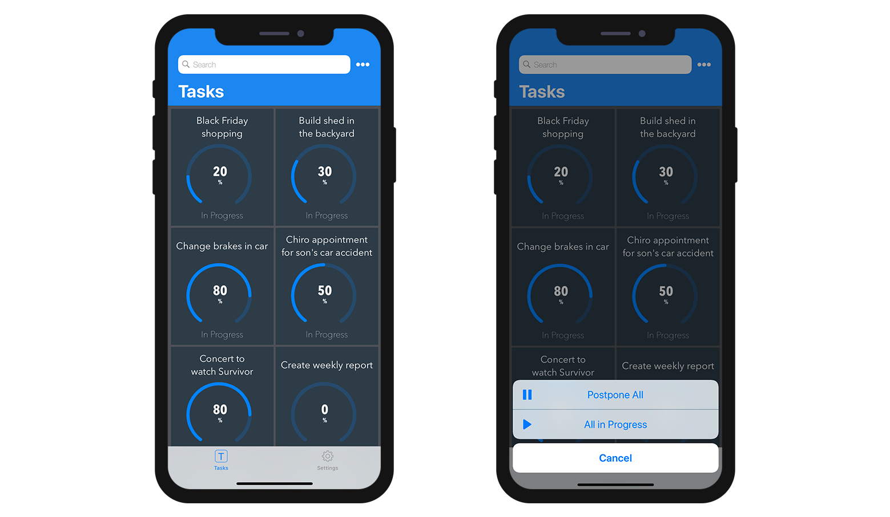

Esta sección le permite:

* crear acciones para ejecutar código 4D desde su aplicación iOS.
* definir y añadir parámetros a sus acciones.

## En el editor de proyectos

### Cree su acción

Puede crear una nueva acción haciendo clic en el botón + en la parte inferior de la tabla Acciones. Aparecerá una nueva línea en la tabla.

A continuación, deberá definir lo siguiente:

* **Nombres:** define el nombre de la acción a utilizar en el método base [On Mobile App Action](https://developer.4d.com/4d-for-ios/docs/en/actions.html#on-mobile-app-action) para lanzar su código 4D.
* **Iconos:** seleccione un icono para su acción de su librería de iconos. También puede agregar su propio icono siguiendo este [tutorial]`(using-icons.html)`.
* **Etiquetas cortas y largas: **las etiquetas para las acciones que se mostrarán en su aplicación.
* **Tabla:** seleccione la tabla en la que desea aplicar la acción.
* **Alcance:** seleccione si desea aplicar la acción en una **entidad** o en una **tabla**.


### Añada parámetros a su acción

Puede añadir los **parámetros de acción** y **editar** datos directamente desde su aplicación.

Para cada parámetro, puede editar las siguientes propiedades:

* Nombre
* Etiqueta larga
* Etiqueta corta
* Formato
* Restricciones de entrada (definir valores mínimos o máximos)
* Placeholder
* Definición de un campo obligatorio
* Valor por defecto


Puede cambiar el orden de los parámetros con solo arrastrar y soltar.

Estos son los diferentes **formatos** que puede seleccionar para un parámetro:

<table>

<tr>
<th colspan="2"  style={{textAlign: 'center'}}>TEXTO</th>
</tr><tr style={{textAlign: 'center'}}>
<th>Formato</th><th>Descripción</th>
</tr><tr>
<td>Texto</td><td>Poner en mayúscula la primera letra de una cadena</td>
</tr><tr>
<td>Correo electrónico</td><td>Teclado iOS optimizado para la entrada de correo electrónico</td>
</tr><tr>
<td>Número de teléfono</td><td>Teclado iOS para ingresar números de teléfono.</td>
</tr><tr>
<td>Cuenta</td><td>Teclado iOS optimizado para la entrada de correo electrónico</td>
</tr><tr>
<td>Contraseña</td><td>Optimizado para manejar contraseñas</td>
</tr><tr>
<td>URL</td><td>Teclado iOS optimizado para la entrada del URL</td>
</tr><tr>
<td>Código postal</td><td>Teclado iOS optimizado para la entrada del código postal</td>
</tr><tr>
<td>Área de texto</td><td>Incluye varias líneas de texto en un solo campo</td>
</tr><tr>
<td>Código de barras</td><td>Extraer el valor asociado al código de barras. Formatos soportados: EAN8, EAN13, Code 39, Code 93, Code 128, QR Code, UPC, PDF417</td>
</tr>
<tr>
<td colspan="2"></td>
</tr>

<tr>
<th colspan="2" style={{textAlign: 'center'}}>NÚMERO</th>
</tr><tr style={{textAlign: 'center'}}>
<th>Formato</th><th>Descripción</th>
</tr><tr>
<td>Número</td><td>Números con decimales</td>
</tr><tr>
<td>Entero</td><td>Números sin decimales</td>
</tr><tr>
<td>Científica</td><td>Notación científica</td>
</tr><tr>
<td>Porcentaje</td><td>Notación en porcentaje</td>
</tr><tr>
<td>Nombre en letras</td><td>Convierte los números en cadenas</td>
</tr>
<tr>
<td colspan="2"></td>
</tr>

<tr>
<th colspan="2" style={{textAlign: 'center'}}>FECHA</th>
</tr><tr style={{textAlign: 'center'}}>
<th>Formato</th><th>Descripción</th>
</tr><tr>
<td>Fecha</td><td>Nov 23, 1937</td>
</tr><tr>
<td>Fecha corta</td><td> 11/23/37</td>
</tr><tr>
<td>Fecha larga</td><td>Noviembre 23, 1937</td>
</tr><tr>
<td>Fecha completa</td><td>Martes, 23 de noviembre 1937</td>
</tr><tr>
<td colspan="2"></td>
</tr>

<tr>
<th colspan="2" style={{textAlign: 'center'}}>HORA</th>
</tr><tr style={{textAlign: 'center'}}>
<th>Formato</th><th>Descripción</th>
</tr><tr>
<td>Hora</td><td>3:30 PM</td>
</tr><tr>
<td>Duración</td><td>2 horas 30 minutos</td>
</tr>
<tr>
<td colspan="2"></td>
</tr>

<tr>
<th colspan="2" style={{textAlign: 'center'}}>BOOLEANO</th>
</tr><tr style={{textAlign: 'center'}}>
<th>Formato</th><th>Descripción</th>
</tr><tr>
<td>Booleano</td><td></td>
</tr><tr>
<td>Marca de verificación</td><td></td>
</tr>

<tr>
<td colspan="2"></td>
</tr>
<tr>
<th colspan="2" style={{textAlign: 'center'}}>IMÁGENES</th>
</tr>
<tr>
<td>Firma</td><td>Permitir firmar con el dedo</td>
</tr>

</table>

## Acciones predefinidas

Los proyectos 4D mobile incluyen las siguientes acciones predefinidas para gestionar el contenido de su aplicación:

* Acción de edición
* Acción de añadir
* Acción de eliminar
* Compartir
* Ordenar

### Añadir acción

Los proyectos móviles 4D simplifican el proceso de creación de **acciones de adición**.

Lo único que debe hacer es seleccionar la opción **Acción de adición para**, accesible desde el **botón + ** en la parte inferior de la tabla Acciones.


Luego **seleccione la tabla** que quiere asociar a la acción añadir.

Esto **creará automáticamente** todos los parámetros en el Editor de proyectos. En la aplicación generada, esto le permitirá editar cada valor de campo.

Para ese tipo de acción, verá que todas las **propiedades** ya están completadas para su conveniencia al lado derecho de la lista de parámetros.


### Acción de edición

La creación de **acciones de edición** sigue el mismo proceso que las acciones de adición, con la excepción de que no podrá definir valores predeterminados desde la sección Acciones.


### Acción de eliminación

La creación de **acciones de eliminación ** sigue el mismo proceso que las acciones de edición. La única diferencia es que esta acción le permite eliminar una entidad.

Para crear una acción de eliminación, seleccione la opción **Acción de eliminación para**, accesible desde el **botón + ** en la parte inferior de la tabla Acciones.

Este tipo de acción debe utilizarse con precaución.


### Acción compartir

La selección de **Compartir acción** permitirá a sus usuarios móviles compartir contenidos con otros usuarios. Sólo tiene que seleccionar el alcance:

- **entidad**: para compartir el contenido de un formulario detallado
- **tabla**: para compartir un formulario lista

Ver la página [Deep Linking](../special-features/deep-linking.md) para más detalles.

### Acción ordenar

**Acciones Ordenar** son útiles para:

- definir un orden por defecto para los formularios lista de la tabla
- permitir a los usuarios móviles elegir el orden de clasificación de la lista

Cuando se crea una acción de ordenación para una tabla, es necesario seleccionar el primer campo sobre el que se realizará la ordenación:


El campo se añade a la lista de criterios de ordenación. Se define un orden ascendente por defecto, pero puede cambiarlo utilizando el menú **Orden de clasificación**.

Puede ordenar las entidades en más de un campo. Cada campo que ordena se denomina como nivel de ordenación. Por ejemplo, los resultados de una ordenación ascendente de dos niveles de los campos `lastName` y `firstName` producirían una lista como esta:

```4d
Aardvark, Anthony
Aardvark, Artemis
Aardvark, Arthur
...
Zygote, Elena
Zymosian, Elmer
```

Para añadir uno o más niveles de ordenación en la lista Criterios de ordenación, seleccione el botón **+** bajo la lista y configure cada nivel:


#### Menú de ordenación en la aplicación móvil

Cuando se define más de una acción de ordenación para una tabla, los usuarios móviles se benefician automáticamente de un menú **de ordenación**. Contiene todas las acciones de ordenación predefinidas:


> Cuando sólo se define una acción de ordenación para una tabla, el menú **ordenación** no se muestra en la parte de la aplicación móvil.

### On Mobile App Action

The [On Mobile App Action](https://livedoc.4d.com/4D-Language-Reference-17-R5/Database-Methods/On-Mobile-App-Action-database-method.301-4286697.en.html) database method is available to call all of your 4D methods.

Después de crear todas sus acciones, simplemente haga clic en el botón Crear de la tabla Acciones para generar automáticamente un bloque de código *Case of* que incluya todos los nombres de sus acciones en el método *On Mobile App Action*.

:::nota notas

- Puede refrescar la selección después de ejecutar una acción utilizando `$out.dataSynchro:=True`.
- Puede notificar al usuario de la aplicación cuando se ha ejecutado una acción utilizando `$out.statusText:="Message you want to display"`.
- También puede decidir forzar el cierre del formulario de edición utilizando `$out.close:=True`.

:::

## Action input controls (for iOS apps only)

### Custom input controls without Swift code
Action input controls display formatted elements (values, pictures, etc.) in your mobile apps. These elements are automatically included in your action form, more specifically in a choice list, in order to select one of the values and to use it as a parameter. These choice lists can be either static or dynamic:
- *Static* choicelists (static json) are located in an 'actionInput' folder (`mybase/Resources/mobile/inputControl`) in a manifest.json file. They are defined by several elements, as follows:

{ "name": "Status", "choiceList": { "0": "KO", "1": "OK" }, "format": "segmented", "type": [ "boolean" ] }

They follow the same logic as [Labels & Icons custom formatters](labels-and-icons.md).

- *Dynamic* choice lists based on datasource. This method enables you to get data very fast by filling a form field using helper modules. Not only will your lists be directly accessible from your mobile app, they will also be constantly updated. For example, if you want to add a client's address on your mobile once you're in their premises, simply select the client's information from your phone contact list and fill the address field in your action form by selecting your position from a map.

"name": "NamesFormatter", "choiceList": { "dataSource": { "dataClass": "TableNameIn4D", "field": "ID" "entityFormat": "%firstname% %lastname%" } "format": "picker", "type": [ "text" ] }

### Custom input controls with Swift code
You can get a custom input control, download some of them from our [gallery](https://4d-go-mobile.github.io/gallery/#/type/input-control) and drop them in an “inputControls” folder (`mybase/Resources/mobile/inputControls`). They will then be available and selectable in the project editor input controls, in the parameter properties section of the action. For example, the phoneControl input control template enables you to select and edit a phone number from your contact list using a picker.


## Acciones en modo sin conexión

El usuario de una aplicación puede redactar, almacenar y poner en cola solicitudes de acción, incluso si está trabajando sin conexión (añadir el número de teléfono de un cliente, subir una foto, imprimir una factura o un presupuesto, borrar una dirección, etc.).  Todas estas tareas se colocan en la lista de acciones pendientes hasta que la red sea accesible. Una vez que el usuario está en línea, todas las acciones pendientes se sincronizan sistemáticamente, se ejecutan y son visibles en la lista de acciones completadas.

Las tareas pendientes pueden visualizarse y abrirse desde:

•   *La pantalla de configuración*

Muestra un resumen y un historial de todas las tareas pendientes y completadas.


•   *La Lista & Formularios detallados*

Muestran todas las tareas relacionadas con la tabla o con la entidad que se está viendo en ese momento.


:::nota notas

- La acción predefinida "Compartir" sólo es ejecutable en línea
- Las acciones son editables mientras están pendientes, pero ya no se pueden modificar una vez que pasan al modo "Completado".

:::

### Actualizar las tareas pendientes que han fallado

Debido a la lógica de negocio de su servidor, algunas tareas podrían ser rechazadas. Para los usuarios de móviles, es posible entonces editar y reintentar el envío de las tareas pendientes correspondientes. Para ello, puede mostrar un texto de estado que describa, en el historial de acciones "Completas", el motivo del fallo. Por ejemplo, puede rechazar una acción enviada por un usuario móvil al servidor e informarle que la operación ha fallado. En ese caso, puede definir el valor de `success` como `False` y poner un mensaje en `statusText`, como se indica a continuación:

 ```4d
 $response:=New object("success"; False; "statusText"; "Operación fallida"))
 ```
 Incluso puede añadir algunos errores por parámetros de acción para el parámetro `alphaField`, por ejemplo:

  ```4d
$response.errors:=New collection(New object("parameter"; "alphaField"; "message"; "El campo Alfa debe contener un valor válido")
  ```


## aplicación iOS

En su aplicación iOS, las acciones están disponibles de diferentes formas en sus formularios listados y detallados, según las plantillas que seleccione en la sección Formularios.

### Formularios Lista en tabla

* **Acción de entidad:** deslice hacia la izquierda en una celda para mostrar las acciones disponibles en un formulario Lista. Se muestra un botón "+" si define más de 3 acciones por entidad.


* **Acciones de tabla:** un botón de acciones genéricas está disponible en la barra de navegación para mostrar una lista de acciones de tabla.


:::consejo

Las acciones se mostrarán en el mismo orden definido en la sección Acción.

:::

### Formularios Lista en colección

* **Acción de entidad:**dependiendo de la plantilla seleccionada, las acciones se muestran al hacer clic en un botón genérico o al mantener el clic en una celda.


* **Acciones de tabla:** como para los formularios Lista en tablas, hay un botón de acciones genérico disponible en la barra de navegación para mostrar una lista de acciones de tabla.



### Formularios detallados

Como para las acciones de tabla en los formularios detallados, un botón de acciones genéricas está disponible en la barra de navegación para mostrar todas sus acciones de entidad en una lista.


### Formularios de edición

Si ha creado una acción de edición o de adición, tan pronto como la seleccione de la lista de acciones, aparecerá un **formulario de edición**.


Desde acá, puede:

* editar todos sus campos seleccionándolos y
* validar o cancelar sus modificaciones con los botones **Listo** o **Cancelar** (disponibles en la barra de navegación).

Para su comodidad, el formulario de Edición incluye algunas **funcionalidades especiales**:

* El tipo de teclado depende del tipo de parámetro seleccionado en la sección Actions.
* Puede ir al campo siguiente o anterior utilizando la flecha en la parte superior del teclado.
* El teclado iOS se puede cerrar tocando cualquier parte fuera de un campo.
* Se le indica al usuario cuando un valor no es válido.
* La vista se centra en los campos obligatorios vacíos cuando el usuario hace clic en el botón Done.

## ¿Qué hacer ahora?

* Un [tutorial]`(actions-getting-started.html)` está disponible para guiarlo a través del **proceso de definición de una acción**.

* Otro [tutorial]`(action-custom-template.html)` lo guiará a través de la **integración TAG de acción** en las plantillas personalizadas.

* Un [tutorial]`(action-parameters.html)` final lo guiará a lo largo de la **definición de los parámetros de una acción**.
