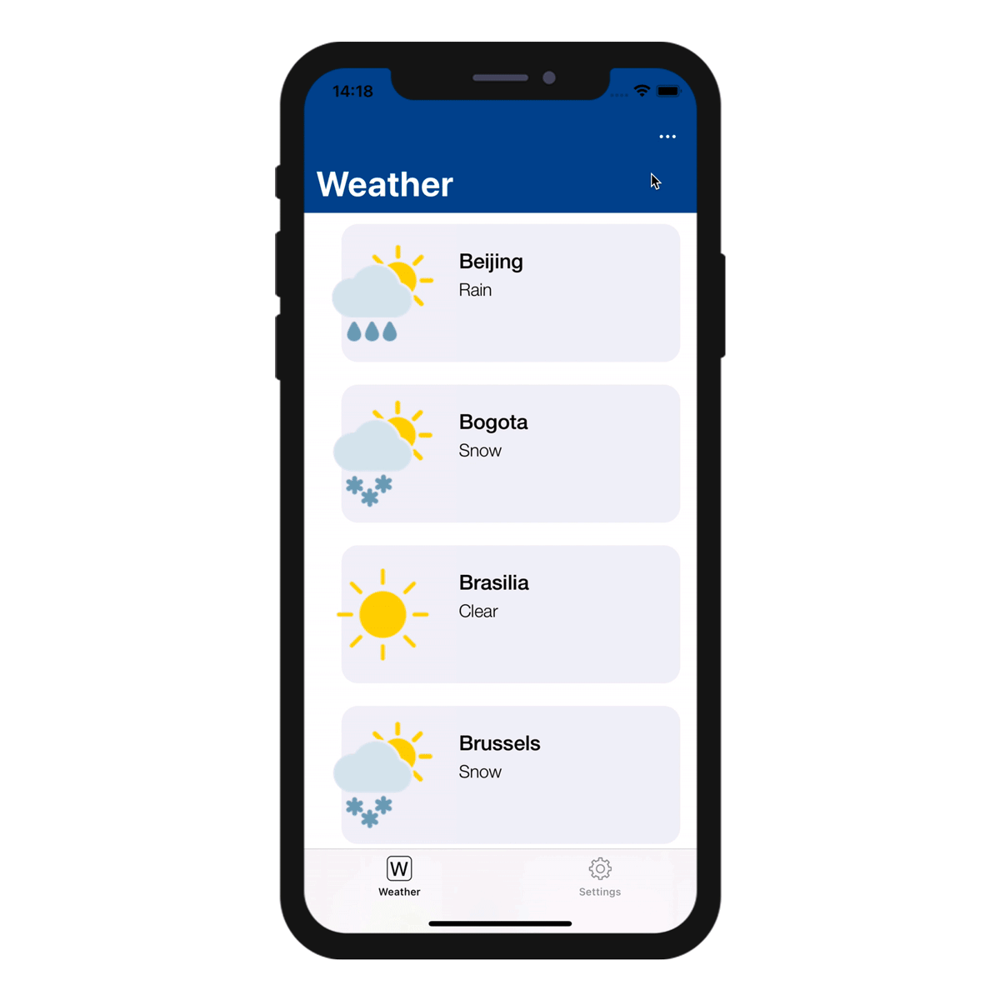

El editor 4D Mobile Project le permite crear acciones para incluir en su aplicación móvil.

Puede utilizar [acciones preestablecidas](#preset-actions) o [acciones personalizadas](../tutorials/actions/define-first-action.md) y [definir sus parámetros](#add-parameters-to-your-actions).

En el lado 4D, puede ejecutar el código 4D en el método base [On Mobile App Action](../4d/on-mobile-app-action.md).

Las acciones están disponibles automáticamente en la [ interfaz móvil](#mobile-app-side).


## En el editor de proyectos

### Cree su acción

Puede crear una nueva acción haciendo clic en el botón + en la parte inferior de la tabla Acciones. Aparecerá una nueva línea en la tabla.

A continuación, deberá definir lo siguiente:

* **Nombres:** define el nombre de la acción a utilizar en el método base [On Mobile App Action](../4d/on-mobile-app-action.md) para lanzar su código 4D.
* **Iconos:** seleccione un icono para su acción de su librería de iconos. You can also [add your own icon](./labels-and-icons.md#adding-custom-icons).
* **Etiquetas cortas y largas: **las etiquetas para las acciones que se mostrarán en su aplicación.
* **Tabla:** seleccione la tabla en la que desea aplicar la acción.
* **Alcance:** seleccione si desea aplicar la acción en una **entidad** o en una **tabla**.


:::nota nota

You can sort the **Names** with a drag-and-drop. This operation will set the order in which they will appear in the app's menu.

:::

### Añada parámetros a su acción

Puede añadir los **parámetros de acción** y **editar** datos directamente desde su aplicación.

Para cada parámetro, puede editar las siguientes propiedades:

* Nombre
* Etiqueta larga
* Etiqueta corta
* [Input control](#built-in-input-controls)
* Mandatory option
* Valor por defecto

Depending on the selected input control, you can define the following additional properties:

* Input constraints (minimum or maximum values)
* Placeholder
* [Data Source](#dynamic-choice-lists)

:::info

By default, the Input Control menu displays **selectionControls**. This is a filter for selection controls, depending on their "format" property. To select a format, you must have [created](#selection-input-controls) at least one selection input control with this format.

:::


Puede cambiar el orden de los parámetros con solo arrastrar y soltar.


## Acciones predefinidas

Los proyectos 4D mobile incluyen las siguientes acciones predefinidas para gestionar el contenido de su aplicación:

* Acción de añadir
* Acción de edición
* Acción de eliminar
* Compartir
* Ordenar
* Open URL

### Añadir acción

Los proyectos móviles 4D simplifican el proceso de creación de **acciones de adición**.

Lo único que debe hacer es seleccionar la opción **Acción de adición para**, accesible desde el **botón + ** en la parte inferior de la tabla Acciones.


Luego **seleccione la tabla** que quiere asociar a la acción añadir.

Esto **creará automáticamente** todos los parámetros en el Editor de proyectos. En la aplicación generada, esto le permitirá editar cada valor de campo.

Para ese tipo de acción, verá que todas las **propiedades** ya están completadas para su conveniencia al lado derecho de la lista de parámetros.


### Acción de edición

La creación de **acciones de edición** sigue el mismo proceso que las acciones de adición, con la excepción de que no podrá definir valores predeterminados desde la sección Acciones.


### Acción de eliminación

La creación de **acciones de eliminación ** sigue el mismo proceso que las acciones de edición. La única diferencia es que esta acción le permite eliminar una entidad.

Para crear una acción de eliminación, seleccione la opción **Acción de eliminación para**, accesible desde el **botón + ** en la parte inferior de la tabla Acciones.

Este tipo de acción debe utilizarse con precaución.


### Acción compartir

La selección de **Compartir acción** permitirá a sus usuarios móviles compartir contenidos con otros usuarios. Sólo tiene que seleccionar el alcance:

- **entidad**: para compartir el contenido de un formulario detallado
- **tabla**: para compartir un formulario lista

Ver la página [Deep Linking](../special-features/deep-linking.md) para más detalles.

### Acción ordenar

**Acciones Ordenar** son útiles para:

- definir un orden por defecto para los formularios lista de la tabla
- permitir a los usuarios móviles elegir el orden de clasificación de la lista

Cuando se crea una acción de ordenación para una tabla, es necesario seleccionar el primer campo sobre el que se realizará la ordenación:


El campo se añade a la lista de criterios de ordenación. Se define un orden ascendente por defecto, pero puede cambiarlo utilizando el menú **Orden de clasificación**.

Puede ordenar las entidades en más de un campo. Cada campo que ordena se denomina como nivel de ordenación. Por ejemplo, los resultados de una ordenación ascendente de dos niveles de los campos `lastName` y `firstName` producirían una lista como esta:

```4d
Aardvark, Anthony
Aardvark, Artemis
Aardvark, Arthur
...
Zygote, Elena
Zymosian, Elmer
```

Para añadir uno o más niveles de ordenación en la lista Criterios de ordenación, seleccione el botón **+** bajo la lista y configure cada nivel:


#### Menú de ordenación en la aplicación móvil

Cuando se define más de una acción de ordenación para una tabla, los usuarios móviles se benefician automáticamente de un menú **de ordenación**. Contiene todas las acciones de ordenación predefinidas:




> Cuando sólo se define una acción de ordenación para una tabla, el menú **ordenación** no se muestra en la parte de la aplicación móvil.

### Acción Open URL

The **Open URL action** allows your mobile users to open an url from their mobile app. This action will display a web page served by 4D Server in a web area from within the mobile app.

When you select this action, you have to define the path that will be opened:


You can only define a path starting with `/`, i.e. relative to the [current 4D web folder](https://developer.4d.com/docs/WebServer/webServerConfig.html#root-folder).

This action can be set for any table and any scope (Table or Current entity). Like other actions, the Open URL action will be automatically available in the [mobile app interface](#mobile-app-side) (short or long label).

:::nota

To close the web page and get back to the mobile app interface, use the `$4d.mobile.dismiss()` function from within the page (see below).

:::

#### Lado del servidor web

The request sent to the server contains the context of the app (current entity and/or dataclass) in the `X-QMobile-Context` header. The content of this header is formatted in JSON and encoded in base64.

:::consejo

You can get the context information already decoded as object using the [**4D Mobile App Server**](https://github.com/4d/4D-Mobile-App-Server#4d-mobile-app-server) component and its [WebHandler class](https://github.com/4d/4D-Mobile-App-Server/blob/main/Documentation/Classes/WebHandler.md).

:::

Context information can be processed in the web page to return through standard 4D web server features:

- [.shtml template pages](https://developer.4d.com/docs/WebServer/templates.html)
- [On Web Connection database method](https://developer.4d.com/docs/WebServer/httpRequests.html#on-web-connection).


#### Web Area Side

For your page to interact with the mobile app, some javascript code is automatically provided in the `$4d.mobile` object. This object contains the following properties and functions:

| Propiedad  |                  |                               | Type     | Descripción                                                                                                                                                      |
| ---------- | ---------------- | ----------------------------- | -------- | ---------------------------------------------------------------------------------------------------------------------------------------------------------------- |
| $4d.mobile | .action          | .name                         | string   | name of the action                                                                                                                                               |
|            |                  | .label                        | string   | label of the action                                                                                                                                              |
|            |                  | .shortlabel                   | string   | short label of the action                                                                                                                                        |
|            | .dismiss()       |                               | Function | closes the native web view                                                                                                                                       |
|            | .status(message) |                               | Function | shows a message in native app for the user <br/>message: string<br/>message: object with "message" (or "statusText") and "success" (or "level") keys |
|            | .logger          | .log(level, message : string) | Function | shows a message in native app for the developer                                                                                                                  |
|            |                  | .info(message : string)       | Function | shows a message in native app for the developer                                                                                                                  |
|            |                  | .info(message : string)       | Function | shows a message in native app for the developer                                                                                                                  |
|            |                  | .warning(message : string)    | Function | shows a message in native app for the developer                                                                                                                  |
|            |                  | .error(message : string)      | Function | shows a message in native app for the developer                                                                                                                  |
|            |                  | .debug(message : string)      | Function | shows a message in native app for the developer                                                                                                                  |
|            |                  | .verbose(message : string)    | Function | shows a message in native app for the developer                                                                                                                  |


:::info See also

Blog post: [4D for Mobile : Display Web Pages in your Mobile Apps](https://blog.4d.com/4d-for-mobile-di…your-mobile-apps/)

:::


### On Mobile App Action

The [`On Mobile App Action`](../4d/on-mobile-app-action.md) database method is available to call all of your 4D methods.

After creating all of your actions, just click on the **Create** button from the Actions table to automatically generate a *Case of* code block that includes all your action names in the *On Mobile App Action* method.

:::nota notas

- You can refresh the selection after executing an action using `$result.dataSynchro:=True`.
- You can notify the app user when action has been executed using `$result.statusText:="Message you want to display"`.
- You can also decide to force close the Edition form using `$result.close:=True`.

:::


## Built-in input controls

Input controls define how information will be entered by the user in the mobile app, and also how it will be rendered. The Project editor provides basic input controls for regular data types. These controls are built-in and can be directly selected in the "Input Control" menu.

You can also define [custom input controls](#custom-input-controls) (see below).

Available built-in input controls depend on the data type:

| Data type | Input controls        | Descripción                                                                                                                       |
| --------- | --------------------- | --------------------------------------------------------------------------------------------------------------------------------- |
| Texto     | Default               | Poner en mayúscula la primera letra de una cadena                                                                                 |
|           | Mail Address          | Optimized keyboard for email entry                                                                                                |
|           | Número de teléfono    | Keypad for entering telephone numbers                                                                                             |
|           | Cuenta                | Optimized keyboard for username entry                                                                                             |
|           | Contraseña            | Optimizado para manejar contraseñas                                                                                               |
|           | URL                   | Optimized keyboard for URL entry                                                                                                  |
|           | Código postal         | Optimized keyboard for zip code entry                                                                                             |
|           | Área de texto         | Incluye varias líneas de texto en un solo campo                                                                                   |
|           | Código de barras      | Extraer el valor asociado al código de barras. Formatos soportados: EAN8, EAN13, Code 39, Code 93, Code 128, QR Code, UPC, PDF417 |
| Número    | Default               | Números con decimales                                                                                                             |
|           | Entero                | Números sin decimales                                                                                                             |
|           | Científica            | Notación científica                                                                                                               |
|           | Porcentaje            | Notación en porcentaje                                                                                                            |
|           | Nombre en letras      | Convierte los números en cadenas                                                                                                  |
| Fecha     | Default               | Nov 23, 1937                                                                                                                      |
|           | Fecha corta           | 11/23/37                                                                                                                          |
|           | Fecha larga           | Noviembre 23, 1937                                                                                                                |
|           | Fecha completa        | Martes, 23 de noviembre 1937                                                                                                      |
| Hora      | Default               | 3:30 PM                                                                                                                           |
|           | Duración              | 2 horas 30 minutos                                                                                                                |
| Booleano  | Default               | Convierte los números en cadenas                                                                                                  |
| Hora      | Default               | 3:30 PM                                                                                                                           |
|           | Duración              | 2 horas 30 minutos                                                                                                                |
| Hora      | Default               |     |
|           | Marca de verificación |      |
| Imagen    | Default               |                                                                                                                                   |
|           | Firma                 | Permitir firmar con el dedo                                                                                                       |


## Custom input controls

You can add custom input controls to your mobile project to highly customize interactions with the user. There are two categories of custom input controls:

- [**selection**](#selection-input-controls) - used to display a list of values to select (static or dynamic).
- [**action**](#action-input-controls) - contains Swift ot Kotlin code and can do any relevant action.

You can create custom input controls for both categories. Note that you can also download **action** input controls from the [Input control Github gallery](https://4d-go-mobile.github.io/gallery//#/type/input-control).

### Defining custom input controls

A custom input control is associated to a `**manifest.json**` file and (optionally) Swift or Kotlin source code. The custom input control files must be stored into a subfolder at the following location:

`myProject/Resources/Mobile/inputControls/`

The `manifest.json` file contains different attributes such as **name** and **type**, depending on the input control type (see below).


### Selection input controls

Selection input controls display formatted elements (values, pictures) in your mobile apps. These elements are automatically included in your action form, more specifically in a choice list, in order to select one of the values and to use it as a parameter.

These choice lists can be either **static** or **dynamic**.

#### Static choice lists

**Static** choice lists (predefined choices hard coded in json) must be located in a [`manifest.json` file in the "inputControls" folder](#defining-custom-input-controls). They are defined by several elements, as follows:

| Propiedad              |            | Type               | Descripción                                                                                                                                           |
| ---------------------- | ---------- | ------------------ | ----------------------------------------------------------------------------------------------------------------------------------------------------- |
| **"name"**             |            | texto              | action input control name                                                                                                                             |
| Optional **"binding"** |            | texto              | "imageNamed" to bind on images (Images must be in a subfolder "images" in the action formatter folder)                                                |
| **"choiceList"**       |            | object             | an object or collection to define a list of key(data sent to server)/value(displayed value to the user)                                               |
| **"type"**             |            | text or collection | one text or a collection of text to define a type (text, integer, boolean) of input control                                                           |
| Optional **"format"**  |            | texto              | to select interface: "push" (default if not defined), "segmented", "popover", "sheet", "picker"                                                       |
| Optional **"assets"**  |            | object             | to adjust the display size (width and height)                                                                                                         |
|                        | **"size"** | object or integer  | if integer, pass a single value to create a square image; if object, pass the following attributes: <li>"width" (integer)</li><li>"height" (integer)</li> |


Here is an example of a manifest.json file containing the contact information of a company's subsidiaries, that can be used as a static choice list:

```json
{
    "name": "choiceListSheet",
    "type": [
        "text"
     ],
    "format": "sheet",
    "choiceList": {
        "1":"Paris",
        "2":"Tokyo",
        "3":"Sydney",
        "4":"San Jose",
        "5":"Rabat",
        "6":"Eching"
     }
}
```

#### Dynamic choice lists

**Dynamic** choice lists are based on datasource (choices depending on the database content). This method enables you to get data very fast by filling a form field using helper modules. Not only will your lists be directly accessible from your mobile app, they will also be constantly updated. The [`manifest.json` file](#defining-custom-input-controls) is composed of the following elements:

| Propiedad             | Type               | Descripción                                                                                     |
| --------------------- | ------------------ | ----------------------------------------------------------------------------------------------- |
| **"name"**            | texto              | input control name                                                                              |
| **"choiceList"**      | object             | an object that contains "dataSource" (see table below)                                          |
| **"type"**            | text or collection | one text or a collection of text to define a type (text, integer, boolean) of input control     |
| Optional **"format"** | texto              | to select interface: "push" (default if not defined), "segmented", "popover", "sheet", "picker" |

| Propiedad        |                             | Type                       | Descripción                                                                                                                                                                      |
| ---------------- | --------------------------- | -------------------------- | -------------------------------------------------------------------------------------------------------------------------------------------------------------------------------- |
| **"dataSource"** |                             | object                     | an object that contains "dataClass", "field" and optional "entityFormat"                                                                                                         |
|                  | **"dataClass"**             | texto                      | table name                                                                                                                                                                       |
|                  | **"field"**                 | texto                      | used to extract data to send to server                                                                                                                                           |
|                  | Optional **"sort"**         | object / collection / text | (sort order ascending by default) can be an object that contains **"field"**(sort criteria/fieldName), and optional **"order"**; or a collection of field names; or a field name |
|                  | Optional **"search"**       | boolean / array            | can be an array that contains field to use for search                                                                                                                            |
|                  | Optional **"entityFormat"** | texto                      | for the display value (if no format we use the extracted data from field)                                                                                                        |

**Note:** When the choice list is extensive, the optional "search" element becomes available.

Here is an example of a dynamic choice list:

```json
{
    "name": "datasourcePush"
    "type": [
        "text"
    ],
    "format":"push",

    "choiceList": {
        "dataSource": {
            "dataClass": "Contact",
            "field": "LastName",
            "entityFormat": "%FirstName% %LastName% - %Job%",
            "search": "LastName",
            "sort": {"field": "LastName", "order":"descending"} 
        }
    }
}
```


On the Project editor side, once you select your **Input control** format, the **Data Source** will be selectable from a filtered list based on the format you have selected. Your app will then be updated and ready-to-use!

The various formats are illustrated in this animation:


### Action input controls

You can easily interact with native apps by using custom input controls, which follow the same logic as [Labels & Icons custom formatters](labels-and-icons.md) with native code.

To do so, you can create your own input controls with native code, or you can download input controls from our [Github gallery](https://4d-go-mobile.github.io/gallery/#/type/input-control), depending on what you need for your app. Drop them into the "inputControls" folder (`mybase/Resources/mobile/inputControls`). They will then be available and selectable from the project editor input controls menu, in the parameter properties of the action.

The [`manifest.json` file](#defining-custom-input-controls) is composed of the following attributes:

| Propiedad                   | Type               | Descripción                                                                                                                              |
| --------------------------- | ------------------ | ---------------------------------------------------------------------------------------------------------------------------------------- |
| **"name"**                  | texto              | input control name                                                                                                                       |
| Optional **"inject"**       | boolean            | "inject" to indicate that when generating the app with this formatter, some source code in Sources must be injected in the final project |
| **"type"**                  | text or collection | one text or a collection of text to define a type (text, integer, boolean) of input control                                              |
| Optional **"capabilities"** | object             | capabilities elements to add some information, some optional according to the needs (map, photo, location, etc.)                         |
| **"target"**                | text or collection | he platform supported by your input control ("ios", "android")                                                                           |

For example, if you want to get a client's phone number from your mobile contact list, the *phoneContact* input control template enables you to automatically fill your client's phone number field.

 

Bear in mind that all input controls from the gallery are open source and available on Github. So feel free to share your own input controls or your feedback on the [4D Forum](https://discuss.4d.com/).

:::info

An example of Kotlin input control definition is provided in [this tutorial](../tutorials/actions/create-kotlin-input.md).

:::


## Acciones en modo sin conexión

The user of an app can draft, store and queue action requests, even if they are working offline (adding a customer's phone number, uploading a picture, printing an invoice or a quote, deleting an address, etc.). Todas estas tareas se colocan en la lista de acciones pendientes hasta que la red sea accesible. Una vez que el usuario está en línea, todas las acciones pendientes se sincronizan sistemáticamente, se ejecutan y son visibles en la lista de acciones completadas.

Las tareas pendientes pueden visualizarse y abrirse desde:

•   *La pantalla de configuración*

Muestra un resumen y un historial de todas las tareas pendientes y completadas.


•   *La Lista & Formularios detallados*

Muestran todas las tareas relacionadas con la tabla o con la entidad que se está viendo en ese momento.


:::nota notas

- La acción predefinida "Compartir" sólo es ejecutable en línea
- Las acciones son editables mientras están pendientes, pero ya no se pueden modificar una vez que pasan al modo "Completado".

:::

### Actualizar las tareas pendientes que han fallado

Debido a la lógica de negocio de su servidor, algunas tareas podrían ser rechazadas. Para los usuarios de móviles, es posible entonces editar y reintentar el envío de las tareas pendientes correspondientes. Para ello, puede mostrar un texto de estado que describa, en el historial de acciones "Completas", el motivo del fallo. Por ejemplo, puede rechazar una acción enviada por un usuario móvil al servidor e informarle que la operación ha fallado. En ese caso, puede definir el valor de `success` como `False` y poner un mensaje en `statusText`, como se indica a continuación:

```4d
 $response:=New object("success"; False; "statusText"; "Operación fallida"))
```

 Incluso puede añadir algunos errores por parámetros de acción para el parámetro `alphaField`, por ejemplo:

```4d
$response.errors:=New collection(New object("parameter"; "alphaField"; "message"; "El campo Alfa debe contener un valor válido")
```


## Mobile app Side

In your mobile app, actions are available in different ways in your List and Detail forms, depending on the templates you select in the Forms section.

### Formularios Lista en tabla

* **Acción de entidad:** deslice hacia la izquierda en una celda para mostrar las acciones disponibles en un formulario Lista. Se muestra un botón "+" si define más de 3 acciones por entidad.


* **Acciones de tabla:** un botón de acciones genéricas está disponible en la barra de navegación para mostrar una lista de acciones de tabla.


:::consejo

Las acciones se mostrarán en el mismo orden definido en la sección Acción.

:::

### Formularios Lista en colección

* **Acción de entidad:**dependiendo de la plantilla seleccionada, las acciones se muestran al hacer clic en un botón genérico o al mantener el clic en una celda.


* **Acciones de tabla:** como para los formularios Lista en tablas, hay un botón de acciones genérico disponible en la barra de navegación para mostrar una lista de acciones de tabla.


### Formularios detallados

Como para las acciones de tabla en los formularios detallados, un botón de acciones genéricas está disponible en la barra de navegación para mostrar todas sus acciones de entidad en una lista.


### Formularios de edición

Si ha creado una acción de edición o de adición, tan pronto como la seleccione de la lista de acciones, aparecerá un **formulario de edición**.


Desde acá, puede:

* editar todos sus campos seleccionándolos y
* validar o cancelar sus modificaciones con los botones **Listo** o **Cancelar** (disponibles en la barra de navegación).

Para su comodidad, el formulario de Edición incluye algunas **funcionalidades especiales**:

* El tipo de teclado depende del tipo de parámetro seleccionado en la sección Actions.
* Puede ir al campo siguiente o anterior utilizando la flecha en la parte superior del teclado.
* The keyboard can be closed by touching anywhere outside of a field.
* Se le indica al usuario cuando un valor no es válido.
* La vista se centra en los campos obligatorios vacíos cuando el usuario hace clic en el botón Done.

## ¿Qué hacer ahora?

See [this tutorial](../tutorials/actions/getting-started.md) that will guide you through the **action definition process**.

See [this tutorial](../tutorials/actions/create-kotlin-input.md) for an example of custom **Kotlin input control definition**.