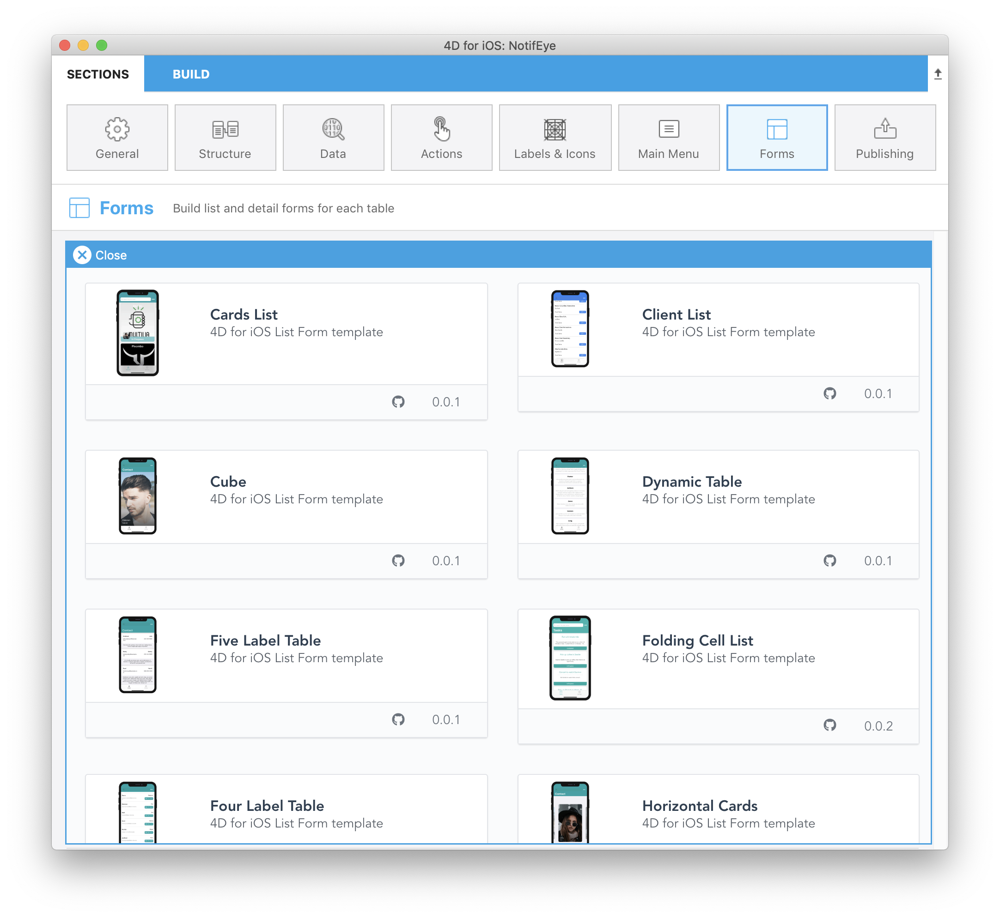
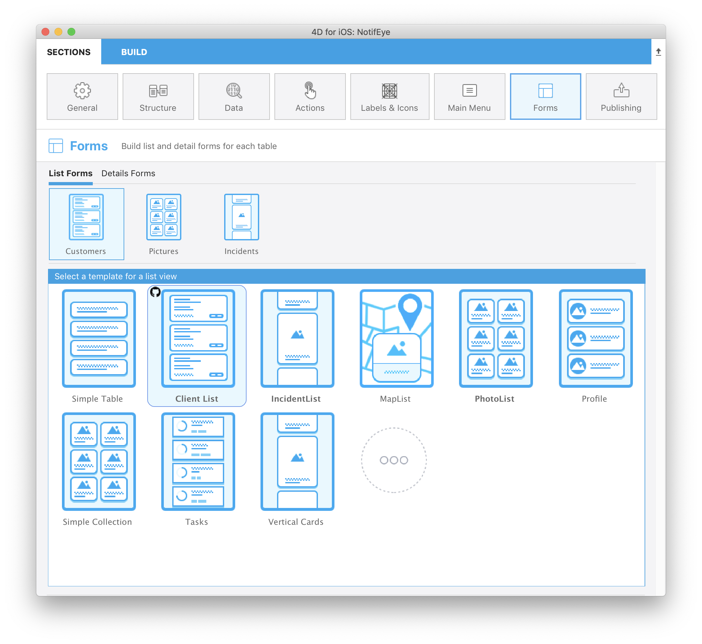

La página Formularios le permite seleccionar ambos formularios Lista y detallados para cada tabla publicada. Puede seleccionar un formulario lista y un formulario detallado por tabla publicada.

El editor de 4D mobile ofrece varias plantillas con efectos de transición personalizados para generar aplicaciones móviles nuevas y modernas. Simple, las plantillas vacías se utilizan de forma predeterminada para los formularios Lista y los formularios de detallados de una aplicación.

Aquí está el desglose de esta pantalla, de arriba a abajo:

* **Formularios Lista/Formularios detallados:** permiten cambiar entre los formulario Lista y los formularios detallados para cada tabla.
* **Las tablas publicadas:** muestra todas las tablas publicadas en la sección [Estructura](structure.md).
* **Formularios:** lista de formularios disponibles. Permite cambiar entre la selección de la plantilla y la definición del contenido. En el área de definición del contenido, puede mostrar consejos que den información adicional sobre los campos del formulario.

## Formularios lista

Cuando se selecciona una plantilla de formulario lista para una tabla, aparece la pantalla de definición del contenido. Luego puede arrastrar y soltar los campos de la lista directamente en la plantilla que se muestra a la derecha.

:::nota

En formularios lista, no se pueden añadir más campos que los incluidos en la plantilla.

:::

La mayoría de los formularios lista incluyen los campos opcionales **Búsqueda** y **Sección**. También puede activar el **escáner de códigos de barras**.

### Buscar

Un campo **búsqueda** permite filtrar dinámicamente el contenido de la lista en función de los caracteres introducidos.

#### Búsqueda multicriterios

Puede soltar más de un campo en el campo de búsqueda, en cuyo caso el campo muestra "Búsqueda multicriterio":

En este caso, la aplicación buscará los caracteres introducidos en todos los campos utilizando el operador "OR". Para eliminar un campo de la lista, haga clic en el botón de eliminación del campo de búsqueda para seleccionar el campo o los campos a eliminar:

### Sección

Un campo sección agrupará y ordenará las entidades en la lista dependiendo de su valor para este campo.

### Escáner de código de barras

Para activar la búsqueda por código de barras, haga clic en la lupa situada junto al campo de búsqueda y seleccione la opción **Activar escáner de código de barras**.

La búsqueda de códigos de barras permite dos funcionalidades:

* Filtrar el formulario lista escaneando un código de barras que contiene un valor texto. Esto llena la barra de búsqueda y abre el formulario detallado si sólo queda un valor después de filtrar.
* Mostrar formularios específicos listados y detallados con sólo escanear un código de barras cuyos valores son **Esquemas URL** o **Enlaces Universales** cuando la funcionalidad [**deep linking**](../special-features/deep-linking.md) está activa.

:::información 4D for Android

This feature is currently not available in 4D for Android.

:::

## Formularios detallados

Al igual que con la definición del Formulario Lista, seleccione una plantilla y configure los campos. En formularios detallados, puede añadir tantos campos como desee en su formulario detallado.

Tiene varias formas de añadir sus campos en los formularios detallados:

* Arrastrar y soltar un campo en cualquier lugar de la vista más a la derecha para agregarlo y mostrarlo justo después del último campo añadido o entre cualquier otro campo que ya se muestre.

* Doble clic en un campo. Su campo se agregará al final de la lista.

* Haga clic derecho en un campo disponible en la tabla Campos de la izquierda y seleccione **Añadir campos que faltan** en el menú contextual.

Puede reordenar sus campos en cualquier momento mediante la función de arrastrar y soltar en el formulario detallado.

:::consejo

Si quiere probar otra plantilla después de despachar sus campos, sólo tiene que seleccionarla: los campos previamente seleccionados se trasladan automáticamente por usted a la nueva plantilla en las áreas apropiadas, según la plantilla y los tipos de campo.

:::

## Galería

Cuando selecciona una plantilla en la sección de formularios, el icono "Más" está disponible tanto para los formularios lista como para los detallados.

Basta con hacer clic en ese icono para que aparezca una lista de plantillas adicionales de la Galería 4D mobile:

Entonces, lo único que tiene que hacer es seleccionar la plantilla que se adapte a sus necesidades y el editor móvil se encargará de todo el proceso de instalación. Por lo tanto, puede comenzar a trabajar directamente en la plantilla, ya que está lista para usar.

Se muestra un icono github en la parte superior izquierda de un icono de plantilla en el selector de plantillas Forms para indicar que viene de Github:

:::consejo

La Galería también está disponible directamente en Github.
- [**galería de plantillas de formularios lista**](https://4d-for-ios.github.io/gallery/#/type/list-detail/picker/0)
- [**galería de plantillas de formularios detallados**](https://4d-for-ios.github.io/gallery/#/type/form-detail/picker/0)

:::

## Crear sus propias plantillas

Si desea personalizar una plantilla descargada o crear sus propias plantillas, **varios tutoriales** pueden guiarle en estas tareas:

- [**Personalización de una plantilla de formulario**](../tutorials/gallery/update-gallery-template.md)
- [**Creación de formularios Lista**](../tutorials/creating-list-forms/list-form-template.md)
- [**Creación de formularios detallados**](../tutorials/creating-detail-forms/detail-form-template.md)