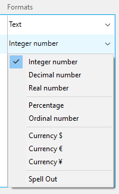

Esta página le permite definir las propiedades de visualización de sus tablas, campos y relaciones en la aplicación móvil.


Se definen las propiedades por defecto. Para modificar una propiedad, seleccione un elemento e introduzca el nuevo valor en la columna correspondiente.

Puede definir las mismas propiedades para las tablas, los campos y las relaciones. Además, se pueden definir formatos para los campos/relaciones.

Estos elementos se mostrarán en formularios detallados y en formularios listados, dependiendo de la plantilla en la aplicación generada.


## Iconos

Icono para asociar a la tabla o campo/elemento en la aplicación móvil cada vez que una plantilla requiera un icono.

:::info

Para los campos de relación, se mostrarán iconos a la izquierda del botón **Relación** que permite abrir una tabla relacionada.

:::

El editor de 4D mobile ofrece una amplia librería de iconos para satisfacer sus necesidades. Estos incluyen iconos para negocios, finanzas, educación, gobierno, salud, industria, bienes raíces, servicios, etc. To select an icon, click on the **icon** button and choose an icon from the list:


:::info

To keep everything consistent, **default icons** are generated for blank fields if at least one icon has been defined for a field.

:::

You can also leave the icon area empty if you don’t want to display icons in your application.


### Adding custom icons

You can add your own icons to the library, so that you can select them in your project. You can use any icon format (SVG or PNG is recommended to preserve transparency) and size. It's highly recommended having colored versions of your custom icons to better visualize them in the project editor.

For example, here are a set of custom icons that you can use:

<div className="center-button">
<a
  className="button button--primary"
  href="https://github.com/4d-go-mobile/tutorial-CustomIcons/releases/latest/download/tutorial-CustomIcons.zip">
  Download custom icons
</a>
</div>

To include custom icons in your project:

1. Create an `icons` folder at the following location:

```
<my4DProjetFolder>/Resources/Mobile/medias
```

:::nota

Puede que tenga que crear la carpeta `medias`.

:::

2. Drag and drop your customized icons in the `icons` folder.


Your icons can now be selected for your project, they are listed after the standard icons.


## Short and long labels

You can define custom labels for published tables, fields, and relations. These labels will be automatically used according to the available space in the template to optimize space and avoid overcrowding the tab bar.

:::info

For relation fields, labels will be displayed in the **Relation** button that allows to open a related table.

:::

- Short labels should have 10 characters or less
- Long labels can have up to 25 characters
- You can use characters that are not allowed in structure names, such as "/","@", the space character, etc.

By default, the mobile editor uses the table and field names as defined in the structure as labels in the app, and the same string is used for short and long labels.


## Formats

This property allows you to format the data to display in the app. When you click on a field row, a format menu is displayed.



Available built-in formats depend on the field type:

| Field type         | Formats                                                                                                                |
| ------------------ | ---------------------------------------------------------------------------------------------------------------------- |
| **Texto**          | Texto                                                                                                                  |
| **Fecha**          | Date, Short date, Long date, Full date                                                                                 |
| **Hora**           | Time, Short time, Duration, Integer number                                                                             |
| **Image**          | Image                                                                                                                  |
| **Booleano**       | "No" or "Yes", "False" or "True"                                                                                       |
| **Integer number** | Integer number, Decimal number, Real number, Percentage, Ordinal number, Currency $, Currency €, Currency ¥, Spell Out |


### Adding custom formats

The mobile editor allows you to add customized formats (called "formatters") in your projects. For example, you can define custom formats for emails, invoice numbers, etc.

To add custom formats to your mobile project, you can:

- Download and install customized formats from the [**go-mobile formatters github repository**](https://4d-for-ios.github.io/gallery/#/type/formatter/picker/0).

- Create your own formats.

:::tip tutorial

Visit [**this tutorial**](../tutorials/data-formatter/create-data-formatter) to know how to define a custom format

:::

To install a custom formatter, you just need to drop the formatter folder into the `/Resources/Mobile/formatters` of the 4D project folder. Once installed, a custom format can be selected from the Formats menu, just like a built-in formats.


## Título

This property is only available for Relation fields. The defined title will be displayed on top of the destination view when using a relation.

Use a pair of `%` characters to include the value of the related field in the title. For example, if you want that the title of the `Employee.employer` related field displays the name of the related `employee` field, you can write:

```
%Name%'s employer
```

:::tip tutorial

A [**tutorial**](../tutorials/relations/one-to-many-title-definition) is available to guide you through the Title definition process.

:::
