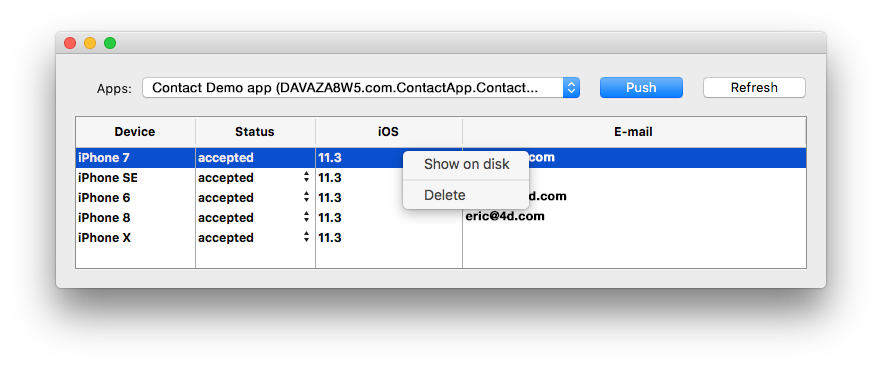

4D for iOS and 4D for Android allow you to manage user sessions, so that you can get information about the connected users and improve their experience on your mobile application.


## Archivo de sesión

When a user opens the app for the first time, a session file is automatically created and stored next to the current data file in the MobileApps folder.

Los archivos de sesión están organizados y agrupados por carpeta de aplicación. Los TeamID y Bundle ID de la aplicación se concatenan para crear los nombres de las carpetas de la aplicación.

Este es un ejemplo de un archivo de sesión generado para 4D for iOS:

```json
{
"application":{
  "id":"com.contactApp.Contact",
  "name":"Contact",
  "version":"1.0.0"
},
"team":{
  "id":"UTT7VDX8W5"
},
"language":{
  "id":"en_US",
  "code":"en",
  "region":"US"
},
"email":"",
"device":{
  "description":"iPhone X",
  "version":"11.3",
  "id":"0DC5132E-1EF4-407C-A832-5FE33D818AF3",
  "simulator":true
},
"send":"link",
"session":{
  "id":"7023d9205074199d1c16fc00d24354e778137675",
  "ip":"::ffff:192.168.5.4"
},
"status":"accepted",
"token":"eyJhcHBOYW1lSUQiOiJjb20uY29udGFjdEFwcC5Db250YWN0IiwiaWQiOiI3MDIzZDkyMDUwNzQxOTlkMWMxNmZjMDBkMjQzNTRlNzc4MTM3Njc1IiwidGVhbUlEIjoiVVRUN1ZEWDhXNSJ9"
}

```

By default, the "status" is automatically set to "accepted" if the session is validated by the [On Mobile App Authentication](../4d/on-mobile-app-authentication.md) database method (`$result.success` set to `True`). If you want the ability to manually validate the first login for every user session, add `$result.verify:=True` to the object returned by the [On Mobile App Authentication](../4d/on-mobile-app-authentication.md) database method. It will change the "accepted" default status to "pending" in the session file. For more information, see [this example](../special-features/authentication#without-the-component).


## Session object

Mobile sessions can take advantage of the powerful [4D user sessions](https://developer.4d.com/docs/en/WebServer/sessions.html), when they are enabled on the server. In this case, information stored in the [mobile session file](#session-file) is used to fill the [Session object](https://developer.4d.com/docs/en/API/SessionClass.html) on the server, so that you could share a cart for the same user between their web and mobile sessions, for example.

On the mobile project, the [Session object](https://developer.4d.com/docs/en/API/SessionClass.html) is automatically available from:

- the [On Mobile App Authentication](../4d/on-mobile-app-authentication.md) database method
- the [On Mobile App Action](../4d/on-mobile-app-action.md) database method
- [webareas](https://github.com/mesopelagique/form-detail-WebArea) in your forms.

With user sessions, you can access and display user data through [4D tags](https://developer.4d.com/docs/en/Tags/tags.html) in [webareas](https://github.com/mesopelagique/form-detail-WebArea). For example, in a page.shtml form, you can write:

```html
<html><body><h1>You use the following address: <!--#4DTEXT Session.info.mobile.email--> </h1></body></html>
```


## Componente Mobile Session Management

Las sesiones pueden ser gestionadas por el componente **Gestión de sesiones móviles**:

<div>
<a className="button button--primary"
href="https://github.com/4d/Mobile-Session-Management/releases/latest">Componente Mobile Session Management</a>
</div>

1. Descargue y descomprima el archivo zip
2. Vaya al archivo Generar / Componentes y obtenga el archivo MOBILE SESSION MANAGEMENT.4dbase
3. Cree una carpeta **Componentes** junto al proyecto 4D con los datos de la aplicación.
4. Coloque el componente **MOBILE SESSION MANAGEMENT** en la carpeta **Componentes** recién creada.
5. Reinicie 4D.
6. Haga clic en el botón **Ejecutar** de la barra de herramientas
7. En el explorador de métodos 4D, seleccione el método **MOBILE SESSION MANAGEMENT** y haga clic en el botón **Ejecutar**.
8. La ventana de aplicaciones aparecerá mostrando todas sus aplicaciones:


* Haga clic derecho en una sesión para mostrar el archivo sesión en el Finder o elimínelo.
* Puede cambiar y definir el estado de la sesión para cada dispositivo: aceptado o pendiente




* El botón **Push** actualizará la sesión en la memoria.
* El botón **Refresh** actualiza la lista de sesiones. 


