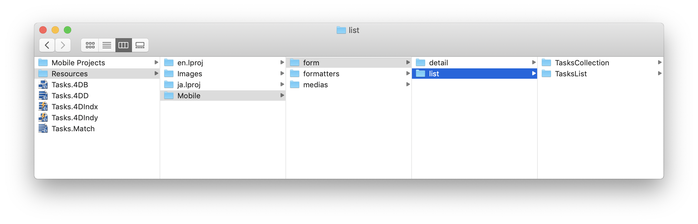
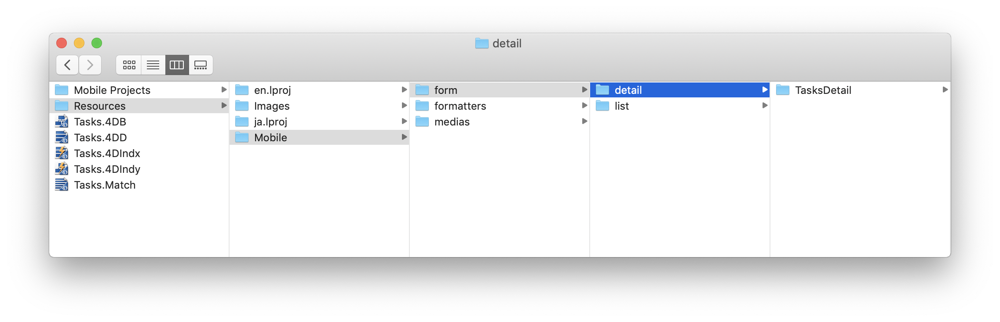
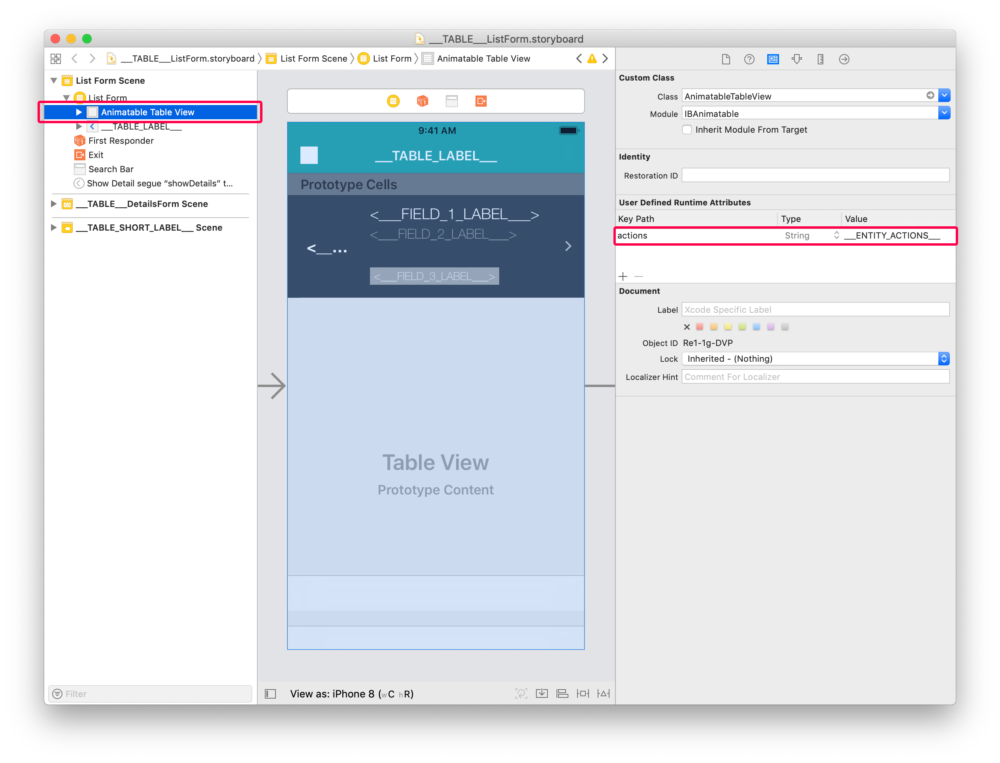
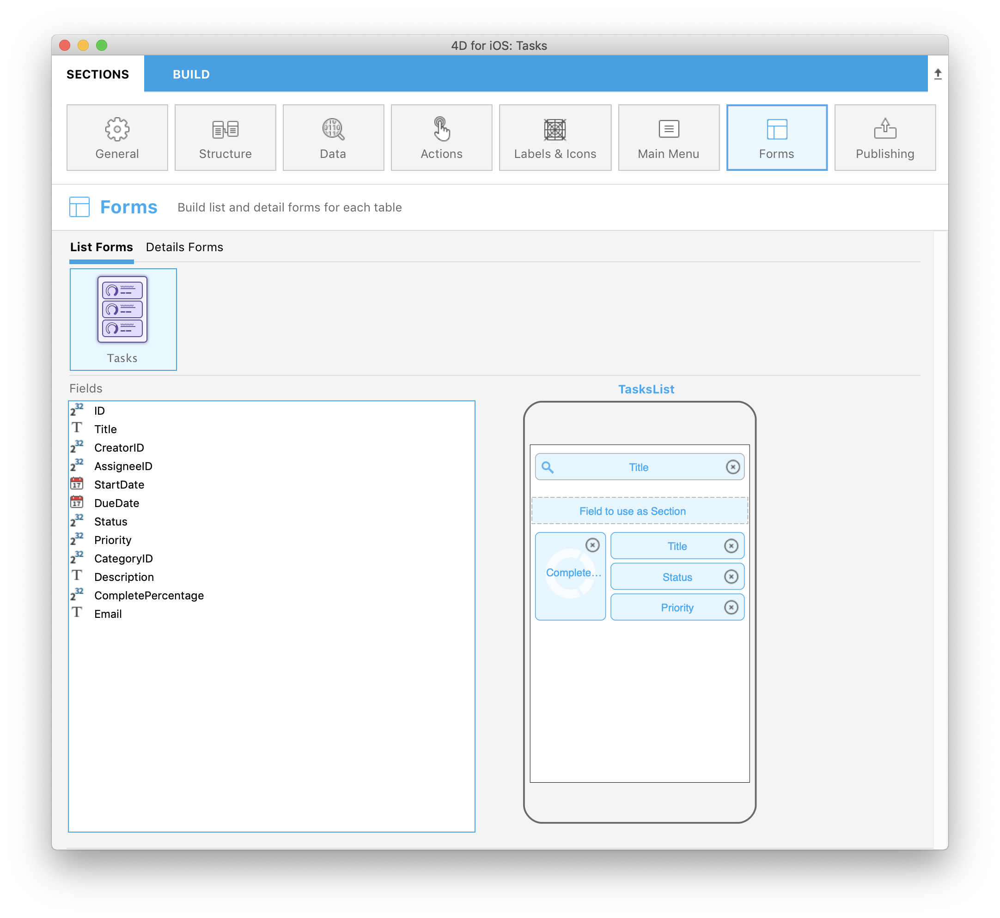
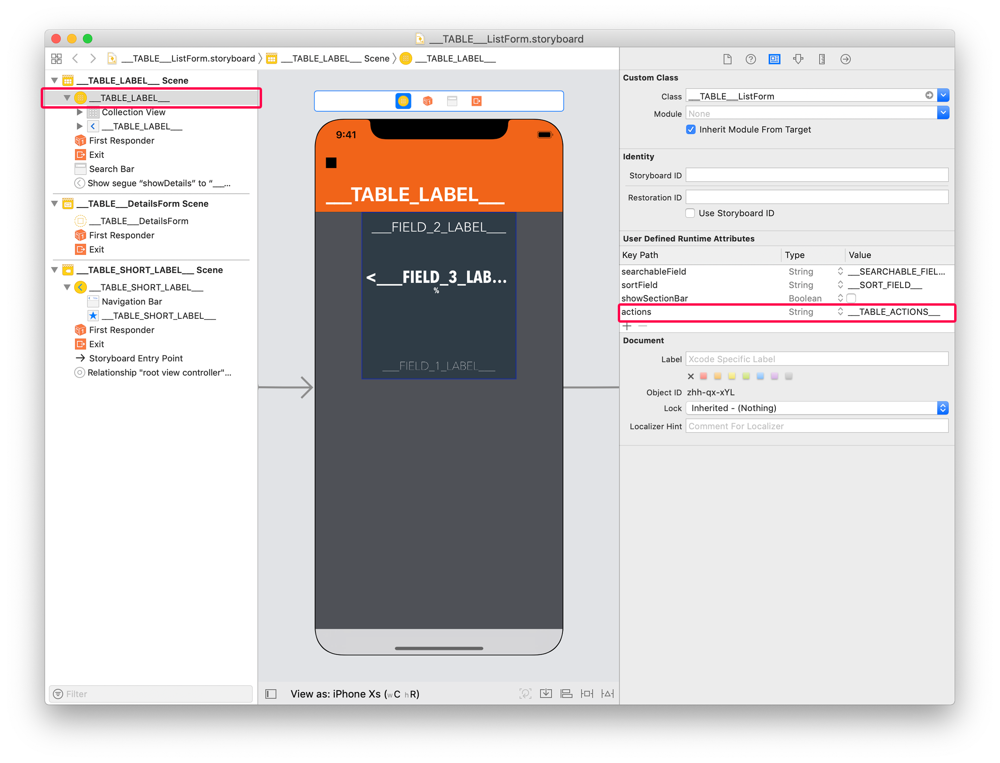
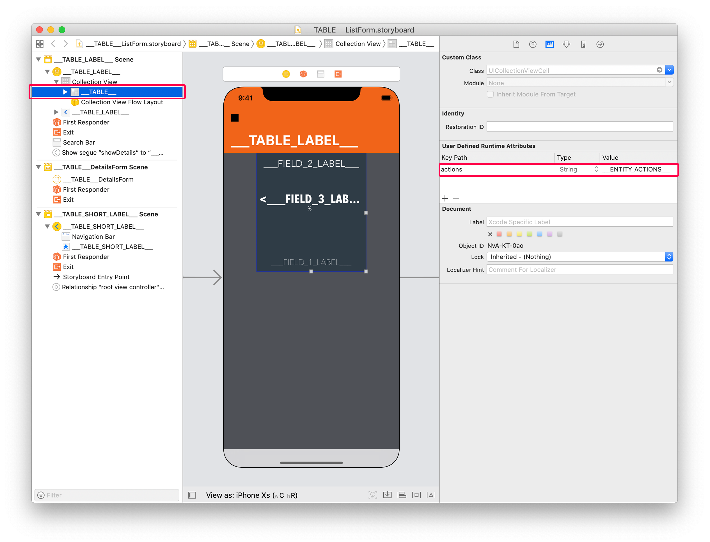
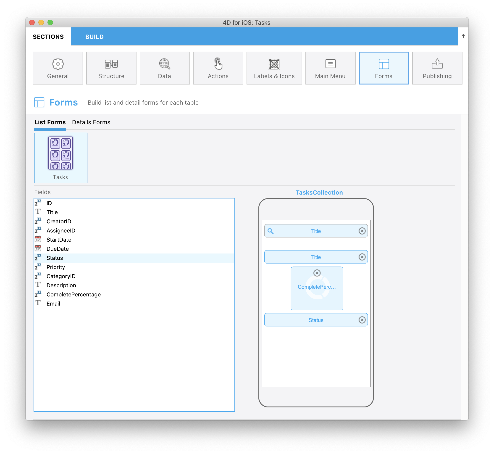
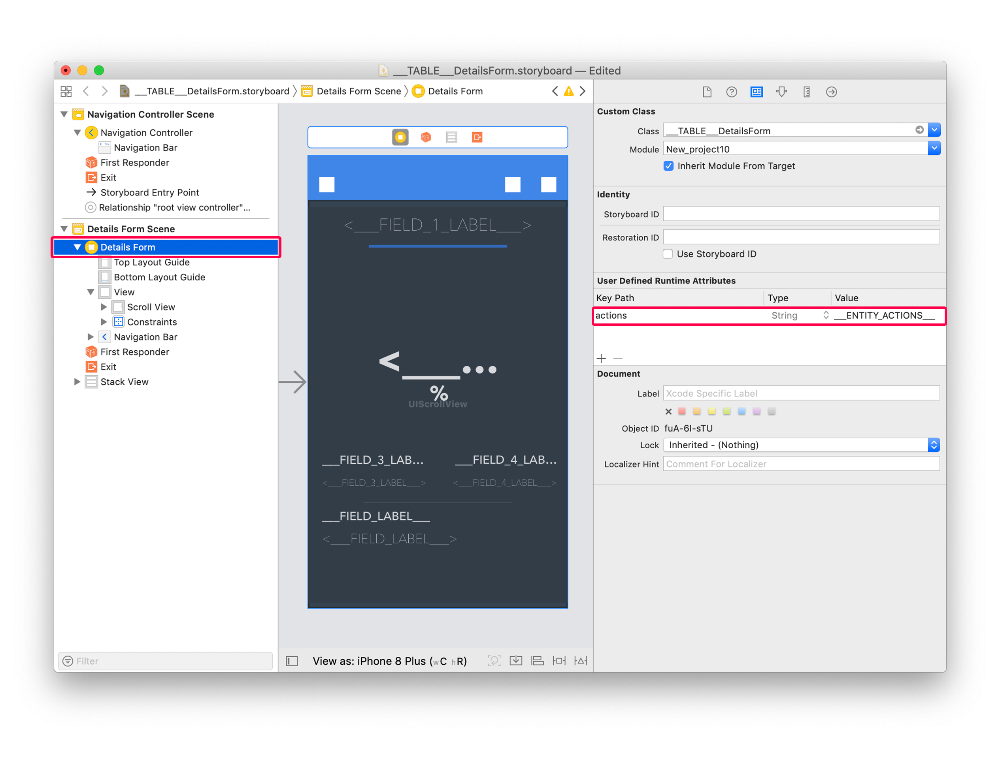
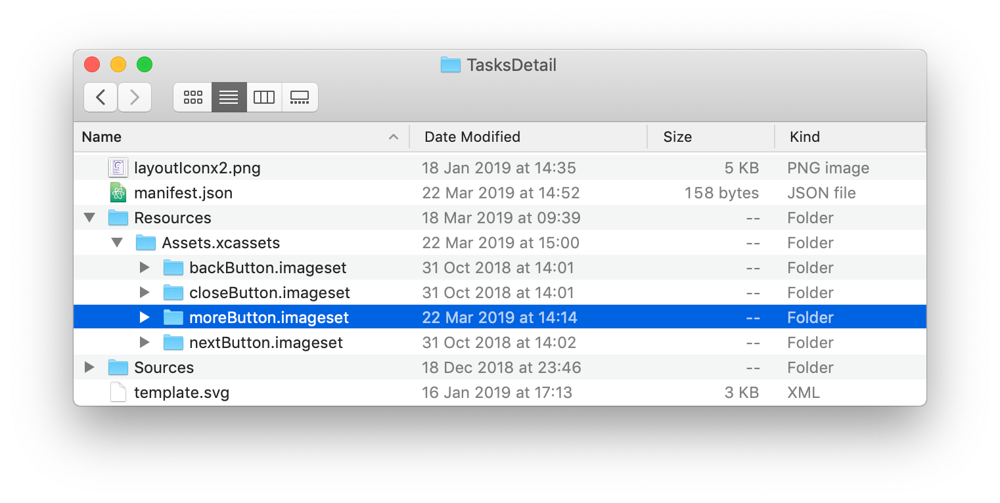
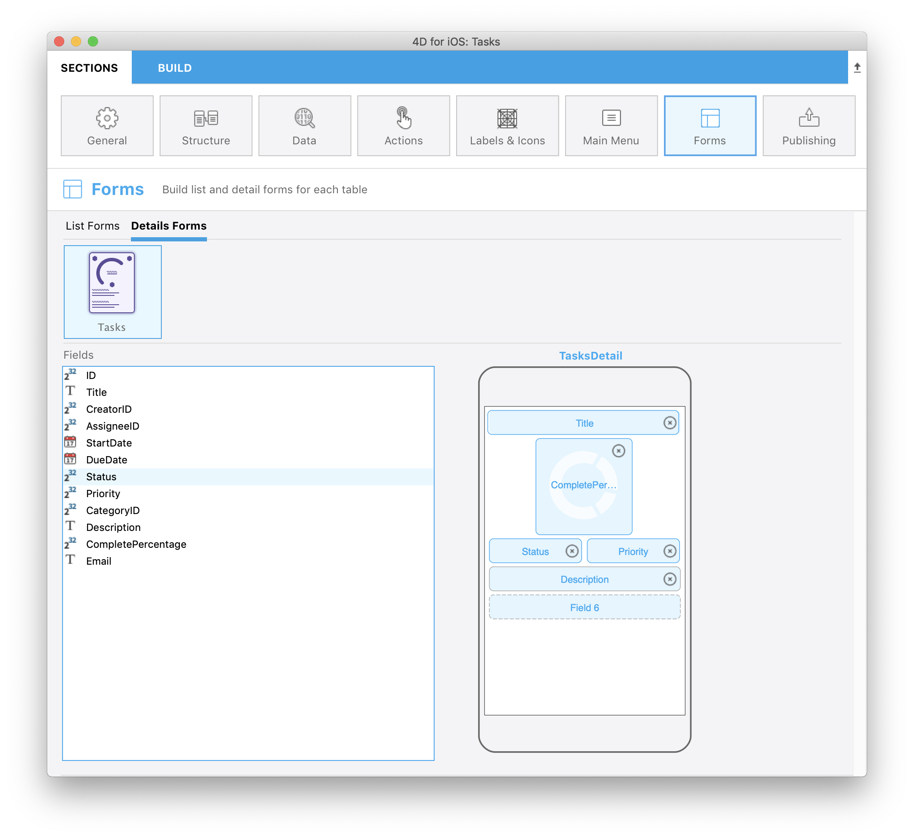

> **OBJECTIVES**
> 
> Add actions to custom List and Detail forms templates.

> **PREREQUISITES**
> 
> Click `[here](prerequisites.html)` to see what you'll need to get started!

En este tutorial, veremos lo fácil que puede ser **agregar acciones a plantillas personalizadas**.

## PASO 1. Download the Starter project

To begin, download the **Starter project**, which includes:

* two custom List form templates (TasksList and TasksCollection)
* a custom Detail form template (TasksDetail)
* un archivo Tasks.4dbase

<a class="button button--primary"
href="https://github.com/4d-go-mobile/tutorial-AddingActionToTemplates/archive/1dc5aecfbea62a9999d571cb1a956f1ef6983111.zip">Download</a>

## PASO 2. Agregar plantillas personalizadas al proyecto 4D for iOS

Primero, suelte:

* las carpetas de plantillas **TasksList** y **TasksCollection** en la carpeta *Tasks.4dbase/Resources/Mobile/form/list*

* las carpetas del modelo **TasksDetail** en *Tasks.4dbase/Resources/Mobile/form/detail folder*

## PASO 3. Añadir las acciones en los formularios Lista

Two types of actions are available:
* table actions
* entity actions

Primero abramos el archivo `list/TasksList/Sources/Forms/Tables/___TABLE___/___TABLE___ListForm.Storyboard`.

### Añadir las acciones a la plantilla personalizada TasksList

#### A. Añadir un Tag de acción de tabla

Seleccione el **List form Controller** y añada esta línea en el **User Defined Runtime Attributes** (Identity inspector):

* Key Path: `actions`
* Type: `String`
* Value: `___TABLE_ACTIONS___`

#### B. Añadir un Tag de acción de entidad

Seleccione la vista Animatable Table y añada esta línea en el **User Defined Runtime Attributes** (Identity inspector):

* Key Path: `actions`
* Type: `String`
* Value: `___ENTITY_ACTIONS___`

¡Su plantilla personalizada está lista para mostrar las acciones!

Puede seleccionar la plantilla personalizada TaskList en la **sección Formularios** y agregar los siguientes campos:

Ahora agreguemos las etiquetas de acción a la plantilla personalizada TasksCollection

### Añadir las acciones a la plantilla personalizada TasksCollection

To do so, open the `list/TasksCollection/Sources/Forms/Tables/___TABLE___/___TABLE___ListForm.Storyboard` file.

#### A. Añadir un Tag de acción de tabla

El proceso es bastante similar al proceso de la plantilla personalizada TasksList.

Seleccione el **List form Controller** y añada esta línea en el **User Defined Runtime Attributes** (Identity inspector):

* Key Path: `actions`
* Type: `String`
* Value: `___TABLE_ACTIONS___`

#### B. Añadir un Tag de acción de entidad

Para las entidades, la forma de mostrar las acciones es bastante diferente de TableView: la acción de deslizar no está realmente adaptada a CollectionViews.

Entonces, con las vistas de colección, la mejor manera de mostrar las acciones es utilizar un gesto de **presión largo** en las celdas con las que desea interactuar.

Para eso, seleccione la celda collectionView y agregue esta línea en el **User Defined Runtime Attributes** (Identity inspector):

* Key Path: `actions`
* Type: `String`
* Value: `___ENTITY_ACTIONS___`

Para optimizar la interacción, puede agregar un efecto escalar con una retroalimentación háptica agregando la siguiente línea en el **User Defined Runtime Attributes** (Identity inspector):

* Key Path: `touch.zoomScale`
* Type: `Number`
* Value: `0,96` (adapt the scale ratio depending on the result you want to get)

Puede seleccionar la plantilla personalizada TasksCollection en la **sección Formularios** y agregar los siguientes campos:

## PASO 4. Añadir las acciones en los formularios detallados

En los formularios detallados, puede utilizar el **botón genérico** en la barra de navegación o **crear fácilmente su propio botón de acción personalizado**. En ambos casos, debe agregar etiquetas.

Para el botón genérico integrado en la barra de navegación, seleccione el Controlador y añada esta línea en el **User Defined Runtime Attributes** (Identity inspector):

* Key Path: `actions`
* Type: `String`
* Value: `___ENTITY_ACTIONS___`

In our tutorial, we want to build our own generic button. Para eso, abra el archivo Storyboard `detail/TasksDetail/Sources/Forms/Tables/___TABLE___/___TABLE___DetailsForm.storyboard`.

Ábralo, seleccione el botón en la parte inferior derecha y agregue esta línea en el **User Defined Runtime Attributes** (Identity inspector):

* Key Path: `actions`
* Type: `String`
* Value: `___ENTITY_ACTIONS___`

Como puede ver, faltan algunos botones visuales en el archivo Storyboard. Puede encontrar esas imágenes en la plantilla **carpeta Resources**. Se incluirán en el proyecto durante el proceso de generación.

Por ejemplo, para el **moreButton.imageset**:

Puede seleccionar la plantilla personalizada TasksDetail en la **sección Formularios** y agregar los siguientes campos:

¡Felicitaciones!, su aplicación iOS Tasks ahora está completa e incluye acciones en los formularios Lista y detallados.

Download the completed project:

<a className="button button--primary"
href="https://github.com/4d-go-mobile/tutorial-AddingActionToTemplates/releases/latest/download/tutorial-AddingActionToTemplates.zip">Download</a>

