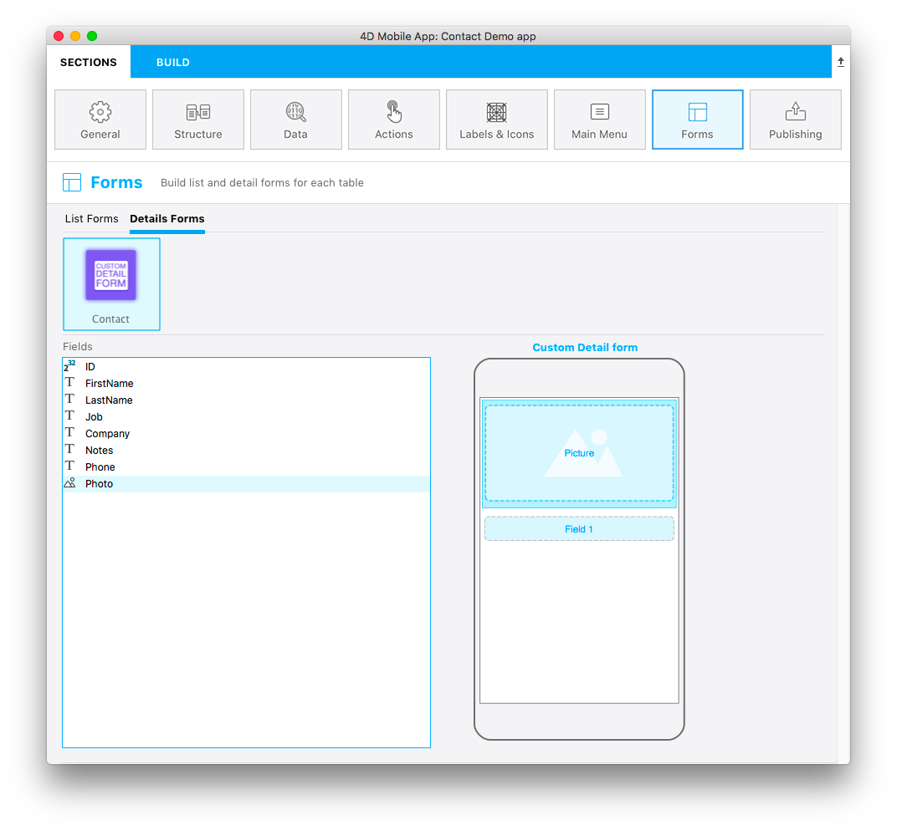
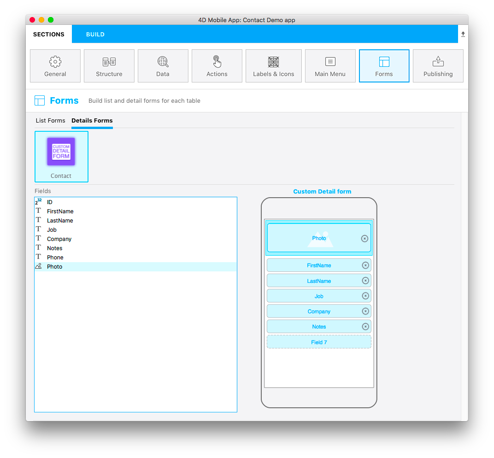

El archivo `template.svg` es una representación básica de plantilla. En este archivo svg, deberá definir áreas para poder agregar campos a la plantilla de formulario detallado desde el editor de proyecto.

Aquí hay una versión final:



Esta plantilla tiene una numeración de campos dinámica, lo que significa que le permitirá agregar una **imagen** y puede colocar ** tantos campos **como necesite. Entonces, durante la creación de su formulario detallado en la sección Formularios y arrastra y suelta un campo, aparece un nuevo campo vacío debajo del anterior para que agregue un nuevo campo:



```

```

Centrémonos en las diferentes partes de este archivo svg y en lo que necesitará editar.

## Título

```xml
<title>Custom Detail form</title>
```

Agregue el título de su plantilla aquí.

## Posición, alto, ancho y tipo del área
Puede definir la posición, la altura y el ancho de todos sus campos. Este proceso es el mismo que [el que se utiliza para los formularios de lista personalizados](../creating-list-forms/list-form-svg-file.md#area-position-height-width-and-type).

### Propiedades de los campos

```xml
//1
<g id="f" visibility="hidden" ios:dy="35">

//2
<rect class="bg field" x="14" y="0" width="238" height="30"/>

//3
<textArea id="f.label" class="label" x="14" y="8" width="238">field[n]</textArea>

//4
<rect id="f" class="droppable field multivalued" x="14" y="0" width="238" height="30" stroke-dasharray="5,2" ios:type="0,1,2,4,8,9,11,25,35"/>

//5
<use id="f.cancel" x="224" y="1" xlink:href="#cancel" visibility="hidden"/>
</g>
```

1. Posición de toda el área Y
2. Posición, alto y ancho del área de fondo
3. Definir la posición del área de texto y el ancho
4. Definir la posición, el alto y el ancho del campo desplegable, así como los [**tipos de campo**](../creating-list-forms/list-form-svg-file.md#iostypes) aceptados (en este ejemplo se aceptan todos los tipos)
5. Definir un botón de cancelación que se mostrará para eliminar el contenido actual

### Área Image field

```xml
//1
<g transform="translate(0,60)">

//2
<rect class="bg field" x="15" y="0" width="236" height="65"/>

//3
<path class="picture" transform="translate(10 0) scale(6)"/>

//4
<textArea id="f1.label" class="label" x="15" y="25" width="236">$4DEVAL(:C991("picture"))</textArea>

//5
<rect id="f1" class="droppable field" x="15" y="0" width="236" height="65" stroke-dasharray="5,2" ios:type="3" ios:bind="fields[0]"/>

//6
<use id="f1.cancel" x="222" y="20" xlink:href="#cancel" visibility="hidden"/>
</g>
```

1. Posición de toda el área Y
2. Posición, alto y ancho del área de fondo
3. Icono para mostrar una imagen en el imageField
4. Definir la posición del área de texto y el ancho
5. Definir la posición del campo soltable, su alto y su ancho, así como los [**tipos de campos**](../creating-list-forms/list-form-svg-file.md#iostypes) aceptados
6. Definir un botón de cancelación que se mostrará para eliminar el contenido actual

Ahora que tiene un **icono**, la **descripción básica de la plantilla** en el archivo manifest.json y su archivo **svg**, pasemos a la parte divertida con Xcode.


:::consejo

Para facilitar la definición de los tipos de campos, 4D for iOS le permite incluir tipos de campos con los ** valores positivos ** y también excluir los tipos de campo con ** valores negativos **. Por ejemplo, `ios:type="-3,-4"` le permitirá arrastrar y soltar todos los campos excepto las imágenes y las fechas. Para incluir todos los tipos de campos, introduzca simplemente `ios:type="all"`.

:::
