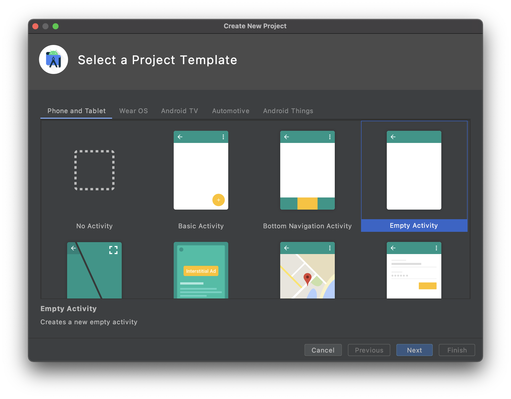
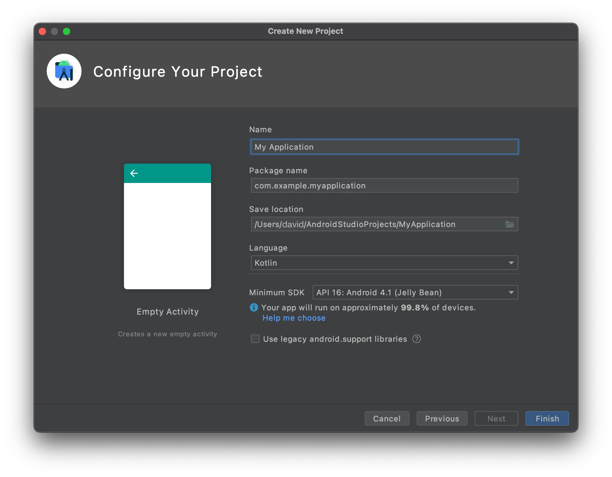
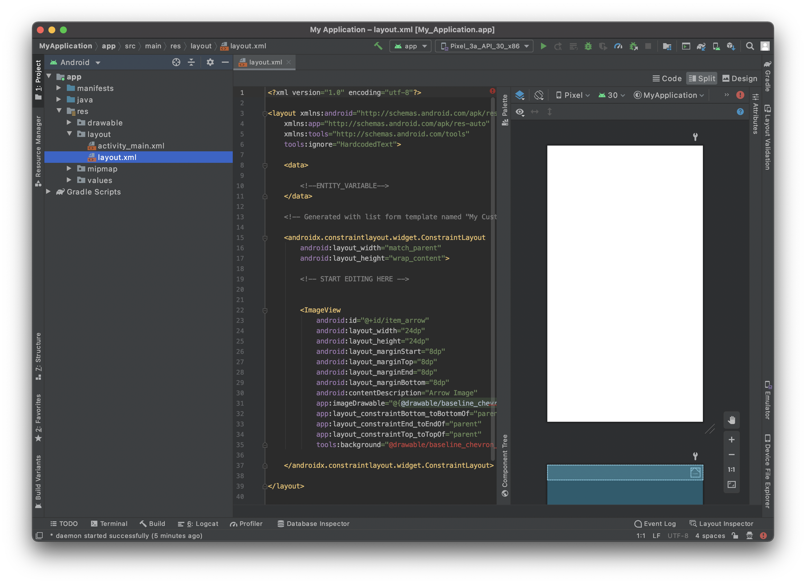
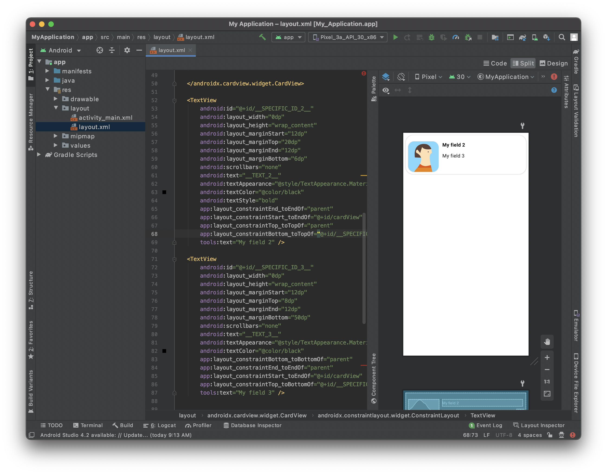

In this section you will see how to create your Android list form interface with Android Studio.

Este es el resultado que queremos lograr:


Para cada celda, vamos a añadir:

* Una foto de perfil
* Título
* Subtitulo

## Abrir el archivo de diseño con Android Studio

La mejor manera de editar o crear una plantilla es:

* Abrir Android Studio y crear un nuevo proyecto móvil vacío presionando en Archivo > Nuevo > Nuevo Proyecto...

* Seleccionar la plantilla Actividad vacía



* Configure su proyecto y haga clic en **Terminar**



* Copiar el archivo layout.xml en app > res > layout soltándolo directamente en la carpeta diseño del proyecto


* Debería tener eso en ese momento:



* Haga clic en la opción superior derecha **Dividir** para visualizar la vista previa de la plantilla así como el código xml.

Está vacío, así que vamos a agregar algo de contenido.


## Add a CardView container

To have a better rendering of your cells we are going to add a [CardView](https://developer.android.com/guide/topics/ui/layout/cardview).

Adding a CardView container will allow you to display your list form cells as nice cards and gives you the ability to add shadow, elevation, corner radius, background color...

So let's add it to your layout file. Don't forget to close the container adding `</androidx.cardview.widget.CardView>` just before `</layout>`.

```xml
   <androidx.cardview.widget.CardView
        android:id="@+id/mainCardview" 
        android:layout_width="match_parent" 
        android:layout_height="wrap_content"
        android:layout_marginStart="8dp"
        android:layout_marginTop="8dp"
        android:layout_marginEnd="8dp"
        android:layout_marginBottom="8dp"
        app:cardBackgroundColor="#FFFFFF"
        app:cardCornerRadius="25dp"
        app:layout_constraintBottom_toBottomOf="parent"
        app:layout_constraintEnd_toEndOf="parent"
        app:layout_constraintStart_toStartOf="parent"
        app:layout_constraintTop_toTopOf="parent">

        ...

        </androidx.cardview.widget.CardView>

```

It is crucial to **give ids to your layout elements** to refer to it later and positioning them among themselves.

Define the **width** and **height** of your container, the **margins** and as we want the content to take all the parent space (minus the margins) we just have to **add constraints**.


Here is the full layout code at this stage :

```xml
<?xml version="1.0" encoding="utf-8"?>

<layout xmlns:android="http://schemas.android.com/apk/res/android"
    xmlns:app="http://schemas.android.com/apk/res-auto"
    xmlns:tools="http://schemas.android.com/tools"
    tools:ignore="HardcodedText">

    <data>
        <!--ENTITY_VARIABLE-->
    </data>

    <androidx.cardview.widget.CardView
        android:id="@+id/mainCardview"
        android:layout_width="match_parent"
        android:layout_height="wrap_content"
        android:layout_marginStart="8dp"
        android:layout_marginTop="8dp"
        android:layout_marginEnd="8dp"
        android:layout_marginBottom="8dp"
        app:cardBackgroundColor="#FFFFFF"
        app:cardCornerRadius="25dp"
        app:layout_constraintBottom_toBottomOf="parent"
        app:layout_constraintEnd_toEndOf="parent"
        app:layout_constraintStart_toStartOf="parent"
        app:layout_constraintTop_toTopOf="parent">

        <androidx.constraintlayout.widget.ConstraintLayout
        android:layout_width="match_parent"
            android:layout_height="wrap_content">

        </androidx.constraintlayout.widget.ConstraintLayout>

    </androidx.cardview.widget.CardView>


</layout>

```

And here is the preview result you are supposed to get :


## Add an ImageView

In order to have a nice Image view display we are going to use agin a CardView container again as we want to add a nice corner radius to the ImageView to have a better design.

```xml
            <androidx.cardview.widget.CardView
                android:id="@+id/cardView"
                android:layout_width="wrap_content"
                android:layout_height="wrap_content"
                android:layout_marginStart="8dp"
                app:cardCornerRadius="20dp"
                app:layout_constraintStart_toStartOf="parent"

            <ImageView
                android:id="@+id/__SPECIFIC_ID_1__"
                android:layout_width="100dp"
                android:layout_height="100dp"
                android:contentDescription="Image"
                app:imageUrl="__IMAGE_1__"
                tools:background="@tools:sample/avatars" /> 

            </androidx.cardview.widget.CardView>
```

Como puede ver, el ImageView está insertado en el CardView. Eso permite añadirle radios de esquina.

The `app:imageUrl="__IMAGE_1__"` line will allow to bind image value that is situated in position 1 in the svg file that you previously defined.


The `tools:background="@tools:sample/avatars"` line simply there to display an ImageView placeholder.


## Add a title

Here we want to add a title at the right of the CardView that contains an ImageView.

To do so we are going to add a TextView :

```xml
 <TextView
                android:id="@+id/__SPECIFIC_ID_2__"
                android:layout_width="0dp"
                android:layout_height="wrap_content"
                android:layout_marginStart="12dp"
                android:layout_marginTop="20dp"
                android:layout_marginEnd="12dp"
                android:layout_marginBottom="6dp"
                android:scrollbars="none"
                android:text="__TEXT_2__"
                android:textAppearance="@style/TextAppearance.MaterialComponents.Body1"
                android:textColor="@color/black"
                android:textStyle="bold"
                app:layout_constraintEnd_toEndOf="parent"
                app:layout_constraintStart_toEndOf="@+id/cardView"
                app:layout_constraintTop_toTopOf="parent"
                tools:text="My field 2" />

```

The `app: text="__TEXT_2__"` line will allow to bind text value that is situated in position 2 in the svg file that you previously defined.

We want to ImageView and the TextView to be top aligned. To do so, we are going to use the TextView id. You just have to add this line to the CardView that include the profile picture :

```xml
app:layout_constraintTop_toTopOf="@id/__SPECIFIC_ID_2__"
```


## Add a subtitle


We want to add a subtitle to this cell. For that you just have to add quite the same block as the title one:


```xml

<TextView
                android:id="@+id/__SPECIFIC_ID_3__"
                android:layout_width="0dp"
                android:layout_height="wrap_content"
                android:layout_marginStart="12dp"
                android:layout_marginTop="8dp"
                android:layout_marginEnd="12dp"
                android:layout_marginBottom="50dp"
                android:scrollbars="none"
                android:text="__TEXT_3__"
                android:textAppearance="@style/TextAppearance.MaterialComponents.Body1"
                   android:textColor="?colorPrimary"
                app:layout_constraintBottom_toBottomOf="parent"
                app:layout_constraintEnd_toEndOf="parent"
                app:layout_constraintStart_toEndOf="@+id/cardView"
                app:layout_constraintTop_toBottomOf="@+id/__SPECIFIC_ID_2__"
                tools:text="My field 3" />
```


The `app: text="__TEXT_3__"` line will allow to bind text value that is situated in position 2 in the svg file that you previously defined.

We want to the subtitle to be at the bottom of the title. To do so, we are going to use the title TextView id. You just have to add this line to title TextView :

```xml
app:layout_constraintBottom_toTopOf="@+id/__SPECIFIC_ID_3__"
```


Your first list form template:




Here is the full layout code at this stage:

```xml
<?xml version="1.0" encoding="utf-8"?>

<layout xmlns:android="http://schemas.android.com/apk/res/android"
    xmlns:app="http://schemas.android.com/apk/res-auto"
    xmlns:tools="http://schemas.android.com/tools"
    tools:ignore="HardcodedText">

    <data>

        <!--ENTITY_VARIABLE-->
    </data>

    <androidx.cardview.widget.CardView
        android:id="@+id/mainCardview"
        android:layout_width="match_parent"
        android:layout_height="wrap_content"
        android:layout_marginStart="8dp"
        android:layout_marginTop="8dp"
        android:layout_marginEnd="8dp"
        android:layout_marginBottom="8dp"
        app:cardBackgroundColor="#FFFFFF"
        app:cardCornerRadius="25dp"
        app:layout_constraintBottom_toBottomOf="parent"
        app:layout_constraintEnd_toEndOf="parent"
        app:layout_constraintStart_toStartOf="parent"
        app:layout_constraintTop_toTopOf="parent">

    <androidx.constraintlayout.widget.ConstraintLayout
        android:layout_width="match_parent"
        android:layout_height="wrap_content">

        <androidx.cardview.widget.CardView
            android:id="@+id/cardView"
            android:layout_width="wrap_content"
            android:layout_height="wrap_content"
            android:layout_marginLeft="8dp"
            app:cardCornerRadius="20dp"
            app:layout_constraintStart_toStartOf="parent"
            app:layout_constraintTop_toTopOf="@id/__SPECIFIC_ID_2__">

        <ImageView
                android:id="@+id/__SPECIFIC_ID_1__"
                android:layout_width="100dp"
                android:layout_height="100dp"
                android:contentDescription="Image"
                app:imageUrl="__IMAGE_1__"
                tools:background="@tools:sample/avatars" />

        </androidx.cardview.widget.CardView>

        <TextView
            android:id="@+id/__SPECIFIC_ID_2__"
            android:layout_width="0dp"
            android:layout_height="wrap_content"
            android:layout_marginStart="12dp"
            android:layout_marginTop="20dp"
            android:layout_marginEnd="12dp"
            android:layout_marginBottom="6dp"
            android:scrollbars="none"
            android:text="__TEXT_2__"
            android:textAppearance="@style/TextAppearance.MaterialComponents.Body1"
            android:textColor="@color/black"
            android:textStyle="bold"
            app:layout_constraintEnd_toEndOf="parent"
            app:layout_constraintStart_toEndOf="@+id/cardView"
            app:layout_constraintTop_toTopOf="parent"
            app:layout_constraintBottom_toTopOf="@+id/__SPECIFIC_ID_3__"
            tools:text="My field 2" />

        <TextView
            android:id="@+id/__SPECIFIC_ID_3__"
            android:layout_width="0dp"
            android:layout_height="wrap_content"
            android:layout_marginStart="12dp"
            android:layout_marginTop="8dp"
            android:layout_marginEnd="12dp"
            android:layout_marginBottom="50dp"
            android:scrollbars="none"
            android:text="__TEXT_3__"
            android:textAppearance="@style/TextAppearance.MaterialComponents.Body1"
            android:textColor="?colorPrimary"
            app:layout_constraintBottom_toBottomOf="parent"
            app:layout_constraintEnd_toEndOf="parent"
            app:layout_constraintStart_toEndOf="@+id/cardView"
            app:layout_constraintTop_toBottomOf="@+id/__SPECIFIC_ID_2__"
            tools:text="My field 3" />

    </androidx.constraintlayout.widget.ConstraintLayout>

    </androidx.cardview.widget.CardView>

</layout>

```

## Label customization

From here you can customize your label's :

* color => android:textColor

* weight => android:textStyle with **normal**, **bold** or **italic** possible values

* appearance of your font => android:textAppearance

Try to keep consistency in your layout text sizes with appearance. The best way to achieve that is to follow the [Material Design type](https://material.io/design/typography/the-type-system.html#type-scale).


For example, a basic TextView should be in `@Body1@` scale.

```xml
android:textAppearance="@style/TextAppearance.MaterialComponents.Body1"
```

## Cómo obtener datos en sus celdas

### Image View

In our list form template we used `app:imageUrl="__IMAGE_1__"`

Aquí suponemos que la ImageView es la primera vista del svg, y su ID de vista es `__SPECIFIC_ID_1__`. Si fuera la tercera vista, sería `__IMAGE_3__` y su ID de vista sería `__SPECIFIC_ID_3__`.

### Etiquetas

In our list form template we used `android:text="__TEXT_2__"` for the title.

Here we suppose the title is the second view in the svg, and its view ID is `__SPECIFIC_ID_2__`.


## ¿Qué hacer ahora?

In this tutorial, we've covered the basics for creating Android list form templates. You are now able to create simple templates on your own using the Starter Project ressources. But wait - there’s more! In the next tutorial, you’ll learn how to build Android detail form templates!

Download the completed template list folder:

<div className="center-button">
<a className="button button--primary"
href="https://github.com/4d-go-mobile/tutorial-CustomListForm/releases/latest/download/tutorial-CustomListForm.zip">Download</a>
</div>


