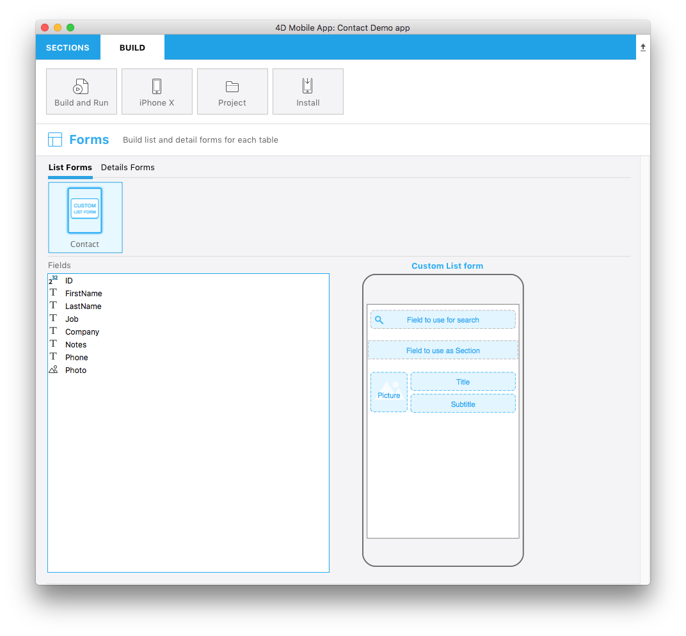

The `template.svg` file is a basic visual representation of a template. En este archivo, deberá definir áreas para poder agregar campos a su plantilla de formulario listado desde el editor de proyecto.

Aquí hay una versión final:



Let’s focus on the different parts of this svg file and what you'll need to edit.

## Title

```xml
<title>Custom List form</title>
```

Title of the template.

## ios:values

```xml
<text id="cookery" ios:values="search,section,f1,f2,f3"/>
```

Includes IDs which define your form areas:

* **search**: Refers to the search field area. Esto le permitirá arrastrar y soltar un campo como criterio de búsqueda en su formulario Lista (opcional).
* **section**: Refers to the section field area. Esto le permitirá arrastrar y soltar un campo como criterio de ordenación en su formulario Lista (opcional).
* **f1, f2 and f3**: Refers to the fields to display in each cell of your list form. Esto le permitirá arrastrar y soltar campos para que aparezcan en las celdas de su formulario Lista.

## Area position, height, and width

You can define the position, height and width for:

* Searchfield
* Sectionfield
* Otros campos generales que se mostrarán en cada celda de la tabla

### Área SearchableField:

```svg
//1
<g transform="translate(0,60)”>

//2
<rect class="bg field" x="14" y="12" width="238" height="30”/>

//3
<path class="magnifyingGlass" transform="translate(20,8) scale(1)”/>

//4
<textArea id="search.label" class="label" x="14" y="8" width="238"/>

//5
<rect id="search" class="droppable field optional" x="14" y="0" width="238" height="30" stroke-dasharray="5,2" ios:type="0,1,2,4,8,9,11,25,35"  ios:bind="searchableField"/>

//6
<use id="search.cancel" x="224" y="1" xlink:href="#cancel" visibility="hidden"/>
</g>
```

1. Posición de toda el área Y
2. Posición, alto y ancho del área de fondo
3. Icono para mostrar un icono de lupa en el campo de búsqueda
4. Definir la posición del área de texto y el ancho
5. Define the droppable field position, height and width, as well as accepted [**field types**](#iostypes)
6. Definir un botón de cancelación que se mostrará para eliminar el contenido actual

The searchable field is optional.


### Área SectionField:

```svg
//1
<rect class="bg field" x="10" y="110" width="246" height="30”/>

//2
<textArea id="section.label" class="label" x="0" y="118" width="250"/>

//3
<rect id="section" class="droppable optional" x="10" y="110" width="246" height="30" stroke-dasharray="5,2" ios:type="0,1,2,4,8,9,11,25,35" ios:bind="sectionField”/>

//4
<use id="section.cancel" x="224" y="111" xlink:href="#cancel" visibility="hidden"/>
```

1. Posición, alto y ancho del área de fondo
2. Definir la posición del área de texto y el ancho
3. Define the droppable field position, height and width as well as accepted [**field types**](#iostypes)
4. Definir un botón de cancelación que se mostrará para eliminar el contenido actual

The section field is optional.

### Área ImageField:

```svg
//1
<g transform="translate(0,162)">

//2
<rect class="bg field" x="14" y="0" width="60" height="65"/>

//3
<path class="picture" transform="translate(-60 0) scale(5)"/>

//4
<textArea id="f1.label" class="label" x="14" y="30" width="60">$4DEVAL(:C991("picture"))</textArea>

//5
<rect id="f1" class="droppable field" x="14" y="0" width="60" height="65" stroke-dasharray="5,2" ios:type="3" ios:bind="fields[0]"/>

//6
<use id="f1.cancel" x="47" y="-2" xlink:href="#cancel" visibility="hidden"/>
</g>
```

1. Posición de toda el área Y
2. Posición, alto y ancho del área de fondo
3. Icono para mostrar una imagen en el imageField
4. Definir la posición del área de texto y el ancho
5. Define the droppable field position, height and width as well as accepted [**field types**](#iostypes)
6. Definir un botón de cancelación que se mostrará para eliminar el contenido actual

### Área Title Field:

```svg
//1
<g transform="translate(0,162)”>

//2
<rect class="bg field" x="84" y="0" width="168" height="30”/>

//3
<textArea id="f2.label" class="label" x="84" y="8" width="168">$4DEVAL(:C991("titleField"))</textArea>

//4
<rect id="f2" class="droppable field" x="84" y="0" width="168" height="30" stroke-dasharray="5,2" ios:type="0,1,2,4,8,9,11,25,35" ios:bind="fields[1]”/>

//5
<use id="f2.cancel" x="224" y="1" xlink:href="#cancel" visibility="hidden"/>
</g>
```

1. Posición de toda el área Y
2. Posición, alto y ancho del área de fondo
3. Definir la posición del área de texto y el ancho
4. Define the droppable field position, height and width as well as accepted [**field types**](#iostypes)
5. Definir un botón de cancelación que se mostrará para eliminar el contenido actual

### Área Subtitle Field:

```svg
//1
<g transform="translate(0,198)”>

//2
<rect class="bg field" x="84" y="0" width="168" height="30”/>

//3
<textArea id="f3.label" class="label" x="84" y="8" width="168">$4DEVAL(:C991("subtitleField"))</textArea>

//4
<rect id="f3" class="droppable field" x="84" y="0" width="168" height="30" stroke-dasharray="5,2" ios:type="0,1,2,4,8,9,11,25,35" ios:bind="fields[2]”/>

//5
<use id="f3.cancel" x="224" y="1" xlink:href="#cancel" visibility="hidden"/>
</g>
```

1. Posición de toda el área Y
2. Posición, alto y ancho del área de fondo
3. Definir la posición del área de texto y el ancho
4. Define the droppable field position, height and width as well as accepted [**field types**](#iostypes)
5. Definir un botón de cancelación que se mostrará para eliminar el contenido actual


## ios:types

The following field types are supported:

| Code | Type           |
| ---- | -------------- |
| 0    | alpha          |
| 1    | real           |
| 2    | text           |
| 3    | picture        |
| 4    | date           |
| 8    | integer        |
| 9    | longint        |
| 11   | time           |
| 25   | integer 64 bit |

:::note

For more information on these field types, refer to [**this page**](https://developer.4d.com/docs/en/Concepts/data-types.html).

:::

:::tip

To make field type definition easier, 4D for iOS allows you to include field types with **positive values** and also exclude field types with **negative values**. For example, `ios:type="-3,-4"` will allow you to drag and drop every field except images and dates. To include all types, just type `ios:type="all"`.

:::