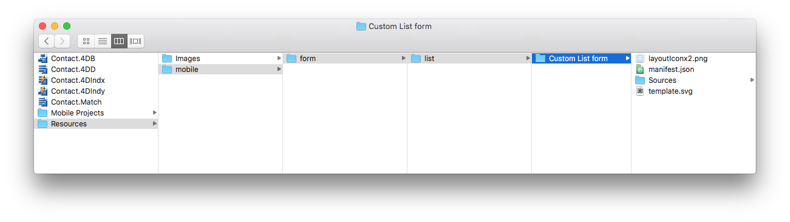

En este tutorial, cubriremos casi todos los aspectos de la creación de una plantilla de formulario lista, incluyendo el uso de una **barra de búsqueda**, una tabla que muestra una **imagen**, un **título**, y un **subtítulo** para cada celda.

## Descargue el proyecto Starter

Antes de comenzar, asegúrese de descargar y descomprimir el **Starter project**, que incluye:

* Una carpeta **List form**
* Un proyecto de demostración en 4D ("Contact") con un proyecto de aplicación móvil listo para usar.

<a className="button button--primary"
href="https://github.com/4d-go-mobile/tutorial-CustomListFormStarter/archive/4702619ed628a98f7cba5aacc08b6302d4bb8f86.zip">Starter project</a>

## Añada una plantilla de formulario listado a su proyecto móvil

Lo primero que deberá hacer es crear una carpeta `list` en *Contact.4dbase/Resources/Mobile/form/* ubicación y arrastrar y soltar su carpeta **list form** en ella.

Ahora, inicie su aplicación 4D y abra el proyecto 4D "Contact".

A continuación, seleccione el proyecto móvil "Contact Demo App": **Archivo > Abrir > Proyecto móvil > App Demo Contact**.

En la **sección Formulario** del editor del proyecto móvil, verá que su plantilla de formulario lista se ha agregado exitosamente a la lista de plantillas de formularios lista disponibles:

Ahora concentrémonos en el contenido de la carpeta **Custom List form**.

## Contenido de la plantilla de formulario Lista

En esta carpeta, encontrará:

* Un icono **layoutIconx2.png** de 160x160px: mostrado en el editor del proyecto cuando seleccione su plantilla
* **Un archivo manifest.json**: incluye una descripción básica de la plantilla
* **Un archivo template.svg**: la representación visual de su plantilla que se muestra cuando define el contenido de su formulario listado.
* una carpeta **ios** que incluye el storyboard (interfaz gráfica) y el archivo **Swift** (código del formulario) en la carpeta `Source/Forms/Tables/___TABLE___`
* una **carpeta android** que incluya el archivo layout.xml (interfaz gráfica) en la carpeta `app/src/main/res/layout`.

Estos archivos y carpetas se detallan en las siguientes secciones. 
