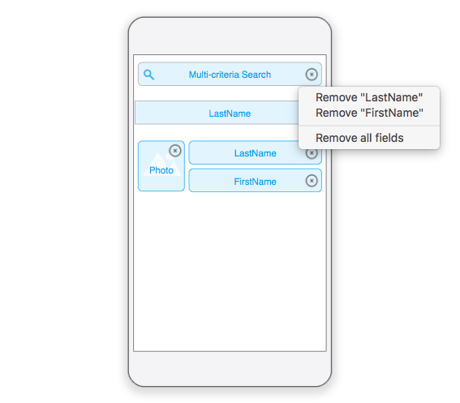

Esta sección le mostrará cómo activar la [búsqueda por criterios múltiples](../../project-definition/forms#multi-criteria-search) en sus propias plantillas.

:::info

La función de búsqueda multicriterio está activada por defecto en todas las plantillas generadas por el editor móvil.

:::

## Template svg file

Para activar esta funcionalidad en sus propias plantillas, debe modificar las siguientes líneas en su archivo template.svg de:

```xml
<rect id="search" class="droppable field optional" x="14" y="0" width="238" height="30" stroke-dasharray="5,2" ios:type="0,1,2,4,8,9,11,25,35" ios:bind="searchableField"/>

```

to:

```xml
<rect id="search" class="droppable field optional multi-criteria" x="14" y="0" width="238" height="30" stroke-dasharray="5,2" ios:type="0,1,2,4,8,9,11,25,35" ios:bind="searchableField"/>

```

There you go! The class is the only thing you need to modify for the multi-search criteria to be active.

## Editor de proyecto

Next, you can go to the project editor and drop several fields into the list form search area.


Click on the search field's delete button to modifiy the associated field list.

A menu will appear to allow you to **remove specific fields** or **remove all fields**, depending on which criteria you want to base your search(es) on.



¡Felicitaciones! You can now base your search(es) on multiple fields in your mobile app!
