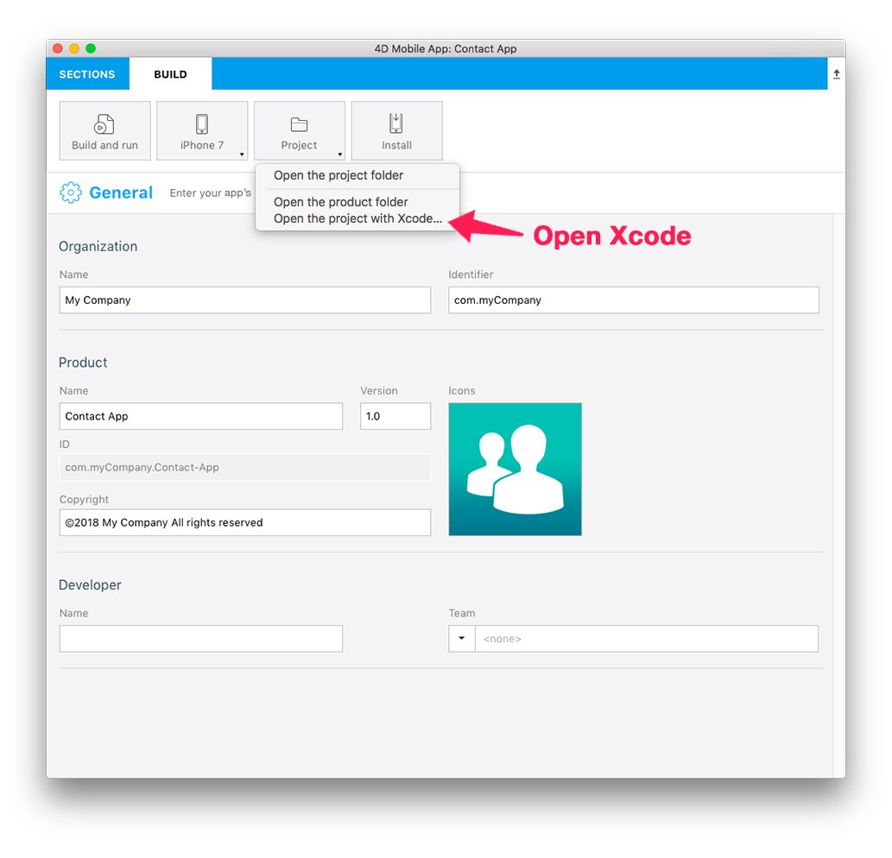

> **OBJETIVOS**
> 
> * Open a 4D for iOS project from the Project Editor.
> * Customize the generated 4D for iOS app.

4D for iOS genera una aplicación iOS nativa modificable y personalizable con Xcode. ¡Miremos el proceso!

> **NOTA**
> 
> If you customize your project on Xcode and rebuild it from the Project Editor All of your modifications will be lost!

We'll use the [contact application](../create-your-first-app) we created.

Download the Starter project:

<a
  className="button button--primary"
  href="#">
  Download
</a>

## PASO 1. Genere su proyecto iOS

* Si no ha construido su proyecto, vaya al paso 2.
* Si ya ha construido su proyecto, vaya al paso 3.

## PASO 2. Cree su proyecto

From the Project Editor BUILD tab:

* Seleccione el dispositivo a utilizar como Simulador haciendo clic en el botón del dispositivo.
* Haga clic en el botón **Crear y ejecutar**.

## PASO 3. Abra su proyecto con Xcode

From the Project Editor BUILD tab:

* Haga clic en Proyecto > Abrir el proyecto con Xcode

Now you're ready to start working on your 4D for iOS project in Xcode.