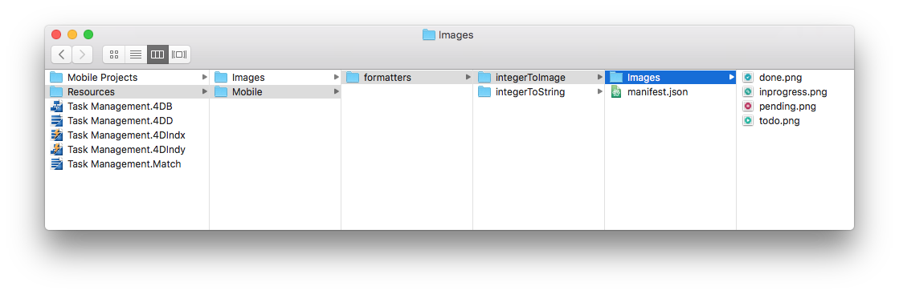
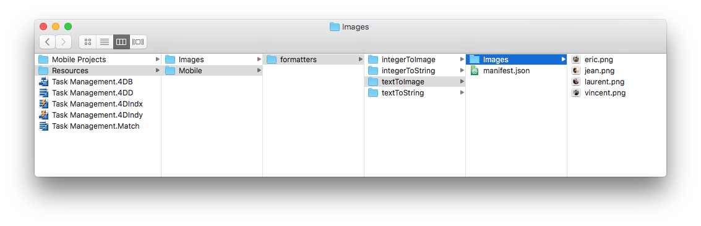
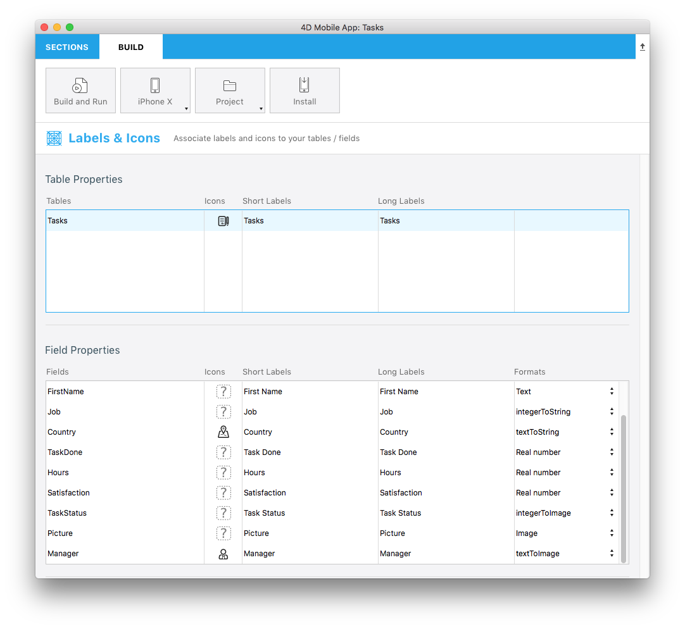

> **OBJETIVOS**
> 
> Crear sus primeros formatos de datos.

> **REQUISITOS PREVIOS**
> 
> Haga clic `[here](prerequisites.html)` para ver lo que necesita para empezar

En este tutorial, lo guiaremos a través de la creación de varios ejemplos de formatos.

## Descargue el proyecto Starter

To begin, download the **Starter project**, which includes:

* Las carpetas **integerToImage_Images** y **textToImage_Images**, que contienen las imágenes (a utilizar más adelante para los formatos que contienen imágenes)
* Un archivo **Task Management.4dbase** (con una aplicación de proyecto móvil lista para utilizar)

<div className="center-button">
<a className="button button--primary"
href="https://github.com/4d-go-mobile/tutorial-CustomDataFormatter/archive/66d7eea49bc3353f73dbf784ee06283b3a332d0b.zip">Starter project</a>
</div>

¡Ahora está listo para crear a sus primeros formatos!

## Crear la carpeta Formats

Primero, cree una carpeta Task Management.4dbase/Resources/Mobile/formatters</em>.


## Formatos de enteros

### Número entero a cadena

* Cree una carpeta **integerToString** en la carpeta de Formats que acaba de crear.
* Cree un archivo </strong>manifest.json** en la carpeta **integerToString**.</li> </ul>


Veamos el contenido del archivo **manifest.json**:

```json
{
   "name": "integerToString",

   "type": ["integer"],

   "binding": "localizedText",

   "choiceList": {"0":"UX designer","1":"Developer","2":"QA","3":"Product Owner"}
}
```

1. **name**: el nombre del formato
2. **type**: tipo de formato 4D que desea utilizar
3. **binding**: puede ser **localized text** para las cadenas o **imageNamed** para las imágenes
4. **choiceList**: valores mapeados

### Entero a imagen

* Cree una carpeta **integerToImage** en la carpeta **formatters** que acaba de crear.

* Cree un archivo **manifest.json** en la carpeta **integerToImage**.


* Cree un archivo **Images** en la carpeta **integerToImage**. Puede agregar las imágenes de **integerToImage_Images** (en StarterProject.zip) para esta nueva carpeta.



Veamos el contenido del archivo **manifest.json**:


```json
{
    "name": "integerToImage",

   "type": ["integer"],

   "binding": "imageNamed",

   "choiceList": {"0":"todo.png","1":"inprogress.png","2":"pending.png","3":"done.png"},

   "assets": {
      "size": {
         "width": 40, "height": 40
      }
    }
}
```
1. **name**: el nombre del formato
2. **type**: el tipo de formato 4D que desea utilizar
3. **binding**: puede ser **localized text** para las cadenas o **imageNamed** para las imágenes
4. **choiceList**: valores mapeados
5. **assets**: ajustar el tamaño de visualización (ancho y alto)

## Formatos texto

### Texto a cadena

* Cree una carpeta **integerToString** en la carpeta Formats que acaba de crear.

* Create a **manifest.json** file in the **textToString** folder.


Veamos el contenido del archivo **manifest.json**:

```json
{
    "name": "textToString",

   "type": ["text"],

   "binding": "localizedText",

   "choiceList": {"FRA":"France","MAR":"Morocco","USA":"United States","AUS":"Australia"}
}
```

1. **name**: el nombre del formato
2. **type**: tipo de formato 4D que desea utilizar
3. **binding**: puede ser **localized text** para las cadenas o **imageNamed** para las imágenes
4. **choiceList**: valores mapeados

### Texto a imagen

* Cree una carpeta **textToImage** en la carpeta Formats que acaba de crear.

* Cree un archivo **manifest.json** en la carpeta **textToImage**.


* Luego cree un archivo **Images** en la carpeta **textToImage**. Puede agregar las imágenes de **textToImage_Images** (en StarterProject.zip) a esta nueva carpeta.



Veamos el contenido del archivo **manifest.json**:

```json
{
    "name": "textToImage",

   "type": ["integer"],

   "binding": "imageNamed",

   "choiceList": ["image1.png","image2.png","image3.png"],

   "assets": {
  "size": {
   "width": 40, "height": 40
        }
    }
}

```

## Dark mode support

Whether your device is in dark or light mode, whether you're working on iOS or Android, you can easily use the custom data formatters containing images. The pictures will be adapted depending on the phone's color mode.

### Tintable color

To optimize the color contrast of your black and white images on your app depending on the color mode (light or dark), you can set the images as follows, with the `"tintable": true` code line:

```json
{
   "name": "textToImage",
   "type": ["text"],
   "binding": "imageNamed",
   "choiceList": {"car":"car.png","plane":"plane.png","bus":"bus.png"},
   "assets": {
     "size": 54, 
     "tintable": true
     }
}
```
Here is the result in light and dark modes:

| Light mode                            |              Dark mode               |
| ------------------------------------- |:------------------------------------:|
|  |  |


### Optimized color pictures

To optimize the color pictures displayed on your app and adapt them to your color mode, you need to have two pictures: one for the light mode, and one for the dark mode suffixed with `_dark`, as follows:


```json
{
   "name": "textToImage",
   "type": ["text"],
   "binding": "imageNamed",
   "choiceList": {"car":"car.png","plane":"plane.png","bus":"bus.png"},
   "assets": {
     "size": 54
   }
}
```
Here is the result in light mode and in dark mode:

| Light mode                               |                Dark mode                |
| ---------------------------------------- |:---------------------------------------:|
|  |  |

## Abrir un proyecto móvil

Open the Task Management.4dbase with 4D and go to File > open > Mobile Project... to open the **Tasks**

Next, go to the **Labels & Icons section** in the project editor. All of your formatters are available for the different field types you  previously defined in the different formatter manifest.json files:

* Seleccione el formato **integerToString** para **Job field**
* Seleccione el formato **textToString** para **Country field**
* Seleccione el formato **integerToImage** para **Task Status**
* Seleccione el formato **textToImage** para **Manager**



## Build your 4D for iOS app

Build your 4D of iOS app and you'll see that your data formatter is well applied depending on the credit limit.


Download the completed formatter template folder:

<div className="center-button">
<a className="button button--primary"
href="https://github.com/4d-go-mobile/tutorial-CustomDataFormatter/releases/latest/download/tutorial-CustomDataFormatter.zip">Download</a>
</div>
