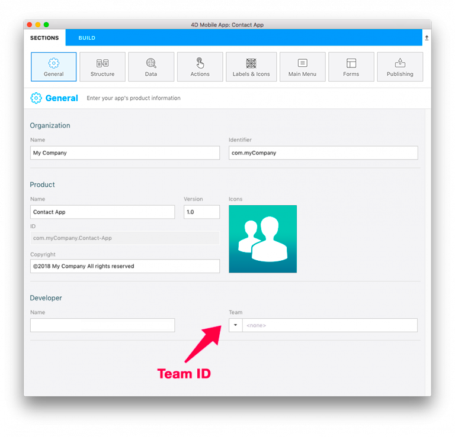

Puede instalar y probar su aplicación móvil en un dispositivo conectado.

## Requisitos

Tiene que suscribirse a un programa de desarrolladores de Apple. Dependiendo de sus objetivos y de sus preferencias, puede optar por inscribirse en uno de los siguientes programas:

* Free Apple Developer Program: For testing only
* [Apple Developer Program for organization or individual](https://developer.apple.com/programs/enroll/): For an App Store Deployment
* [Apple Enterprise Developer Program](https://developer.apple.com/programs/enterprise/): To deploy your app in-house

:::nota

Necesita [Apple configurator 2](https://itunes.apple.com/us/app/apple-configurator-2/id1037126344) instalado en su Mac para automatizar la instalación de la aplicación (opcional).

:::

## PASO 1. Crear cuenta

* **Identificador Apple**: cree su identificador Apple. Si no tienen uno, haga clic [aquí](https://appleid.apple.com/account#!&page=create).

* **Developer Account**: elija un Apple Developer Program (para empresas o individuos) para desplegar en la App Store o el Apple Developer Enterprise Program (para despliegue interno).

## PASO 2. Configuración Xcode

* **Developer Account**: En Xcode > Preferences > Accounts, añada su Apple ID. 

## PASO 3. Obtenga su Team ID

* If your are using a Free Apple Developer Program, go to [step 4](#step-4-team-id-for-free-account).
* Si está utilizando un [Apple Developer Program para empresas](../tutorials/developer-program/register-apple-developer-program-organization), [ para particulares ](../tutorials/developer-program/register-apple-developer-program-individual) o un [Apple Enterprise Developer Program](../tutorials/developer-program/register-apple-developer-enterprise-program) vaya al [paso 5](#step-5-team-id-for-paid-subscription-account).

## PASO 4. Team ID para una cuenta gratuita

### Deje que Xcode genere su perfil y certificado

* Abra su proyecto actual desde la pestaña BUILD.

* Verify that the **Automatically manage signing** option is checked and select the account you added, from the Team dropdown list.

* Conecte su dispositivo a su ordenador y selecciónelo en el menú superior de Xcode.

* Xcode genera automáticamente los perfiles y certificados de aprovisionamiento necesarios para crear su aplicación.

### Creación del proyecto con Xcode

* ¡Presione el botón Build and run Button en Xcode!

## PASO 5. Team ID para una cuenta paga

* **Team ID**: Haga clic en Developer Account > Membership y obtenga su Team ID. 

* **4D for iOS**: Lance 4D for iOS en Sections > General e introduzca su Team ID. 

* Vaya al PASO 6 para ejecutar su proyecto en su dispositivo.

## PASO 6. Instalación

### Instalación automática con Apple Configurator 2

* Cuando su aplicación esté lista, abra la pestaña CREAR.
* Conecte su dispositivo a su ordenador con un cable USB.
* Desde la pestaña CREAR, haga clic en **Instalador**.

* ¡La aplicación se está instalando en su dispositivo!

### Instalación manual con Xcode

* Cuando su aplicación esté lista, abra la pestaña CREAR.
* Conecte su dispositivo a su ordenador con un cable USB.
* Desde la pestaña CREAR, haga clic en **Instalador**.

* Se crea un archivo de su proyecto

* Indique el archivo generado en Finder

* Abra Xcode y vaya a Menu > Window > Devices and Simulator y arrastre y suelte el archivo ipa generado en la sección Installed Apps.

* ¡La aplicación se está instalando en su dispositivo!

