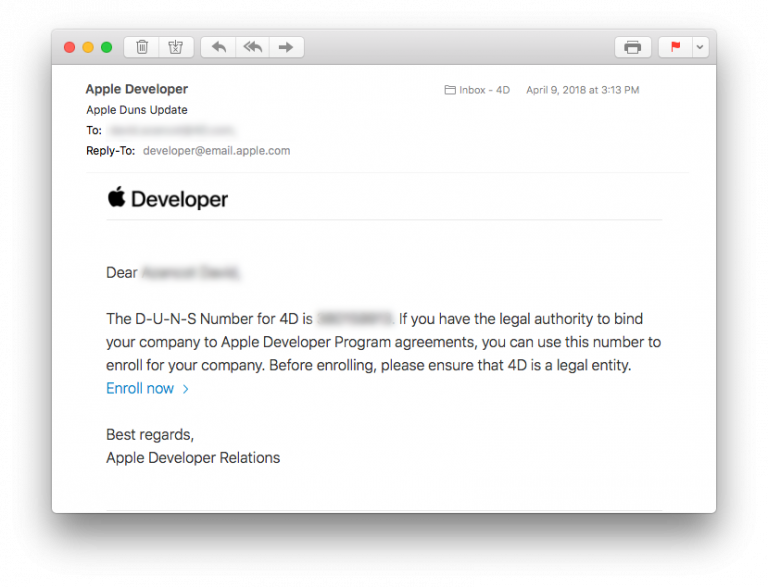
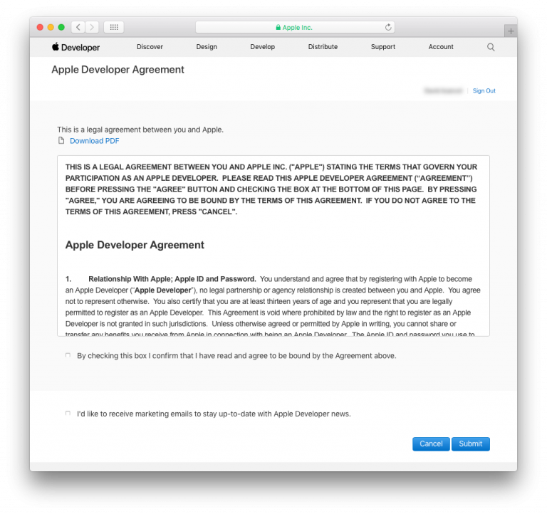
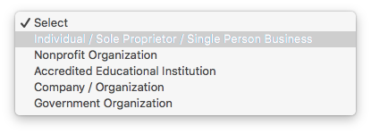

> **OBJETIVOS**
> 
> Elegir el Apple Developer Program apropiado.

Debe tener una cuenta de desarrollador Apple válida para **distribuir una aplicación iOS**. Apple ofrece dos programas para desarrolladores:

* **[Apple Developer Program](https://developer.apple.com/programs/)** **for organization** or **for individual** – $99/year
* **[Apple Enterprise Developer Program](https://developer.apple.com/programs/enterprise/)** – $299/year

La principal diferencia entre los dos programas es:

* **Apple Developer Program (para las empresas o para los particulares)**: le permite distribuir aplicaciones**en el App Store**.

* **Apple Developer Enterprise Program**: ofrece recursos ÚNICAMENTE para desarrollar y distribuir **aplicaciones internas patentadas** a empleados.

For **test purposes** you can use a Free Apple Developer Program.

Aquí hay un gráfico que compara los diferentes niveles de membresía de desarrollador:

:::info

To enroll in any **Apple Developer Program**, your Apple ID must be associated with an email address using your organization’s domain name.

:::

:::info Free Apple Developer account

If you want to join the Apple Developer Program for free, you can create a free Apple ID and use it to access a limited set of developer-oriented privileges. Therefore, follow only Steps 1 and 2, then launch Xcode > Preferences > Accounts, Add your Apple ID and sign in ! :::

## PASO 1. Identificador Apple

Si no tiene identificación Apple, vaya a '[Paso 2](#step-2-create-your-apple-id).

Si no tiene identificación Apple, vaya a '[Paso 3](#step-3-d-u-n-s-number).

## PASO 2. Cree su identificación Apple

Vaya a la [página de creación del identificador Apple](https://appleid.apple.com/).

* Llene el formulario y las preguntas de seguridad.
* Recibirá un código de verificación por correo electrónico.
* Ingrese el código de verificación para validar la creación de su cuenta.

* Una vez que tenga su identificación Apple, puede continuar con el Paso 3.

## PASO 3. Número D-U-N-S

:::info

This step is not included for the **Apple Developer Program as an individual**.

:::

* Si no tiene un número D-U-N-S, vaya a [ Paso 4](#step-4-request-a-d-u-n-s-number).
* Si ya tiene un número D-U-N-S, vaya a [ Paso 5](#step-5-register-as-a-developer).

## PASO 4. Solicite un número D-U-N-S

:::info

This step is not included for the **Apple Developer Program as an individual**.

:::

Solicite un número D-U-N-S [aquí](https://developer.apple.com/enroll/duns-lookup/#/search)

* Llene el formulario.
* Haga clic en **Continue**.
* Verifique su e-mail para obtener el número D-U-N-S.

## PASO 5. Register

### Apple Developer Entreprise and Apple Developer as an organisation

Puede registrarte como desarrollador [aquí](https://developer.apple.com/programs/enterprise/enroll/).

* Haga clic en el botón **Start your Enrollment**.
* Lea y acepte los términos del contrato "Apple Developer Agreement".
* Haga clic en **Submit**.

### Apple Developer as an individual

* Puedes registrarte como desarrollador [aquí](https://developer.apple.com/account/).

* Lea y acepte los términos del contrato "Apple Developer Agreement".
* Haga clic en **Submit**.

## PASO 6. Join

:::info

This step is not included for the **Apple Developer Enterprise Program**.

:::

### Apple Developer Program as an Organisation

* Puede suscribirse al Apple Developer Program [aquí](https://developer.apple.com/enroll/enterprise/).

### the Apple Developer Program as an Individual

* Haga clic en **Join the Apple Developer Program** en la parte inferior de la página.

## PASO 7. Enroll

### Apple Developer Program as an Organisation

* Haga clic en el botón **Start your Enrollment**.
* Seleccione **Company / Organization** en la lista desplegable "Entity Type".
* Haga clic en **Continue**.

* Llene el formulario.
* Haga clic en **Continue**.

* Apple tiene un proceso de verificación interno que generalmente tarda hasta seis días hábiles. Una vez que Apple recibe la solicitud de inscripción, verifican que el desarrollador esté habilitado para vincular a su organización con los acuerdos legales del Apple Developer Program.
* Generalmente, Apple llama para verificar que el contacto principal existe y que se ha solicitado el registro al Apple Developer Enterprise Program.
* Luego, recibirá otro correo electrónico que lo invitará a finalizar el proceso de inscripción.

### Apple Developer Program para particulares

* Haga clic en el botón **Start your Enrollment**.
* Seleccione **Individuals / Sole Proprietor / Single Person Business** en la lista desplegable "Entity Type".
* Haga clic en **Continue**.

* Llene el formulario
* Lea y acepte el Contrato de desarrollador de licencia "Apple Developer Program License Agreement".
* Haga clic en **Continue**.

### Apple Developer Enterprise Program

* Puede suscribirse al Apple Developer Program [aquí](https://developer.apple.com/enroll/enterprise/).
* Haga clic en el botón **Start your Enrollment**.
* Seleccione **Company / Organization** en la lista desplegable "Entity Type".
* Haga clic en **Continue**.

* Llene el formulario.
* Haga clic en **Continue**.

## PASO 8. Verificación de Apple

:::info

This step is  included only for the **Apple Developer Enterprise Program**.

:::

* Apple tiene un proceso de verificación interno que generalmente tarda hasta seis días hábiles. Una vez que Apple recibe la solicitud de inscripción, verifican que el desarrollador esté habilitado para vincular a su organización con los acuerdos legales del Apple Developer Program.
* Generalmente, Apple llama para verificar que el contacto principal existe y que se ha solicitado el registro al Apple Developer Enterprise Program.
* Luego, recibirá otro correo electrónico que lo invitará a finalizar el proceso de inscripción.

## PASO 9. Complete su suscripción

* Una vez que su solicitud de inscripción haya sido aceptada, puede proceder al pago.

* Cuando haya completado su compra, recibirá un correo electrónico confirmando su adhesión al programa.

¡Felicitaciones! ¡Felicitaciones! ¡Felicitaciones! Acaba de agregar 2 acciones a su aplicación iOS. You are now ready to deploy and publish your applications!

