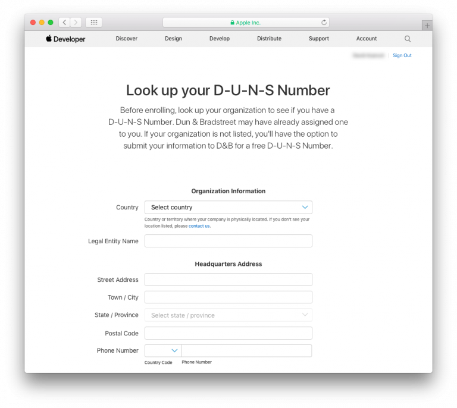

> **OBJETIVOS**
> 
> Elegir el Apple Developer Program apropiado.

Debe tener una cuenta de desarrollador Apple válida para **distribuir una aplicación iOS**. Apple ofrece dos programas para desarrolladores:

* **[Apple Developer Program](https://developer.apple.com/programs/)** **for organization** or **for individual** ($99/year) - Allows you to distribute app(s) **on the App Store**.
* **[Apple Developer Enterprise Program](https://developer.apple.com/programs/enterprise/)** ($299/year) - Provides resources ONLY for developing and distributing **proprietary, in-house apps** to employees

For **test purposes** you can use a **Free Apple Developer Program** (*Sign in with Apple ID*, see below).

Aquí hay un gráfico que compara los diferentes niveles de membresía de desarrollador:

:::info

To enroll in any **Apple Developer Program**, your Apple ID must be associated with an email address using your organization’s domain name.

:::

:::info Free Apple Developer account

If you want to join the Apple Developer Program for free, you only need to create a free Apple ID and sign in with it. Therefore, follow only Steps 1 and 2, then launch Xcode > Preferences > Accounts, Add your Apple ID and sign in! :::

## PASO 1. Cree su identificación Apple

If you already have an Apple ID, go to [Step 2](#step-2-request-a-d-u-n-s-number).

Vaya a la [página de creación del identificador Apple](https://appleid.apple.com/).

* Llene el formulario y las preguntas de seguridad.
* Recibirá un código de verificación por correo electrónico.
* Ingrese el código de verificación para validar la creación de su cuenta.

## PASO 2. Solicite un número D-U-N-S

:::info

This step is not necessary for the **Apple Developer Program as an individual**.

:::

* If you already have a D-U-N-S Number, go to [Step 3](#step-3-register).

Solicite un número D-U-N-S [aquí](https://developer.apple.com/enroll/duns-lookup/#/search)

* Llene el formulario.
* Haga clic en **Continue**.
* Verifique su e-mail para obtener el número D-U-N-S.

## PASO 3. Register

For **Apple Developer Enterprise Program** and **Apple Developer as an organisation**, you can register as a developer [here](https://developer.apple.com/programs/enterprise/enroll/).

For **Apple Developer as an individual**, you can register as a developer [here](https://developer.apple.com/account/).

Then, read and accept the *Apple Developer Agreement* and **Submit**.

## PASO 4. Join

:::info

This step is not necessary for the **Apple Developer Enterprise Program**.

:::

For **Apple Developer Program as an Organisation**, you can sign up for the Apple Developer Program [here](https://developer.apple.com/enroll/enterprise/).

For **Apple Developer Program as an Individual**, click on **Join the Apple Developer Program** at the bottom of the page.

## PASO 5. Enroll

* Haga clic en el botón **Start your Enrollment**.
* From the Entity Type dropdown list, select:
    - **Company / Organization** (for Apple Developer Enterprise Program and Apple Developer Program as an Organisation).
    - **Individuals / Sole Proprietor / Single Person Business** (for Apple Developer Program as an individual).

* Complete the form and Click on **Continue**.

## PASO 6. Verificación de Apple

:::info

This step is  only necessary for the **Apple Developer Enterprise Program**.

:::

* Apple tiene un proceso de verificación interno que generalmente tarda hasta seis días hábiles. Una vez que Apple recibe la solicitud de inscripción, verifican que el desarrollador esté habilitado para vincular a su organización con los acuerdos legales del Apple Developer Program.
* Generalmente, Apple llama para verificar que el contacto principal existe y que se ha solicitado el registro al Apple Developer Enterprise Program.
* Luego, recibirá otro correo electrónico que lo invitará a finalizar el proceso de inscripción.

## PASO 7. Complete su suscripción

* Una vez que su solicitud de inscripción haya sido aceptada, puede proceder al pago.

* Cuando haya completado su compra, recibirá un correo electrónico confirmando su adhesión al programa.

¡Felicitaciones! ¡Felicitaciones! ¡Felicitaciones! Acaba de agregar 2 acciones a su aplicación iOS. You are now ready to deploy and publish your applications!
