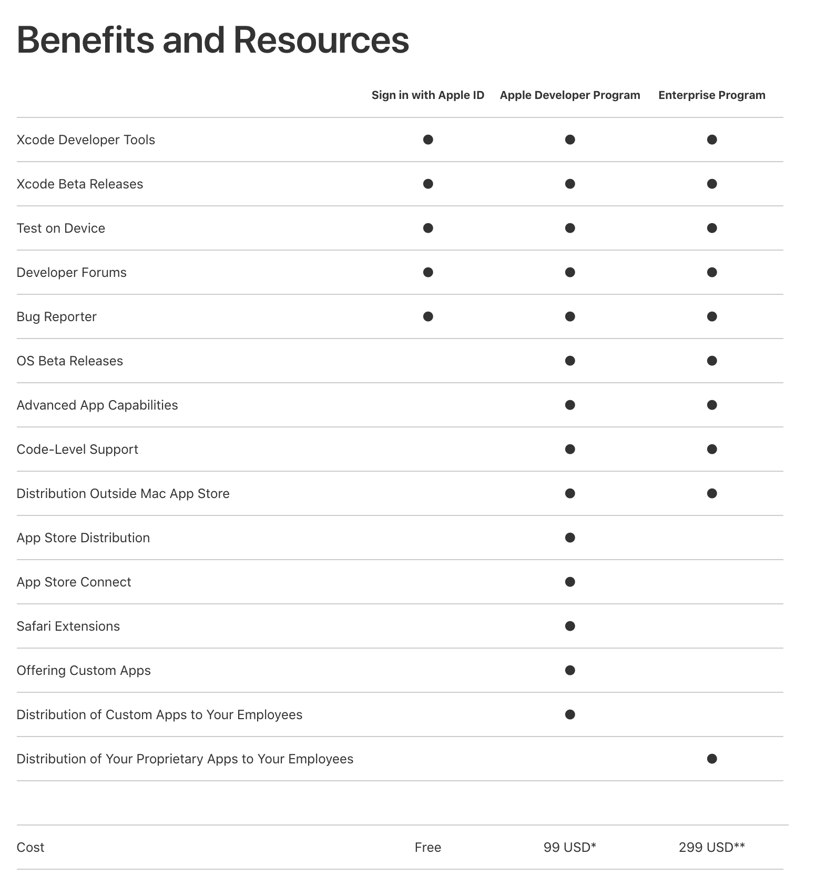

> **OBJECTIVES**
> 
> Choose the appropriate Apple Developer Program.

Debe tener una cuenta de desarrollador Apple válida para **distribuir una aplicación iOS**. Apple ofrece dos programas para desarrolladores:

* [Apple Developer Program for organization]`(selecting-your-developer-program-register-apple-developer-program-organization.html)` or [for individual]`(selecting-your-developer-program-register-apple-developer-program-individual.html)` – $99/year
* [Apple Enterprise Developer Program]`(selecting-your-developer-program-register-apple-developer-enterprise-program.html)` – $299/year

La principal diferencia entre los dos programas es:

* **Apple Developer Program (para las empresas o para los particulares)**: le permite distribuir aplicaciones**en el App Store**.

* **Apple Developer Enterprise Program**: ofrece recursos ÚNICAMENTE para desarrollar y distribuir **aplicaciones internas patentadas** a empleados.

For **test purposes** you can use a [Free Apple Developer Program]`(free-developer-account.html)`.

Aquí hay un gráfico que compara los diferentes niveles de membresía de desarrollador:

