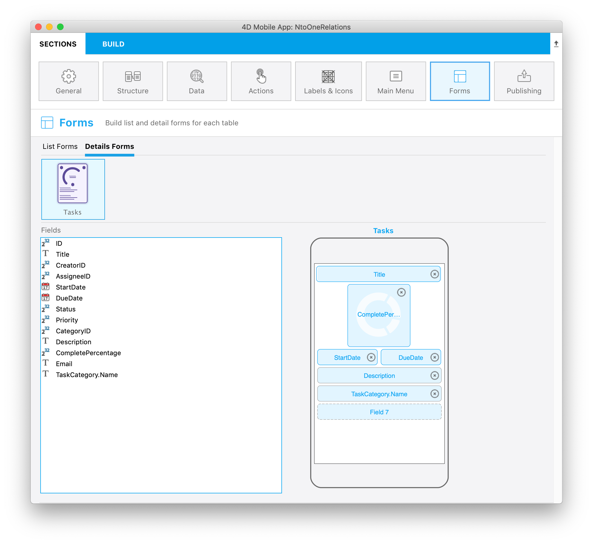
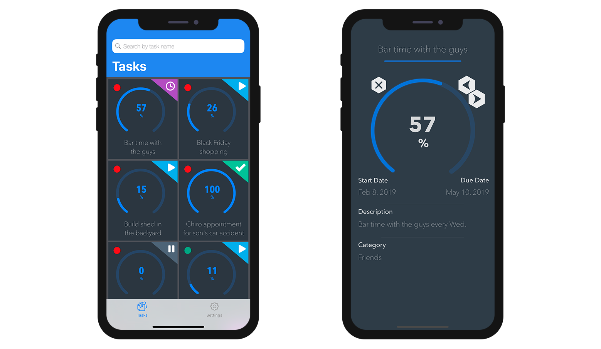

This tutorial will show you how easy it can be to include Many to one relations in your mobile projects.

:::note

In this tutorial, we will use the relation names between your tables. Giving descriptive relation names can make your project structure definition easier.

:::

Let's get started by downloading the Starter project:

<a className="button button--primary" href="https://github.com/4d-go-mobile/tutorial-ManyToOneRelations/releases/latest/download/tutorial-ManyToOneRelations.zip">Starter project</a>

Here we want to display the category for each task in the detail form of your generated app. To do so, open the **StarteriOSProject** from **Open > Mobile Project...**

Then go right to your Structure section and select the **Task table**.

### Structure section

* Puede constatar que el **enlace TaskCategory** está subrayado

* Al hacer clic en él, se mostrarán los campos disponibles a través de esta relación

* Seleccione el **campo Name**

* Este campo funcionará como cualquier otro campo durante el resto del proceso de creación de la aplicación

* You can also filter your app content using related fields from the Data section. To do so enter `TaskCategory.Name != 'Personal'` in the Filter query field to exclude personal tasks.

 

* Luego puede seleccionar un **ícono** y los **formatos** y definir las **etiquetas cortas y largas** en la sección Etiquetas e iconos

* Vaya a la sección Formularios y arrastre el campo en el formulario detallado Tasks

* Build and Run

You should see your related field in your app detail form !

