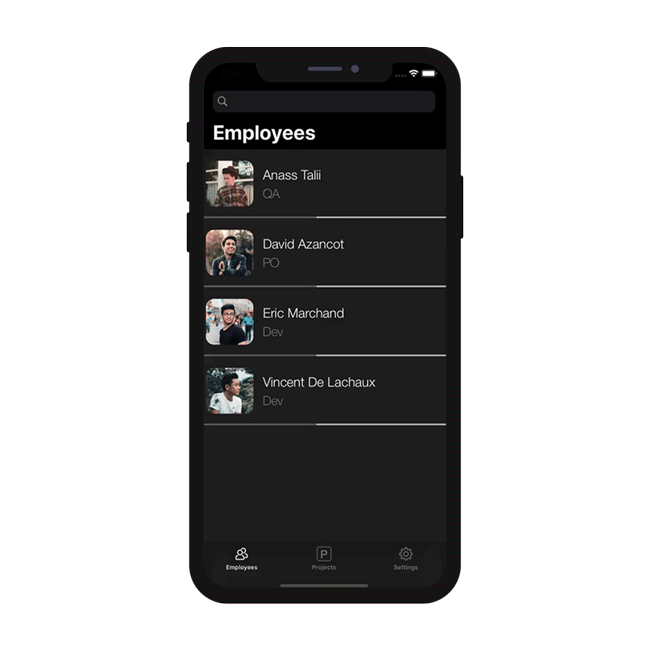
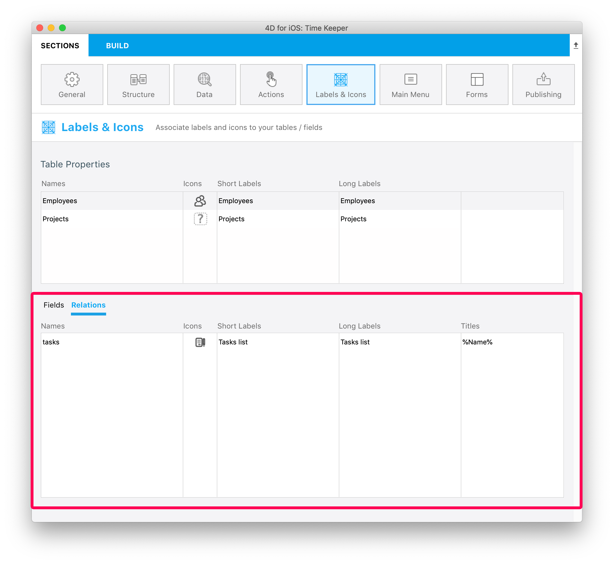

This tutorial will show you how easy it can be to include One to Many relations in your mobile project.

Let's get started by downloading the Starter project:

<a className="button button--primary"
href="https://github.com/4d-go-mobile/tutorial-OneToManyRelations/archive/c006015afeb0e134d872152f53b8cd5e4dcb59bb.zip">Starter project</a>

En este tutorial, vamos a construir una **aplicación Task** utilizando 4D for iOS.

Pero primero, demos un vistazo a la estructura de nuestra base:

Como puede ver, hay un enlace de Uno a Muchos llamado **tasks** que usaremos en nuestra aplicación iOS para mostrar las tareas'(**1**) (**a Muchos**) de los empleados.

Ahora, vaya directamente al menú Abrir > Proyecto móvil... a seleccionar *Time Keeper* y vaya a la sección **Structure**.

## Structure section

Puede ver la **relación de tareas** que hemos visto antes... ¡Puede publicarla!

Este campo ahora funcionará como cualquier otro campo durante el resto del proceso de creación de la aplicación.

:::tip

On mouse over, a tip displays the table name originating the relation.

:::

## Sección Etiquetas e Iconos

The One to Many relation is now available in the **Labels and Icons** section.

It is important to know that including a One to Many relation will create a button into the genrated iOS app.

So, in the Labels & Icons section you will define:

* una etiqueta de botón
* un icono de botón
* a title that will be displayed in the destination view (to indicate where you come from for example).

## Forms section

* Vaya a la sección Formularios y suelte la relación *tasks* en el formulario detallado Employee Task.

## Build and Run

1. A partir del formulario Employee List, haga clic en un empleado
2. Esto abrirá el formulario detallado del empleado, donde debería ver un nuevo ¡**botón Relación**!
3. Haga clic en este botón Relación para mostrar las tareas del empleado.

Well done! You've successfully included One to Many relations in your mobile project.

Download the completed project:

<a className="button button--primary"
href="https://github.com/4d-go-mobile/tutorial-OneToManyRelations/releases/latest/download/tutorial-OneToManyRelations.zip">Download</a>

