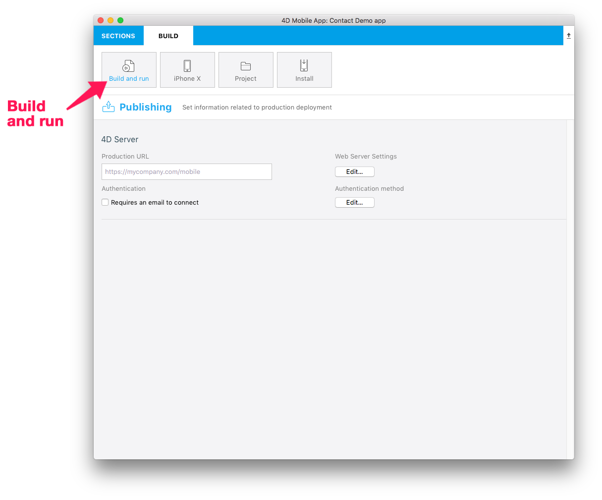
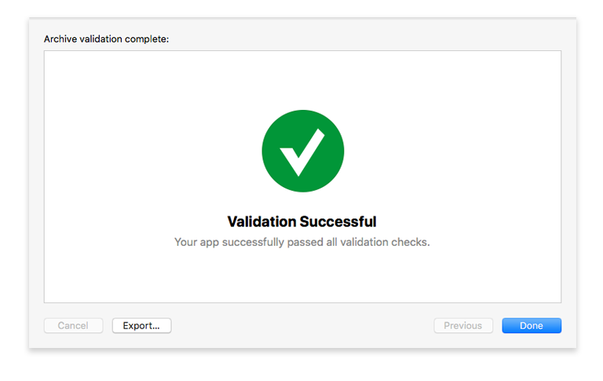
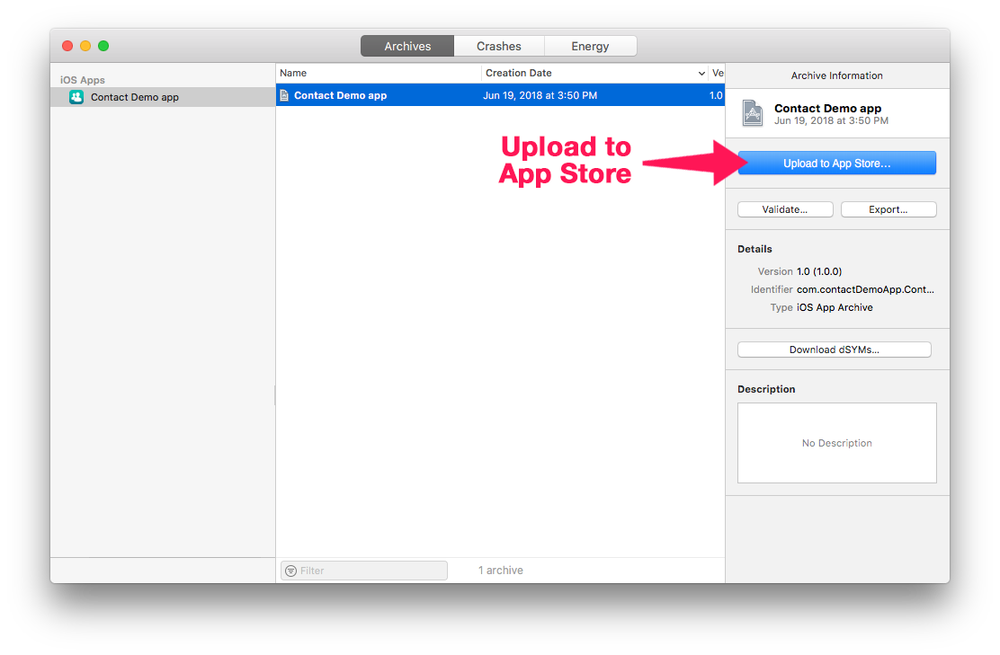

> **OBJETIVOS**
> 
> Archivar y publicar un proyecto en la App Store Connect.

## PASO 1. Configuración Xcode
* Si ha elegido una cuenta de desarrollador de Apple individual, su cuenta estará disponible de inmediato.
* Si ha elegido una Cuenta de desarrollador de Apple como organización, debe esperar la validación de Apple.
* Cuando se pueda acceder a su cuenta, agréguela a Xcode en Preferences > Accounts.
* Xcode instalará automáticamente los elementos de provisión y certificados necesarios.

## PASO 2. Obtenga su Team ID

* Inicie sesión en su cuenta de desarrollador Apple. Encuentre su ITeam ID en Membership.

## PASO 3. Configure 4D for iOS

* Lance 4D for iOS
* En la pestaña SECTIONS:

**General: introduzca su Team ID**

**Publicación: introduzca su URL de producción**

(HTTPS es obligatorio para el despliegue).

* En la pestaña BUILD:

**Crear y ejecutar: cree su proyecto**

## PASO 4. Abra su proyecto con Xcode

* Desde la pestaña BUILD del editor de proyectos de 4D for iOS, haga clic en Proyecto > Abrir el proyecto con Xcode

## PASO 5. Archive su proyecto desde Xcode

* Desde Xcode, vaya al menú del simulador y seleccione **Generic iOS Device**.

* Luego desde el menú, haga clic en Product y seleccione **Archive**

## PASO 6. Valide su proyecto

* Al final del proceso de archivo, aparece la ventana del Organizador con el archivo que acaba de crear.

* Haga clic en el botón **Validate** para iniciar el proceso de validación.

* El primer paso es seleccionar las opciones de distribución de la App Store.

* Entonces debe volver a firmar su aplicación. Deje que Xcode administre esto marcando la opción **Automatically manage signing**.

* Verifique el contenido de su aplicación.

* Si su proyecto pasa el proceso de validación, debería ver este mensaje:

Si se produce un error, se mostrará un mensaje. Estos errores deben corregirse antes de volver a intentar el proceso de validación.

* Haga clic en **Done**. Esto le devolverá a la ventana del organizador.

## PASO 7. Subir a la App Store

Una vez termine el proceso de validación, estará listo para agregar su aplicación a la App Store.

* Haga clic en el botón **Upload to App Store**.

* Cuando su proyecto se haya subido con éxito, verá esta ventana:

## PASO 8. Seleccione la versión destinada a la App Store

* Desde App Store Connect > App Store > iOS App, seleccione su aplicación y haga clic en el botón **+** que aparece en la sección Build

* Seleccione la versión que quiere enviar y haga clic en **Done**.

* Finalmente, haga clic en el botón **Submit for Review**.

## PASO 9. Envíe para revisión

* El último paso para enviar su aplicación para revisión es responder algunas preguntas rápidas sobre su aplicación.

* Cuando haya terminado con las preguntas, haga clic en **Submit**.

* El tiempo promedio de revisión de la App Store es de alrededor de dos días.
