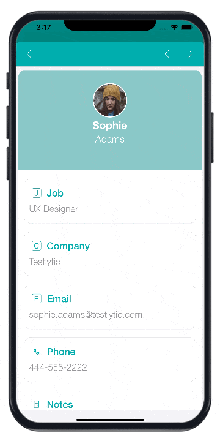

:::información 4D for Android

Esta sección no está disponible actualmente en 4D for Android.

:::

## ¿Qué es una notificación push?

En un teléfono móvil, una notificación Push es un mensaje de alerta, recibido a través de una aplicación, que puede abrir, eliminar, autorizar o bloquear. Puede ser muy útil por ejemplo para notificar a los usuarios de la aplicación que hay una nueva versión disponible.

Pero, ¿qué pasa con la arquitectura a implementar, para integrar esta funcionalidad en una aplicación móvil? Y ¿Cuál es el proceso de una notificación push, desde la creación hasta la visualización en el teléfono del usuario?

## Arquitectura técnica

Estos son los diferentes elementos necesarios para crear, enviar y recibir una notificación push móvil:


## Prerrequisitos

Para enviar notificaciones push, se requiere un archivo de autenticación `AuthKey_XXXYYY.p8` de Apple.

1. Genere y descargue un archivo de llave .p8 como se describe en [esta documentación](https://github.com/4d-for-ios/4D-Mobile-App-Server/blob/master/Documentation/Generate_p8.md).

2. En la página [Publishing](../project-definition/publishing), marque la opción **Notificaciones push** y seleccione su certificado en el proyecto móvil.


## Ejemplo básico para gestionar sus notificaciones push

El componente [4D Mobile App Server](https://github.com/4d-for-ios/4D-Mobile-App-Server/tree/master) ofrece métodos para enviar notificaciones push a uno o varios destinatarios. Para obtener información detallada, consulte la documentación del componente [PushNotification](https://github.com/4d-for-ios/4D-Mobile-App-Server/blob/master/Documentation/Classes/PushNotification.md).

Este es un ejemplo simple para enviar una notificación push a `test@4d.com`:

```4d

$pushNotification:=MobileAppServer.PushNotification.new() 
$notification:=New object 
$notification.title:="Este es el título" 
$notification.body:="Este es el contenido de esta notificación" 
$response:=$pushNotification.send($notification;"test@4d.com")

```

It's as simple as that!

:::consejo

Utilice el componente [**4D Mobile App Server**](https://github.com/4d-for-ios/4D-Mobile-App-Server/blob/master/Documentation/Classes/PushNotification.md) para adaptar fácilmente notificaciones push a sus propias necesidades. Siéntase libre de usarlo y elegir los aspectos más relevantes para su aplicación. Y por supuesto, todas las contribuciones son bienvenidos a este proyecto, a través de comentarios, informes de errores y aún mejor: "pull requests".

:::

## Notificación push con sincronización de datos

Con una notificación push, también puede lanzar una sincronización para actualizar sus datos.

Por ejemplo, si su aplicación tiene una opción de seguimiento de la entrega, la información sobre la entrega se actualizará en la base de datos gracias a una notificación enviada al cliente. Esta notificación, que contiene una solicitud de sincronización de los datos, permitirá al cliente obtener los datos modificados en su teléfono inteligente.

Para ello utilizando el componente `4D Mobile App Server`, es necesario especificar si se desea forzar la sincronización de los datos en la notificación push. Por lo tanto, simplemente suministre el valor booleano `dataSynchro` en el objeto `userInfo`.

### Sincronización de datos con una notificación que abre un registro

Por defecto, una notificación que abre un registro activa automáticamente una sincronización de datos.

Por ejemplo, en una aplicación Contact, si se ha modificado la información específica de un contacto (*es decir.* el registro de un contacto, como la dirección o el número de teléfono), el usuario recibe una notificación que abre automáticamente el registro correspondiente y sincroniza los datos contenidos en el mismo. Cuando el usuario abre la notificación, la información del contacto se actualiza completamente.

Este es un ejemplo del comportamiento por defecto, una petición `dataSynchro` con el método `open()`:

:::nota

Para el método `open()` exclusivamente, este es el comportamiento por defecto. Como resultado, si no especifica el valor booleano `dataSynchro`, es `true` por defecto.

:::

```4d

$pushNotification:=MobileAppServer.PushNotification.new()

$notification:=New object
$notification.title:="This is title" 
$notification.body:="Este es el contenido de esta notificación" 

$entity:=ds.Employees.get("456456")
$response:=$pushNotification.open($entity; $notification; $recipients)

```

Sin embargo, también se puede optar por no forzar una sincronización de datos, evitando `dataSynchro`:

```4d

$pushNotification:=MobileAppServer.PushNotification.new()

$notification:=New object
$notification.title:="Este es el título" 
$notification.body:="Este es el contenido de esta notificación" 
$notification.userInfo:=New object("dataSynchro"; False)

$entity:=ds.Employees.get("456456")
$response:=$pushNotification.open($entity; $notification; $recipients)

```

### Sincronización de datos con una simple notificación

También puede solicitar una sincronización para una simple notificación sin abrir un registro específico. Por ejemplo, se han añadido algunas entradas nuevas. Entonces puede informar a su usuario y actualizar los datos sin ninguna manipulación por su parte.

Aquí hay un ejemplo de código que también puede utilizar con otros métodos, siempre y cuando llene el objeto `userInfo` con el valor `dataSynchro`.

```4d

$pushNotification:=MobileAppServer.PushNotification.new()

$notification:=New object
$notification.title:="Este es el título" 
$notification.body:="Este es el contenido de esta notificación" 
$notification.userInfo:=New object("dataSynchro"; True)

$response:=$pushNotification.send($notification; $recipients)

```


## Configuración Windows

Los usuarios de Windows necesitan descargar la [última versión de CURL](https://curl.se/download.html) para trabajar en las variables del entorno de su máquina. O pueden insertar curl.exe en la carpeta Resources de su base de producción.

## Carpeta MobileApps

Tanto si trabaja en Windows como en macOS, tiene que copiar los siguientes archivos de su proyecto de desarrollo a su proyecto de producción:

- `4DBASE/MobileApps/ID.BundleID/AuthKey_XXXX.P8`
- `4DBASE/MobileApps/ID.BundleID/manifest.json`


