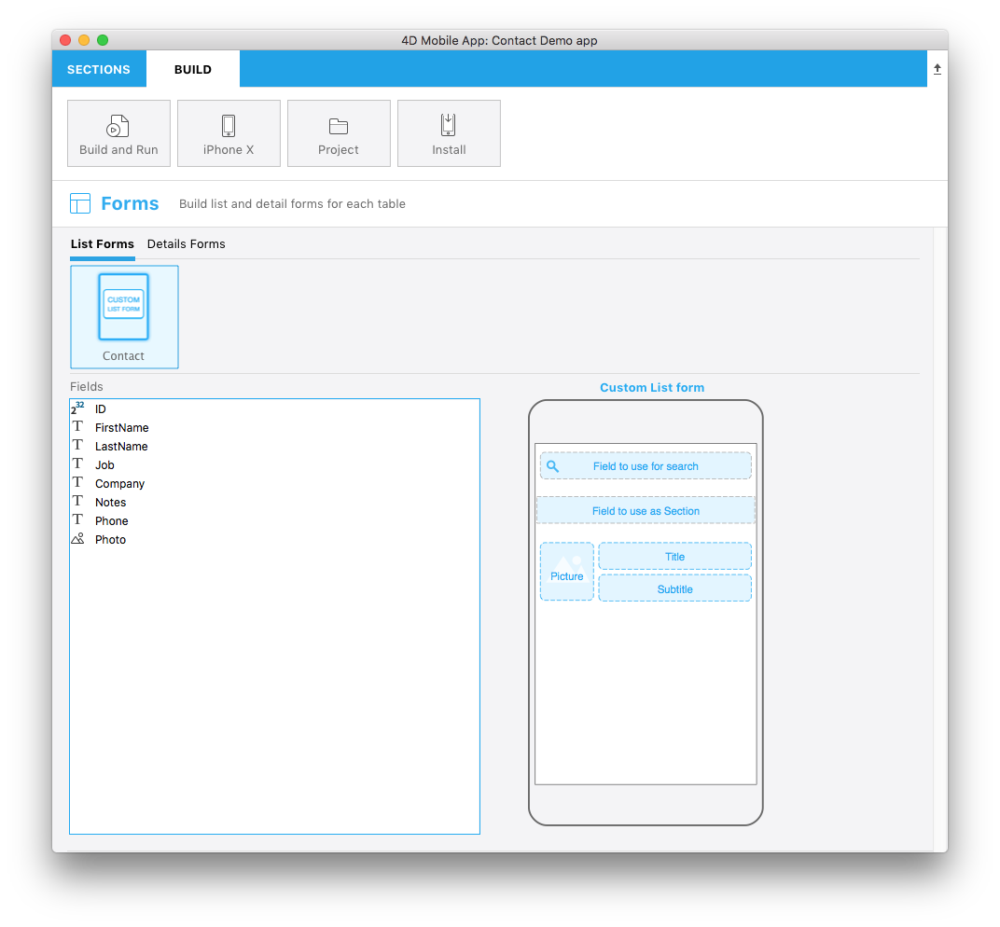

El archivo `template.svg` es una representación visual básica de una plantilla. En este archivo, deberá definir áreas para poder agregar campos a su plantilla de formulario listado desde el editor de proyecto.

Aquí hay una versión final:



Centrémonos en las diferentes partes de este archivo svg y en lo que necesitará editar.

## Título

```xml
<title>Custom List form</title>
```

Título de la plantilla.

## ios:values

```xml
<text id="cookery" ios:values="search,section,f1,f2,f3"/>
```

Incluye las identificaciones que definen sus áreas de formulario:

* **search**: se refiere al área del campo de búsqueda. Esto le permitirá arrastrar y soltar un campo como criterio de búsqueda en su formulario Lista (opcional).
* **section**: se refiere al área de campo de la sección. Esto le permitirá arrastrar y soltar un campo como criterio de ordenación en su formulario Lista (opcional).
* **f1, f2 y f3**: se refiere a los campos a mostrar en cada celda de su formulario listado. Esto le permitirá arrastrar y soltar campos para que aparezcan en las celdas de su formulario Lista.

## Posición, alto y ancho del área

Puede definir la posición, el alto y ancho para:

* Searchfield
* Sectionfield
* Otros campos generales que se mostrarán en cada celda de la tabla

### Área SearchableField:

```svg
//1
<g transform="translate(0,60)”>

//2
<rect class="bg field" x="14" y="12" width="238" height="30”/>

//3
<path class="magnifyingGlass" transform="translate(20,8) scale(1)”/>

//4
<textArea id="search.label" class="label" x="14" y="8" width="238"/>

//5
<rect id="search" class="droppable field optional" x="14" y="0" width="238" height="30" stroke-dasharray="5,2" ios:type="0,1,2,4,8,9,11,25,35"  ios:bind="searchableField"/>

//6
<use id="search.cancel" x="224" y="1" xlink:href="#cancel" visibility="hidden"/>
</g>
```

1. Posición de toda el área Y
2. Posición, alto y ancho del área de fondo
3. Icono para mostrar un icono de lupa en el campo de búsqueda
4. Definir la posición del área de texto y el ancho
5. Definir la posición del campo soltable, su alto y su ancho, así como los [**tipos de campos**](#iostypes) aceptados
6. Definir un botón de cancelación que se mostrará para eliminar el contenido actual

El campo de búsqueda es opcional.


### Área SectionField:

```svg
//1
<rect class="bg field" x="10" y="110" width="246" height="30”/>

//2
<textArea id="section.label" class="label" x="0" y="118" width="250"/>

//3
<rect id="section" class="droppable optional" x="10" y="110" width="246" height="30" stroke-dasharray="5,2" ios:type="0,1,2,4,8,9,11,25,35" ios:bind="sectionField”/>

//4
<use id="section.cancel" x="224" y="111" xlink:href="#cancel" visibility="hidden"/>
```

1. Posición, alto y ancho del área de fondo
2. Definir la posición del área de texto y el ancho
3. Definir la posición del campo soltable, su alto y su ancho y también los [**tipos de campos**](#iostypes) aceptados
4. Definir un botón de cancelación que se mostrará para eliminar el contenido actual

El campo de sección es opcional.

### Área ImageField:

```svg
//1
<g transform="translate(0,162)">

//2
<rect class="bg field" x="14" y="0" width="60" height="65"/>

//3
<path class="picture" transform="translate(-60 0) scale(5)"/>

//4
<textArea id="f1.label" class="label" x="14" y="30" width="60">$4DEVAL(:C991("picture"))</textArea>

//5
<rect id="f1" class="droppable field" x="14" y="0" width="60" height="65" stroke-dasharray="5,2" ios:type="3" ios:bind="fields[0]"/>

//6
<use id="f1.cancel" x="47" y="-2" xlink:href="#cancel" visibility="hidden"/>
</g>
```

1. Posición de toda el área Y
2. Posición, alto y ancho del área de fondo
3. Icono para mostrar una imagen en el imageField
4. Definir la posición del área de texto y el ancho
5. Definir la posición del campo soltable, su alto y su ancho y también los [**tipos de campos**](#iostypes) aceptados
6. Definir un botón de cancelación que se mostrará para eliminar el contenido actual

### Área Title Field:

```svg
//1
<g transform="translate(0,162)”>

//2
<rect class="bg field" x="84" y="0" width="168" height="30”/>

//3
<textArea id="f2.label" class="label" x="84" y="8" width="168">$4DEVAL(:C991("titleField"))</textArea>

//4
<rect id="f2" class="droppable field" x="84" y="0" width="168" height="30" stroke-dasharray="5,2" ios:type="0,1,2,4,8,9,11,25,35" ios:bind="fields[1]”/>

//5
<use id="f2.cancel" x="224" y="1" xlink:href="#cancel" visibility="hidden"/>
</g>
```

1. Posición de toda el área Y
2. Posición, alto y ancho del área de fondo
3. Definir la posición del área de texto y el ancho
4. Definir la posición del campo soltable, su alto y su ancho y también los [**tipos de campos**](#iostypes) aceptados
5. Definir un botón de cancelación que se mostrará para eliminar el contenido actual

### Área Subtitle Field:

```svg
//1
<g transform="translate(0,198)”>

//2
<rect class="bg field" x="84" y="0" width="168" height="30”/>

//3
<textArea id="f3.label" class="label" x="84" y="8" width="168">$4DEVAL(:C991("subtitleField"))</textArea>

//4
<rect id="f3" class="droppable field" x="84" y="0" width="168" height="30" stroke-dasharray="5,2" ios:type="0,1,2,4,8,9,11,25,35" ios:bind="fields[2]”/>

//5
<use id="f3.cancel" x="224" y="1" xlink:href="#cancel" visibility="hidden"/>
</g>
```

1. Posición de toda el área Y
2. Posición, alto y ancho del área de fondo
3. Definir la posición del área de texto y el ancho
4. Definir la posición del campo soltable, su alto y su ancho y también los [**tipos de campos**](#iostypes) aceptados
5. Definir un botón de cancelación que se mostrará para eliminar el contenido actual


## tipos:ios

Se soportan los siguientes tipos de campos:

| Code | Type           |
| ---- | -------------- |
| 0    | alfa           |
| 1    | real           |
| 2    | texto          |
| 3    | imagen         |
| 4    | fecha          |
| 8    | entero         |
| 9    | entero largo   |
| 11   | hora           |
| 25   | entero 64 bits |

:::nota

Para más información sobre estos tipos de campo, consulte [**esta página**](https://developer.4d.com/docs/en/Concepts/data-types.html).

:::

:::consejo

Para facilitar la definición de los tipos de campos, 4D for iOS le permite incluir tipos de campos con los ** valores positivos ** y también excluir los tipos de campo con ** valores negativos **. Por ejemplo, `ios:type="-3,-4"` le permitirá arrastrar y soltar todos los campos excepto las imágenes y las fechas. Para incluir todos los tipos de campos, introduzca simplemente `ios:type="all"`.

:::