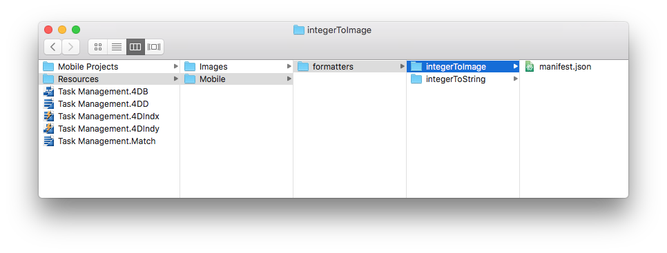
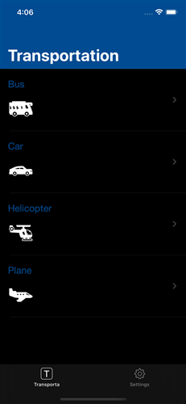
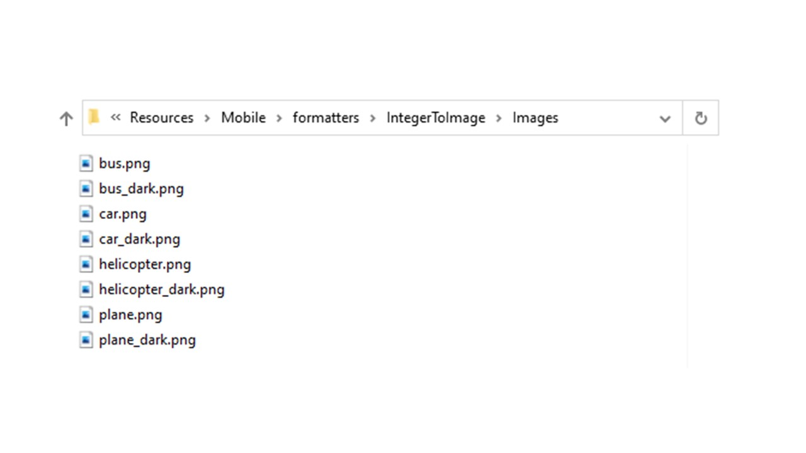
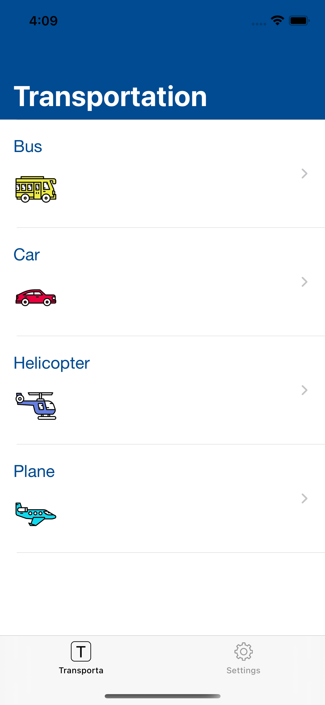

> **OBJETIVOS**
> 
> Crear sus primeros formatos de datos.

> **REQUISITOS PREVIOS**
> 
> Haga clic `[here](prerequisites.html)` para ver lo que necesita para empezar

En este tutorial, lo guiaremos a través de la creación de varios ejemplos de formatos.

## Descargue el proyecto Starter

Para comenzar, descargue el **proyecto Starter**, que incluye:

* Las carpetas **integerToImage_Images** y **textToImage_Images**, que contienen las imágenes (a utilizar más adelante para los formatos que contienen imágenes)
* Un archivo **Task Management.4dbase** (con una aplicación de proyecto móvil lista para utilizar)

<div className="center-button">
<a className="button button--primary"
href="https://github.com/4d-go-mobile/tutorial-CustomDataFormatter/archive/66d7eea49bc3353f73dbf784ee06283b3a332d0b.zip">Starter project</a>
</div>

¡Ahora está listo para crear a sus primeros formatos!

## Crear la carpeta Formats

Primero, cree una carpeta *Task Management.4dbase/Resources/Mobile/formatters*.


## Formatos de enteros

### Número entero a cadena

* Cree una carpeta **integerToString** en la carpeta de Formats que acaba de crear.
* Cree un archivo **manifest.json** en la carpeta **integerToString**.


Veamos el contenido del archivo **manifest.json**:

```json
{
   "name": "integerToString",

   "type": ["integer"],

   "binding": "localizedText",

   "choiceList": {"0":"UX designer","1":"Developer","2":"QA","3":"Product Owner"}
}
```

1. **name**: el nombre del formato
2. **type**: tipo de formato 4D que desea utilizar
3. **binding**: puede ser **localized text** para las cadenas o **imageNamed** para las imágenes
4. **choiceList**: valores mapeados

### Entero a imagen

* Cree una carpeta **integerToImage** en la carpeta **formatters** que acaba de crear.

* Cree un archivo **manifest.json** en la carpeta **integerToImage**.



* Cree un archivo **Images** en la carpeta **integerToImage**. Puede agregar las imágenes de **integerToImage_Images** (en StarterProject.zip) para esta nueva carpeta.


Veamos el contenido del archivo **manifest.json**:


```json
{
    "name": "integerToImage",

   "type": ["integer"],

   "binding": "imageNamed",

   "choiceList": {"0":"todo.png","1":"inprogress.png","2":"pending.png","3":"done.png"},

   "assets": {
      "size": {
         "width": 40, "height": 40
      }
    }
}
```
1. **name**: el nombre del formato
2. **type**: el tipo de formato 4D que desea utilizar
3. **binding**: puede ser **localized text** para las cadenas o **imageNamed** para las imágenes
4. **choiceList**: valores mapeados
5. **assets**: ajustar el tamaño de visualización (ancho y alto)

## Formatos texto

### Texto a cadena

* Cree una carpeta **integerToString** en la carpeta Formats que acaba de crear.

* Create a **manifest.json** file in the **textToString** folder.


Veamos el contenido del archivo **manifest.json**:

```json
{
    "name": "textToString",

   "type": ["text"],

   "binding": "localizedText",

   "choiceList": {"FRA":"France","MAR":"Morocco","USA":"United States","AUS":"Australia"}
}
```

1. **name**: el nombre del formato
2. **type**: tipo de formato 4D que desea utilizar
3. **binding**: puede ser **localized text** para las cadenas o **imageNamed** para las imágenes
4. **choiceList**: valores mapeados

### Texto a imagen

* Cree una carpeta **textToImage** en la carpeta Formats que acaba de crear.

* Cree un archivo **manifest.json** en la carpeta **textToImage**.


* Luego cree un archivo **Images** en la carpeta **textToImage**. Puede agregar las imágenes de **textToImage_Images** (en StarterProject.zip) a esta nueva carpeta.


Veamos el contenido del archivo **manifest.json**:

```json
{
    "name": "textToImage",

   "type": ["integer"],

   "binding": "imageNamed",

   "choiceList": ["image1.png","image2.png","image3.png"],

   "assets": {
  "size": {
   "width": 40, "height": 40
        }
    }
}

```

## Soporte modo Oscuro

Tanto si su dispositivo está en modo oscuro como claro, si trabaja en iOS o Android, puede utilizar fácilmente los formateadores de datos personalizados que contienen imágenes. Las imágenes se adaptarán en función del modo de color del teléfono.

### Color tintado

Para optimizar el contraste de color de sus imágenes en blanco y negro en su aplicación dependiendo del modo de color (claro u oscuro), puede configurar las imágenes de la siguiente manera, con la línea de código `"tintable": true`:

```json
{
   "name": "textToImage",
   "type": ["text"],
   "binding": "imageNamed",
   "choiceList": {"car":"car.png","plane":"plane.png","bus":"bus.png"},
   "assets": {
     "size": 54, 
     "tintable": true
     }
}
```
Aquí está el resultado en los modos claro y oscuro:

| Modo Claro                            |             Modo Oscuro              |
| ------------------------------------- |:------------------------------------:|
|  |  |


### Imágenes a color optimizadas

Para optimizar las imágenes de color que se muestran en su aplicación y adaptarlas a su modo de color, necesita tener dos imágenes: una para el modo claro y otra para el modo oscuro con el sufijo `_dark`, como sigue:



```json
{
   "name": "textToImage",
   "type": ["text"],
   "binding": "imageNamed",
   "choiceList": {"car":"car.png","plane":"plane.png","bus":"bus.png"},
   "assets": {
     "size": 54
   }
}
```
Aquí está el resultado en modo claro y en modo oscuro:

| Modo Claro                               |               Modo Oscuro               |
| ---------------------------------------- |:---------------------------------------:|
|  |  |

## Abrir un proyecto móvil

Abra Task Management.4dbase con 4D y vaya al Archivo > abrir > Mobile Project... para abrir **Tasks**

A continuación, vaya a la sección **Etiquetas e iconos** en el editor de proyectos. Todos los formatos están disponibles para los diferentes tipos de campos definidos previamente en los diferentes archivos de formato manifest.json:

* Seleccione el formato **integerToString** para **Job field**
* Seleccione el formato **textToString** para **Country field**
* Seleccione el formato **integerToImage** para **Task Status**
* Seleccione el formato **textToImage** para **Manager**


## Genere su aplicación 4D for iOS

Genere su aplicación 4D for iOS y verá que su formateador de datos se aplica correctamente en función del "crédito límite".


Descargue la carpeta de la plantilla del formateador terminada:

<div className="center-button">
<a className="button button--primary"
href="https://github.com/4d-go-mobile/tutorial-CustomDataFormatter/releases/latest/download/tutorial-CustomDataFormatter.zip">Descargar</a>
</div>
