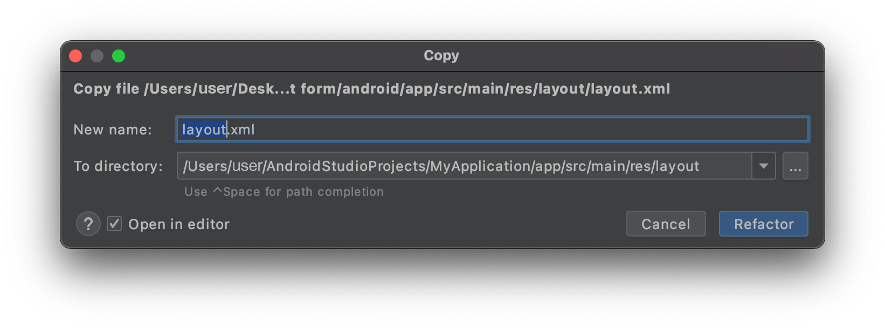

En esta sección verá cómo crear su interfaz de formulario detallado con Android Studio.

Este es el resultado que queremos lograr:


Para esta plantilla, vamos a añadir:

* una foto de perfil en el encabezado
* un campo a duplicar

## Abrir el archivo de diseño con Android Studio

La mejor manera de editar o crear una plantilla es:

* Abrir Android Studio y crear un nuevo proyecto móvil vacío presionando en Archivo > Nuevo > Nuevo Proyecto...

* Seleccionar la plantilla Actividad vacía


* Configure su proyecto y haga clic en **Terminar**


* Copiar el archivo layout.xml en app > res > layout soltándolo directamente en la carpeta diseño del proyecto



* Debería tener eso en ese momento:


* Haga clic en la opción superior derecha **Dividir** para visualizar la vista previa de la plantilla así como el código xml.

Está vacío, así que vamos a agregar algo de contenido.


## Qué está disponible en este proyecto inicial

Para que la vista sea desplazable, ya se incluye una vista de desplazamiento en el diseño:

```xml
    <androidx.core.widget.NestedScrollView
        android:layout_width="match_parent"
        android:layout_height="match_parent"
        android:fillViewport="true">

```

La parte que se va a duplicar:

```xml
 <androidx.cardview.widget.CardView
                android:layout_width="match_parent"
                android:layout_height="wrap_content"
                android:layout_gravity="center"
                android:layout_marginHorizontal="4dp"
                android:layout_marginVertical="2dp"
                card_view:cardCornerRadius="4dp">

                <androidx.constraintlayout.widget.ConstraintLayout
                    android:layout_width="match_parent"
                    android:layout_height="wrap_content">

                    <TextView
                        android:id="@+id/__LABEL_ID__"
                        android:layout_width="0dp"
                        android:layout_height="wrap_content"
                        android:layout_marginStart="8dp"
                        android:layout_marginTop="8dp"
                        android:layout_marginEnd="8dp"
                        android:scrollbars="none"
                        android:text="__LABEL__"
                        android:textAppearance="@style/TextAppearance.MaterialComponents.Body1"
                        android:textColor="?colorPrimary"
                        app:layout_constraintBottom_toTopOf="@+id/__VALUE_ID__"
                        app:layout_constraintEnd_toEndOf="parent"
                        app:layout_constraintStart_toStartOf="parent"
                        app:layout_constraintTop_toTopOf="parent"
                        tools:text="My label" />

                    <!--IF_IS_IMAGE-->
                    <!-- IF THE DROPPED FIELD IS AN IMAGE -->
                    <ImageView
                        android:id="@+id/__VALUE_ID__"
                        android:layout_width="0dp"
                        android:layout_height="wrap_content"
                        android:layout_marginStart="8dp"
                        android:layout_marginTop="8dp"
                        android:layout_marginEnd="8dp"
                        android:layout_marginBottom="8dp"
                        android:contentDescription="Image"
                        app:imageUrl="__IMAGE__"
                        app:layout_constraintBottom_toBottomOf="parent"
                        app:layout_constraintEnd_toEndOf="parent"
                        app:layout_constraintStart_toStartOf="parent"
                        app:layout_constraintTop_toBottomOf="@+id/__LABEL_ID__" />

                    <!--END_IF_IS_IMAGE-->
                    <!--IF_IS_NOT_IMAGE-->
                    <!-- IF THE DROPPED FIELD IS NOT AN IMAGE, THEN IT WILL BE A TEXT VIEW -->

                    <TextView
                        android:id="@+id/__VALUE_ID__"
                        android:layout_width="0dp"
                        android:layout_height="wrap_content"
                        android:layout_marginStart="8dp"
                        android:layout_marginEnd="8dp"
                        android:layout_marginBottom="8dp"
                        android:scrollbars="none"
                        android:text="__TEXT__"
                        android:textAlignment="textStart"
                        android:textAllCaps="false"
                        android:textAppearance="@style/TextAppearance.MaterialComponents.Body2"
                        android:textColor="?colorOnSurface"
                        app:layout_constraintBottom_toBottomOf="parent"
                        app:layout_constraintEnd_toEndOf="parent"
                        app:layout_constraintStart_toStartOf="parent"
                        app:layout_constraintTop_toBottomOf="@+id/__LABEL_ID__"
                        tools:text="My field" />
                    <!--END_IF_IS_NOT_IMAGE-->

                </androidx.constraintlayout.widget.ConstraintLayout>

            </androidx.cardview.widget.CardView>
```


## Añadir una "Image View"

Para tener una buena visualización de la imagen vamos a utilizar de nuevo un contenedor CardView. Queremos añadir un radio de esquina a la ImageView para tener un mejor diseño.

```xml
    <androidx.cardview.widget.CardView
                    android:id="@+id/cardview"
                    android:layout_width="match_parent"
                    android:layout_height="300dp"
                    android:layout_gravity="center"
                    android:layout_marginHorizontal="4dp"
                    android:layout_marginVertical="6dp"
                    card_view:cardCornerRadius="12dp"
                    app:layout_constraintEnd_toEndOf="parent"
                    app:layout_constraintStart_toStartOf="parent"
                    app:layout_constraintTop_toTopOf="parent">
                    <ImageView
                        android:id="@+id/__SPECIFIC_ID_1__"
                        android:layout_width="match_parent"
                        android:layout_height="match_parent"
                        android:contentDescription="Image"
                        android:scaleType="centerCrop"
                        app:imageUrl="__IMAGE_1__"
                        app:layout_constraintEnd_toEndOf="parent"
                        app:layout_constraintStart_toStartOf="parent"
                        app:layout_constraintTop_toTopOf="parent"
                        tools:background="@tools:sample/avatars"/>
                </androidx.cardview.widget.CardView>

```

Como puede ver, el ImageView está insertado en el CardView. Eso permite añadirle radios de esquina.

La línea `app:imageUrl="__IMAGE_1__"` permitirá enlazar el valor de la imagen que se encuentra en la posición 1 del archivo svg que se ha definido previamente.


La línea `tools:background="@tools:sample/avatars"` simplemente está ahí para mostrar un marcador de posición ImageView.

Aquí está el código de diseño completo en esta etapa:

```xml
<?xml version="1.0" encoding="utf-8"?>

<layout xmlns:android="http://schemas.android.com/apk/res/android"
    xmlns:app="http://schemas.android.com/apk/res-auto"
    xmlns:card_view="http://schemas.android.com/apk/res-auto"
    xmlns:tools="http://schemas.android.com/tools"
    tools:ignore="DuplicateIds,HardcodedText">

    <data>

        <!--ENTITY_VARIABLE-->
    </data>

    <!-- Generated with detail form template named "Visual Contact" -->

    <androidx.core.widget.NestedScrollView
        android:layout_width="match_parent"
        android:layout_height="match_parent"
        android:fillViewport="true">

        <LinearLayout
            android:layout_width="match_parent"
            android:layout_height="match_parent"
            android:orientation="vertical">

            <!-- START EDITING HERE -->

            <androidx.constraintlayout.widget.ConstraintLayout
                android:layout_width="match_parent"
                android:layout_height="wrap_content">

                <androidx.cardview.widget.CardView
                    android:id="@+id/cardview"
                    android:layout_width="match_parent"
                    android:layout_height="300dp"
                    android:layout_gravity="center"
                    android:layout_marginHorizontal="4dp"
                    android:layout_marginVertical="6dp"
                    card_view:cardCornerRadius="12dp"
                    app:layout_constraintEnd_toEndOf="parent"
                    app:layout_constraintStart_toStartOf="parent"
                    app:layout_constraintTop_toTopOf="parent">

                    <ImageView
                        android:id="@+id/__SPECIFIC_ID_1__"
                        android:layout_width="match_parent"
                        android:layout_height="match_parent"
                        android:contentDescription="Image"
                        android:scaleType="centerCrop"
                        app:imageUrl="__IMAGE_1__"
                        app:layout_constraintEnd_toEndOf="parent"
                        app:layout_constraintStart_toStartOf="parent"
                        app:layout_constraintTop_toTopOf="parent"
                        tools:background="@tools:sample/avatars"/>
                </androidx.cardview.widget.CardView>


            </androidx.constraintlayout.widget.ConstraintLayout>

            <!--
            THE FOLLOWING PART WILL BE DUPLICATED CARD VIEWS FOR EVERY FIELD
            YOU DROP AT THE BOTTOM OF THE TEMPLATE
            -->

            <!--FOR_EACH_FIELD-->
            <!-- EVERYTHING BELOW WILL BE DUPLICATED FOR EACH FIELD YOU DROP AT THE BOTTOM OF THE
                 TEMPLATE IN THE PROJECT EDITOR -->
            <androidx.cardview.widget.CardView
                android:layout_width="match_parent"
                android:layout_height="wrap_content"
                android:layout_gravity="center"
                android:layout_marginHorizontal="4dp"
                android:layout_marginVertical="2dp"
                card_view:cardCornerRadius="4dp">

                <androidx.constraintlayout.widget.ConstraintLayout
                    android:layout_width="match_parent"
                    android:layout_height="wrap_content">

                    <TextView
                        android:id="@+id/__LABEL_ID__"
                        android:layout_width="0dp"
                        android:layout_height="wrap_content"
                        android:layout_marginStart="8dp"
                        android:layout_marginTop="8dp"
                        android:layout_marginEnd="8dp"
                        android:scrollbars="none"
                        android:text="__LABEL__"
                        android:textAppearance="@style/TextAppearance.MaterialComponents.Body1"
                        android:textColor="?colorPrimary"
                        app:layout_constraintBottom_toTopOf="@+id/__VALUE_ID__"
                        app:layout_constraintEnd_toEndOf="parent"
                        app:layout_constraintStart_toStartOf="parent"
                        app:layout_constraintTop_toTopOf="parent"
                        tools:text="My label" />

                    <!--IF_IS_IMAGE-->
                    <!-- IF THE DROPPED FIELD IS AN IMAGE -->
                    <ImageView
                        android:id="@+id/__VALUE_ID__"
                        android:layout_width="0dp"
                        android:layout_height="wrap_content"
                        android:layout_marginStart="8dp"
                        android:layout_marginTop="8dp"
                        android:layout_marginEnd="8dp"
                        android:layout_marginBottom="8dp"
                        android:contentDescription="Image"
                        app:imageUrl="__IMAGE__"
                        app:layout_constraintBottom_toBottomOf="parent"
                        app:layout_constraintEnd_toEndOf="parent"
                        app:layout_constraintStart_toStartOf="parent"
                        app:layout_constraintTop_toBottomOf="@+id/__LABEL_ID__" />
                    <!--END_IF_IS_IMAGE-->
                    <!--IF_IS_NOT_IMAGE-->
                    <!-- IF THE DROPPED FIELD IS NOT AN IMAGE, THEN IT WILL BE A TEXT VIEW -->

                    <TextView
                        android:id="@+id/__VALUE_ID__"
                        android:layout_width="0dp"
                        android:layout_height="wrap_content"
                        android:layout_marginStart="8dp"
                        android:layout_marginEnd="8dp"
                        android:layout_marginBottom="8dp"
                        android:scrollbars="none"
                        android:text="__TEXT__"
                        android:textAlignment="textStart"
                        android:textAllCaps="false"
                        android:textAppearance="@style/TextAppearance.MaterialComponents.Body2"
                        android:textColor="?colorOnSurface"
                        app:layout_constraintBottom_toBottomOf="parent"
                        app:layout_constraintEnd_toEndOf="parent"
                        app:layout_constraintStart_toStartOf="parent"
                        app:layout_constraintTop_toBottomOf="@+id/__LABEL_ID__"
                        tools:text="My field" />
                    <!--END_IF_IS_NOT_IMAGE-->

                </androidx.constraintlayout.widget.ConstraintLayout>

            </androidx.cardview.widget.CardView>

            <!--END_FOR_EACH_FIELD-->

        </LinearLayout>

    </androidx.core.widget.NestedScrollView>

</layout>

```

## Cómo obtener datos en su formulario detallado

### Image View

En nuestra plantilla de formulario detallado hemos utilizado `app:imageUrl="__IMAGE_1__"`

Aquí suponemos que la ImageView es la primera vista del svg, y su ID de vista es `__SPECIFIC_ID_1__`. Si fuera la tercera vista, sería `__IMAGE_3__` y su ID de vista sería `__SPECIFIC_ID_3__`.


## ¿Qué hacer ahora?

En este tutorial, hemos cubierto los conceptos básicos para crear plantillas de formularios detallados. Ahora puede crear plantillas simples por su cuenta utilizando los recursos del Proyecto Starter. Descargue la carpeta de la plantilla terminada:

<div className="center-button">
<a className="button button--primary"
href="https://github.com/4d-go-mobile/tutorial-CustomDetailForm/releases/latest/download/tutorial-CustomDetailForm.zip">Descargar</a>
</div>


