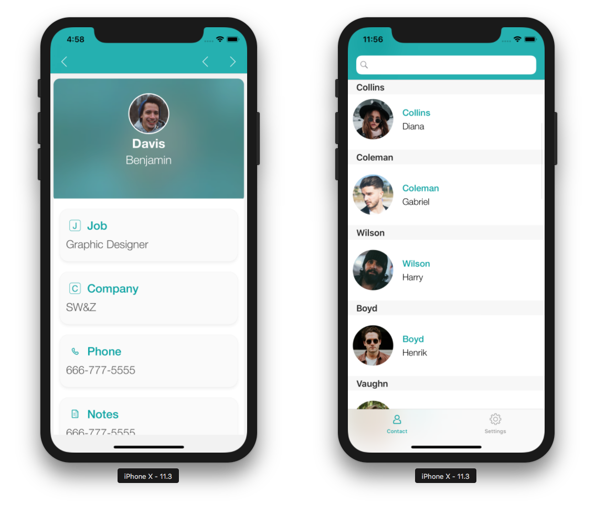

Puedes probar su aplicación en cualquier momento durante el desarrollo, gracias al Simulador situado en la pestaña GENERACIÓN del Editor de Proyectos.

Veamos más de cerca las opciones de la pestaña Generación:

* **Crear y ejecutar:** lanza la aplicación en el simulador.

* **iPhone X:** simulador por defecto. Al hacer clic aquí, se mostrará una lista desplegable con todos los simuladores disponibles.

* **Projet:** muestra una lista desplegable donde puede **abrir la carpeta del proyecto** o la **carpeta del producto**, o **abrir el producto con Xcode**. Esta lista desplegable es útil para [operaciones de depuración](../debug/from-project-editor).

* **Instalar:** instala la aplicación en un dispositivo conectado (ver [Instalación en su dispositivo iOS](../deployment/testing-on-your-device)).

## Utilización del simulador

Puede utilizar el Simulador siguiendo estos pasos.

1. Seleccione su dispositivo.

En la pestaña BUILD del Editor de Proyectos, seleccione un dispositivo iOS o Android para ejecutar su aplicación.

2. Haga clic en el botón **Crear y ejecutar**.

3. Pruebe su aplicación.

Pruebe navegar entre los formularios Lista y los formularios detallados en su aplicación.

 
