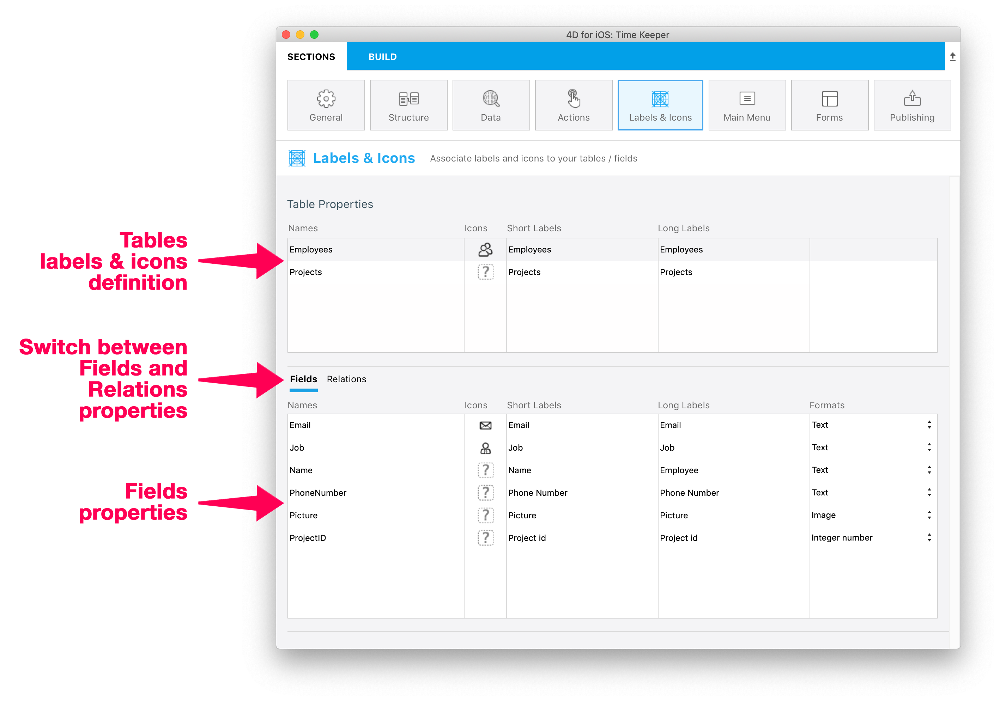

Esta página le permite definir las propiedades de visualización de sus tablas, campos y relaciones en la aplicación móvil.



Se definen las propiedades por defecto. Para modificar una propiedad, seleccione un elemento e introduzca el nuevo valor en la columna correspondiente.

Puede definir las mismas propiedades para las tablas, los campos y las relaciones. Además, se pueden definir formatos para los campos/relaciones.

Estos elementos se mostrarán en formularios detallados y en formularios listados, dependiendo de la plantilla en la aplicación generada.


## Iconos

Icono para asociar a la tabla o campo/elemento en la aplicación móvil cada vez que una plantilla requiera un icono.

:::info

Para los campos de relación, se mostrarán iconos a la izquierda del botón **Relación** que permite abrir una tabla relacionada.

:::

El editor de 4D mobile ofrece una amplia librería de iconos para satisfacer sus necesidades. Estos incluyen iconos para negocios, finanzas, educación, gobierno, salud, industria, bienes raíces, servicios, etc. Para seleccionar un icono, haga clic en el botón **icono** y elija un icono de la lista:


:::info

Para mantener todo consistente, los **iconos predeterminados** se generan para los campos vacíos, si se ha definido al menos un icono para un campo.

:::

También puede dejar el área de iconos vacía si no desea mostrar los iconos en su aplicación.


### Añadir iconos personalizados

Puede añadir sus propios iconos a la librería, para poder seleccionarlos en su proyecto. Puede utilizar cualquier formato de icono (se recomienda SVG o PNG para conservar la transparencia) y tamaño. Es muy recomendable tener iconos de colores personalizados para visualizarlos mejor en el editor de proyectos.

Por ejemplo, aquí tiene un conjunto de iconos personalizados que puede utilizar:

<div className="center-button">
<a
  className="button button--primary"
  href="https://github.com/4d-go-mobile/tutorial-CustomIcons/releases/latest/download/tutorial-CustomIcons.zip">
  Descargar iconos personalizados
</a>
</div>

Para incluir iconos personalizados en su proyecto:

1. Cree una carpeta `iconos` en la siguiente ubicación:

```
<my4DProjetFolder>/Resources/Mobile/medias
```

:::nota

Puede que tenga que crear la carpeta `medias`.

:::

2. Arrastre y suelte sus iconos personalizados en la carpeta `iconos`.


Ahora puede seleccionar sus iconos para su proyecto, que aparecen después de los iconos estándar.


## Etiquetas cortas y largas

Puede definir etiquetas personalizadas para tablas, campos y relaciones publicadas. Estas etiquetas se utilizarán de acuerdo con el espacio disponible en la plantilla para optimizar espacio y evitar congestionamiento en la barra de pestañas.

:::info

Para los campos de relación, se mostrarán etiquetas en el botón **Relación** que permite abrir una tabla relacionada.

:::

- Las etiquetas cortas deben tener 10 caracteres o menos
- Las etiquetas largas pueden tener hasta 25 caracteres
- Puede utilizar caracteres no permitidos en los nombres de estructuras, como "/", "@", el caracter de espacio, etc.

Por defecto, el editor móvil utiliza los nombres de tablas y campos definidos en la estructura como etiquetas en la aplicación, y se utiliza la misma cadena para las etiquetas cortas y largas.


## Formatos

Esta propiedad permite dar formato a los datos que se mostrarán en la aplicación. Al hacer clic en una línea de campo, se muestra un menú de formato.


Los formatos integrados disponibles dependen del tipo de campo:

| Tipo de campo     | Formatos                                                                                                               |
| ----------------- | ---------------------------------------------------------------------------------------------------------------------- |
| **Texto**         | Texto                                                                                                                  |
| **Fecha**         | Fecha, Fecha corta, Fecha larga, Fecha completa                                                                        |
| **Hora**          | Fecha, Fecha corta, Duración, Número entero                                                                            |
| **Imagen**        | Imagen                                                                                                                 |
| **Booleano**      | "No" o "Yes", "False" o "True"                                                                                         |
| **Número entero** | Número entero, número decimal, número real, porcentaje, número ordinal, moneda $, moneda €, moneda ¥, número en letras |


### Añadir formatos personalizados

El editor móvil le permite añadir formatos personalizados (llamados "formateadores") en sus proyectos. Por ejemplo, puede definir formatos personalizados para los correos electrónicos, los números de factura, etc.

Para añadir formatos personalizados a su proyecto móvil, puede:

- Download and install customized formats from the [**go-mobile formatters github repository**](https://4d-go-mobile.github.io/gallery//#/type/formatter).

- crear sus propios formatos.

:::tip tutorial

Visite [**este tutorial**](../tutorials/data-formatter/create-data-formatter) para saber cómo definir un formato personalizado

:::

Para instalar un formateador personalizado, sólo tiene que soltar la carpeta del formateador en la carpeta `/Resources/Mobile/formatters` del proyecto 4D. Una vez instalado, se puede seleccionar un formato personalizado en el menú Formatos, al igual que los formatos integrados.


## Título

Esta propiedad sólo está disponible para los campos Relación. El título definido se mostrará en la parte superior de la vista de destino al usar una relación.

Utilice un par de caracteres `%` para incluir el valor del campo relacionado en el título. Por ejemplo, si quiere que el título del campo relacionado `Employee.employer` muestre el nombre del campo relacionado `employee`, puede escribir:

```
%Name%'s employer
```

:::tip tutorial

Un [**tutorial**](../tutorials/relations/one-to-many-title-definition) está disponible para guiarlo a través del proceso de definición de un título.

:::
