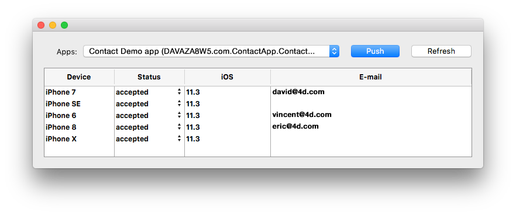

## Archivo de sesión

Cuando un usuario abre la aplicación por primera vez, se crea un archivo de sesión y se almacena junto al archivo de datos actual en la carpeta MobileApps.

Los archivos de sesión están organizados y agrupados por carpeta de aplicación. Los TeamID y Bundle ID de la aplicación se concatenan para crear los nombres de las carpetas de la aplicación.

Este es un ejemplo de un archivo de sesión generado para 4D for iOS:

```json
{
"application":{
  "id":"com.contactApp.Contact",
  "name":"Contact",
  "version":"1.0.0"
},
"team":{
  "id":"UTT7VDX8W5"
},
"language":{
  "id":"en_US",
  "code":"en",
  "region":"US"
},
"email":"",
"device":{
  "description":"iPhone X",
  "version":"11.3",
  "id":"0DC5132E-1EF4-407C-A832-5FE33D818AF3",
  "simulator":true
},
"send":"link",
"session":{
  "id":"7023d9205074199d1c16fc00d24354e778137675",
  "ip":"::ffff:192.168.5.4"
},
"status":"accepted",
"token":"eyJhcHBOYW1lSUQiOiJjb20uY29udGFjdEFwcC5Db250YWN0IiwiaWQiOiI3MDIzZDkyMDUwNzQxOTlkMWMxNmZjMDBkMjQzNTRlNzc4MTM3Njc1IiwidGVhbUlEIjoiVVRUN1ZEWDhXNSJ9"
}

```

Si desea la posibilidad de validar manualmente el primer inicio de sesión para cada sesión usuario, debe cambiar el estado por defecto "aceptado" a "pendiente" añadiendo `$response.verify:=True` al método base [*On Mobile App Authentication*](https://doc.4d.com/4Dv19/4D/19/On-Mobile-App-Authentication-database-method.301-5392844.en.html).


## Componente Mobile Session Management

Las sesiones pueden ser gestionadas por el componente **Gestión de sesiones móviles**:

<div>
<a className="button button--primary"
href="https://github.com/4d/Mobile-Session-Management/releases/latest">Componente Mobile Session Management</a>
</div>

1. Descargue y descomprima el archivo zip
2. Vaya al archivo Generar / Componentes y obtenga el archivo MOBILE SESSION MANAGEMENT.4dbase
3. Cree una carpeta **Componentes** junto al proyecto 4D con los datos de la aplicación.
4. Coloque el componente **MOBILE SESSION MANAGEMENT** en la carpeta **Componentes** recién creada.
5. Reinicie 4D.
6. Haga clic en el botón **Ejecutar** de la barra de herramientas
7. En el explorador de métodos 4D, seleccione el método **MOBILE SESSION MANAGEMENT** y haga clic en el botón **Ejecutar**.
8. La ventana de aplicaciones aparecerá mostrando todas sus aplicaciones:



* Haga clic derecho en una sesión para mostrar el archivo sesión en el Finder o elimínelo.
* Puede cambiar y definir el estado de la sesión para cada dispositivo: aceptado o pendiente


* El botón **Push** actualizará la sesión en la memoria.
* El botón **Refresh** actualiza la lista de sesiones. 


