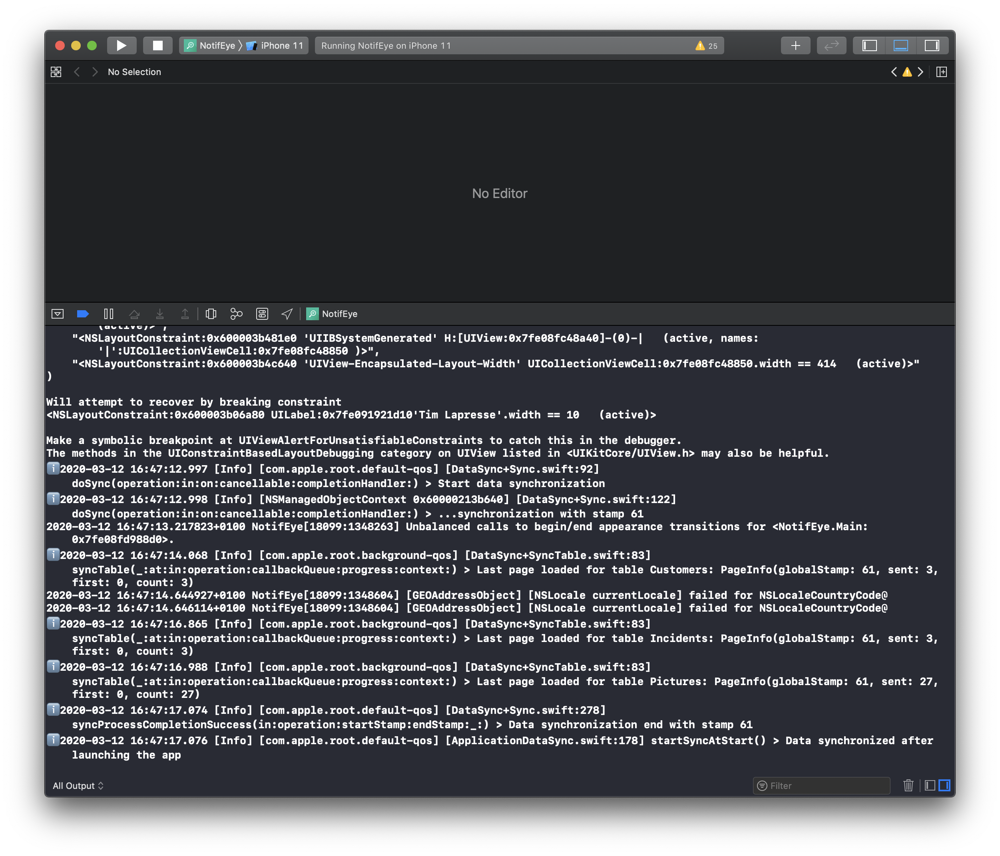
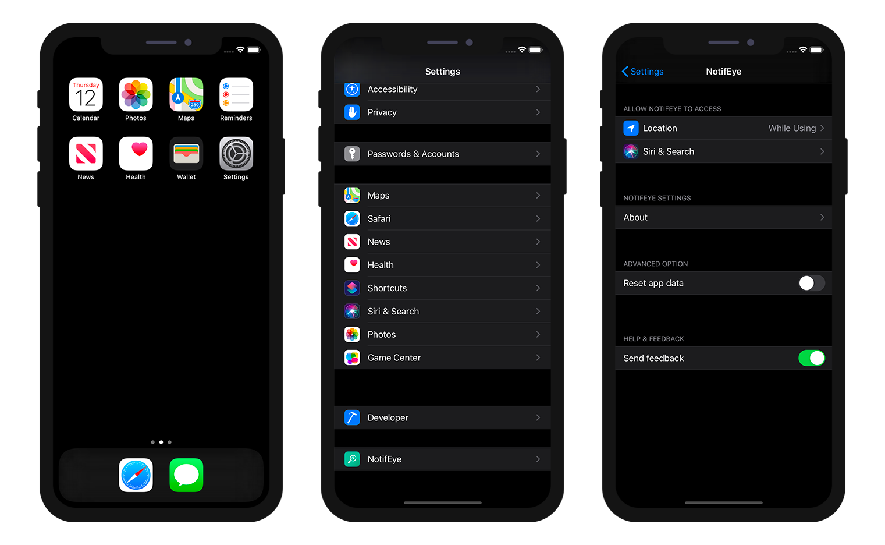

## Debug from Xcode
Si tiene problemas durante el proceso de creación, puede abrir su proyecto generado con Xcode seleccionando la opción ** Abrir el producto con Xcode ** en el menú **Project**.

Desde aquí puede ** lanzar su aplicación ** en el simulador haciendo clic en el **botón Generar** y obtener todos los historiales en la parte inferior del espacio de trabajo Xcode.

### Logger (registrador)

Un registrador es un objeto que le permitirá registrar y rastrear.

Para eso utilizamos [XCGLogger](https://github.com/DaveWoodCom/XCGLogger).

Encontrará la definición de los parámetros del registrador en su proyecto Xcode/Settings/Settings.plist.

### Niveles

Puede filtrar y mostrar diferentes niveles de registro en su consola agregando log.level en su archivo Settings.plist.

Para hacerlo, agregue una línea haciendo clic derecho en el archivo Settings.plist e ingrese:
* log.level como llave
* Número como tipo
* 3 como valor (por ejemplo)

Los **valores disponibles** son los siguientes:

* 0 para verbose
* 1 para la depuración
* 2 para info (valor por defecto)
* 3 advertencia
* 4 error
* 5 severo

Entonces, para este ejemplo, si define el valor log.level Value en 3, obtendrá una **advertencia, un error y un severo ** en su consola Xcode.

### Formato

Puede mostrar diferentes indicadores visuales en la consola Xcode para **resaltar diferentes tipos de historiales**.

Para hacerlo, solo tiene que abrir su proyecto Xcode/Settings/Settings.plist

#### Emoticones

 * prefixes[.verbose] = "🗯"
 * prefixes[.debug] = "🔹"
 * prefixes[.info] = "ℹ️"
 * prefixes[.warning] = "⚠️"
 * prefixes[.error] = "‼️"
 * prefixes[.severe] = "💣"

#### Círculos

* prefixes[.verbose] = "🔘"
* prefixes[.debug] = "🔵"
* prefixes[.info] = "⚪"
* prefixes[.warning] = "☢️"
* prefixes[.error] = "🔴"
* prefixes[.severe] = "⚫"

## Debug from your iPhone

From your app, if you have a crash, you can display, edit and send feedback.

Para eso:
* Vaya a la configuración de su iPhone
* encuentre su aplicación desplazándose hacia abajo
* Active los comentarios

A partir de aquí, lo único que tiene que hacer es volver a abrir su aplicación. Aparecerá una hoja de acción que le permitirá:
* Enviar mensajes
* Sugerir una mejora
* Mostrar el historial actual
* Reportar un problema

