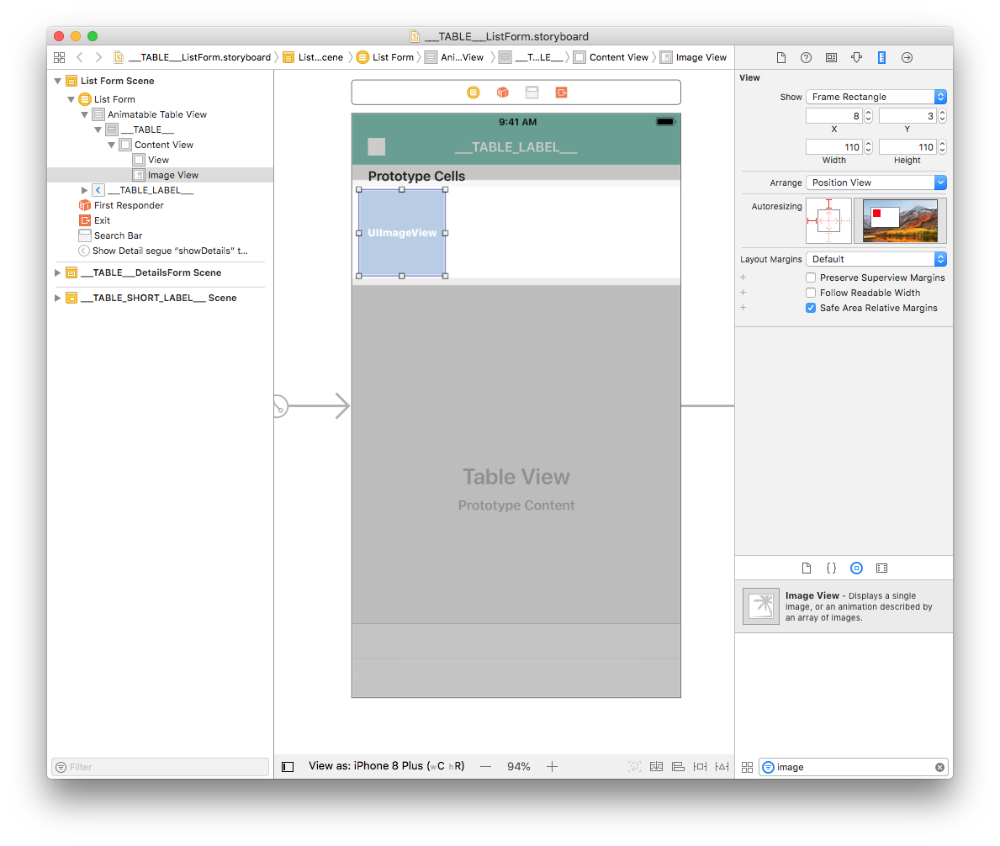
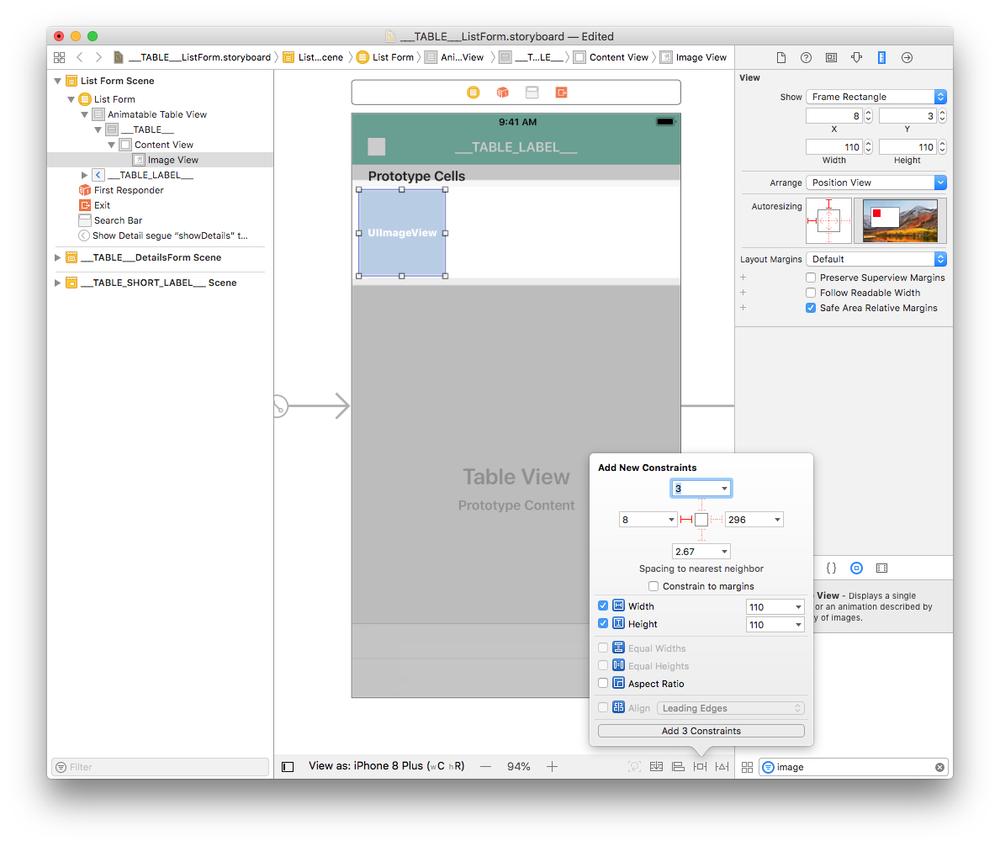
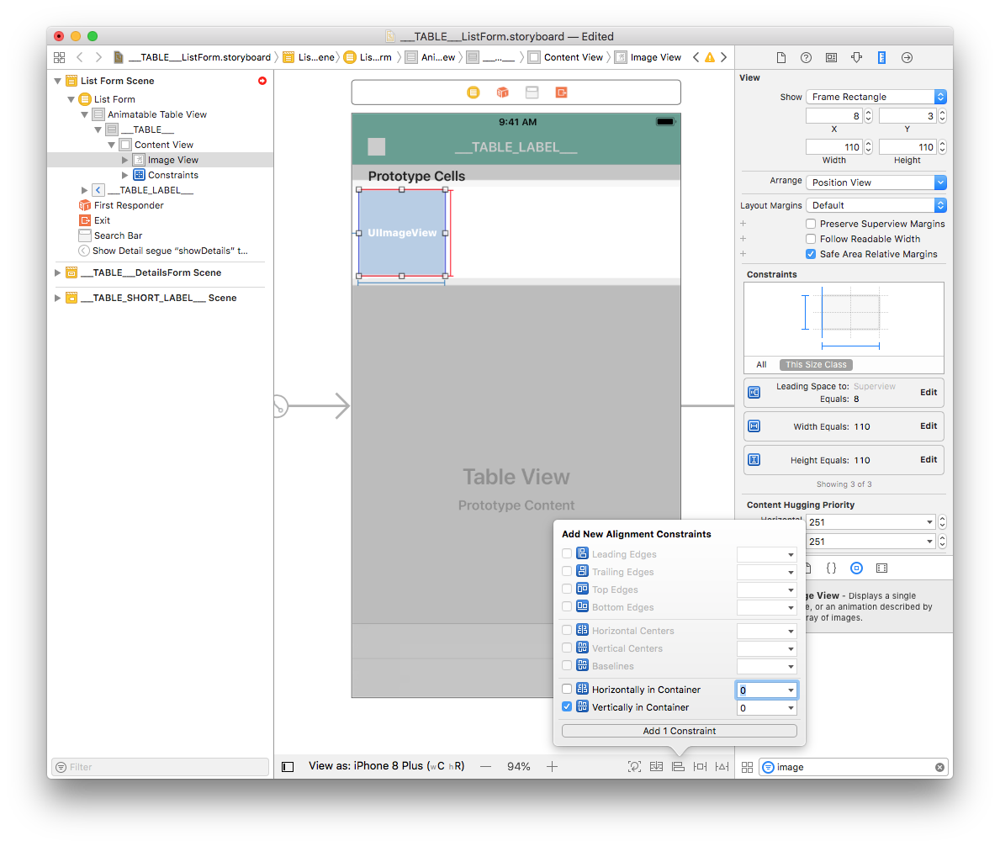
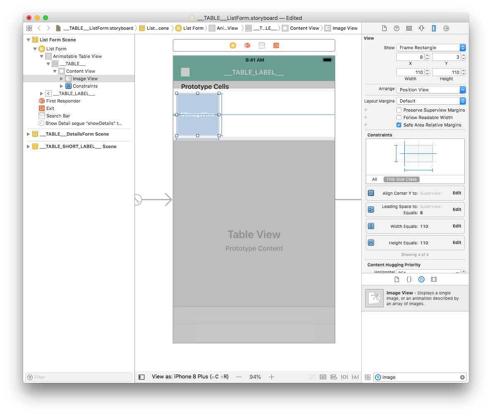
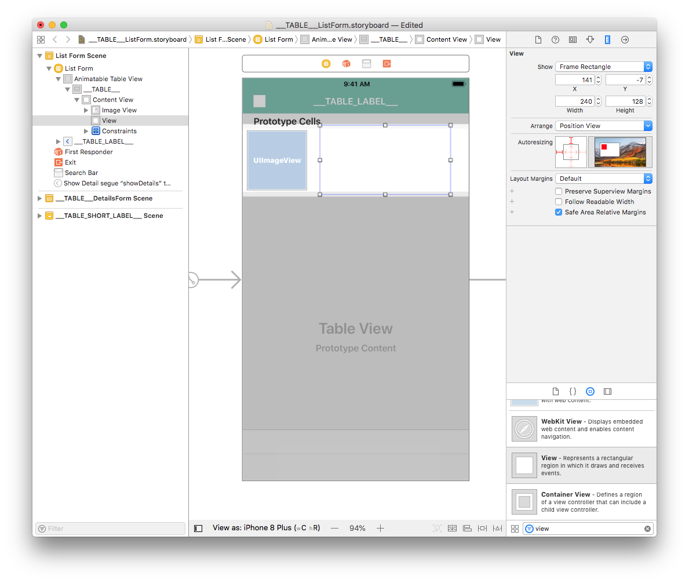
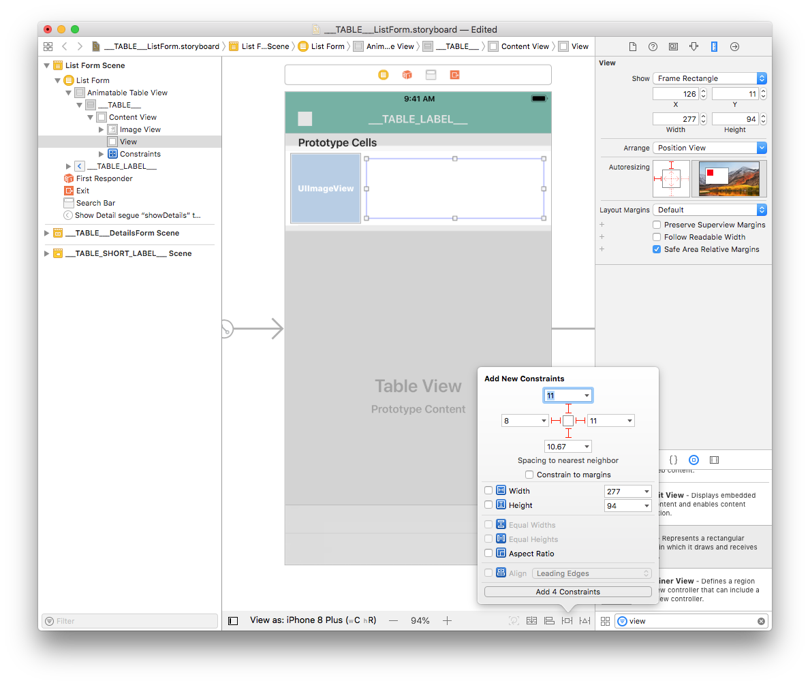
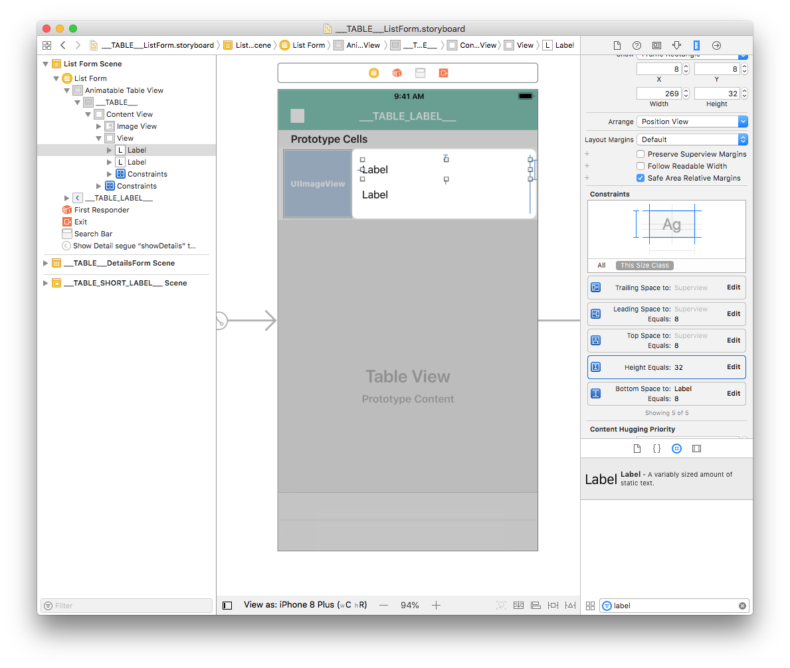
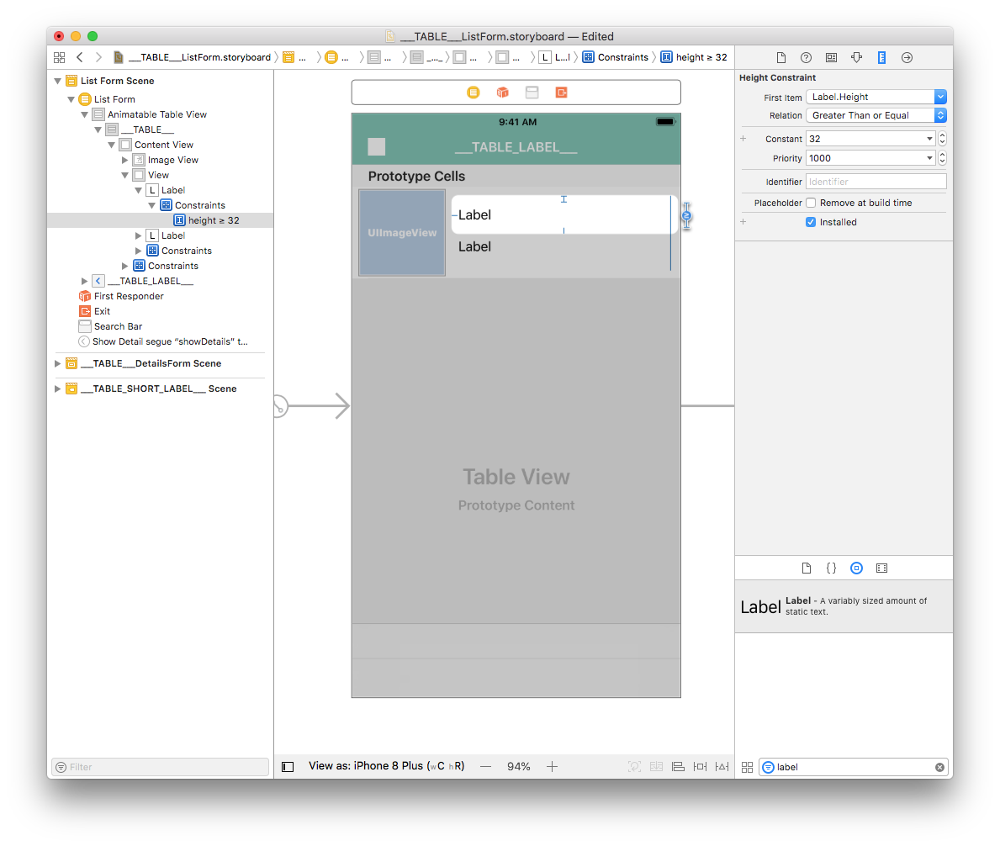
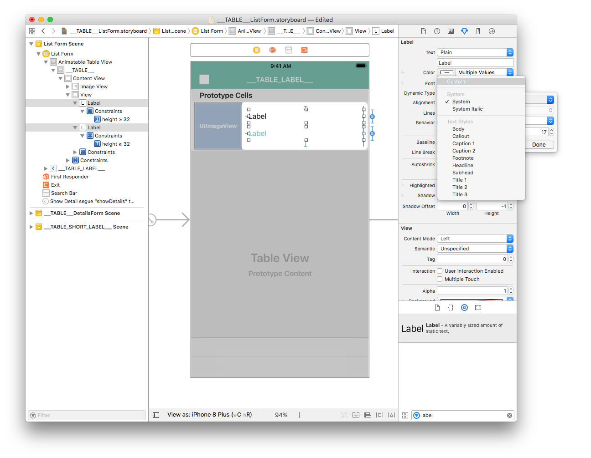
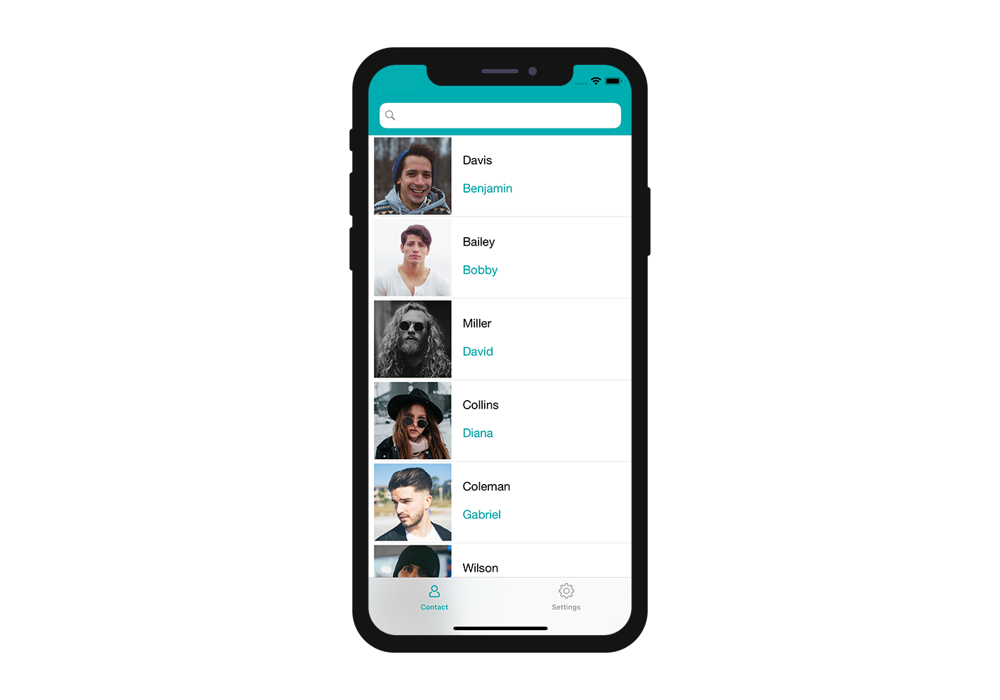

Ahora es el momento de crear su interfaz iOS de formulario listado con Xcode.

Este es el resultado que queremos lograr:

Para cada celda, vamos a añadir:

* Una foto de perfil
* Título
* Subtitulo

## Abrir el archivo storyboard con Xcode

Primero, abra su archivo storyboard en Xcode.

Está vacío, así que vamos a agregar algo de contenido.

## Añadir una "Image View"

Desde la **Object library** (la librería de objetos), arrastre y suelte una **Image View** (una vista de imagen) en una celda. Puede buscar una "Image View" en la barra de búsqueda en la parte inferior de la librería de objetos.

Desde el **Size inspector** (al lado derecho del Interface Builder), defina el ancho de la imagen en 110 y su altura en 110. Luego, defina el valor de X en 8 y el valor de Y en 3.

A continuación, agregue una restricción (Leading: 8) haciendo clic en el botón ** Add New Constraints button** (en la parte inferior de la ventana del Generador de interfaz). Agregue también restricciones de ancho y alto, como se muestra:

Haga clic en el botón **Align**(en la parte inferior del Interface Builder) y marque la casilla "Vertically in Container".

Su vista Imagen ahora está bien ubicada.

Ahora, vamos a trabajar en las etiquetas de celdas.

## Añadir etiquetas de título y subtítulo

Comencemos por **agregar una vista**. Busque "View" en la **Librería de objetos** y arrastre la vista al contenedor de celdas.

Desde el panel **Size inspector** (al lado derecho del Interface Builder), defina el ancho de la imagen en 277 y su altura en 94. Luego, defina el valor de X en 126 y el valor de Y en 10.

Para la vista de imagen, agregue cuatro restricciones haciendo clic en el botón **Add New Constraints** (Trailing: 11, Leading: 8, Top: 11, y Bottom: 10.67) para posicionarla correctamente como se muestra a continuación:

Arrastre y suelte una etiqueta en la Vista que acaba de agregar desde la Librería de objetos.

Desde el panel ** Size inspector**, defina el valor de ancho de etiqueta vista en 269 y el valor de alto en 32. A continuación, defina el valor de X en 8 y el valor de Y en 8.

**Duplique la etiqueta** y en el panel **Size inspector**, defina el valor de X en 8 y el valor de Y en 48.

Seleccione las dos etiquetas y añada cuatro restricciones haciendo clic en el botón **Add New Constraints** (Trailing: 0, Leading: 8, Top:, y Bottom: Multiple) como se muestra a continuación:

Con una etiqueta seleccionada, haga doble clic en **Height constraint** para editarla.

Cambie la relación "Equal" por **Greater Than or Equal** para que pueda tener una altura variable (para manejar etiquetas multilíneas).

Repita el proceso para la segunda etiqueta.

## Personalizar la etiqueta

Desde el inspector de atributos (al lado derecho de la ventana del Interface Builder), puede personalizar los colores de fuente de su etiqueta. Apliquemos el color **Dark Grey Color** a la segunda etiqueta:

También puede seleccionar el color principal de su aplicación:

Desde el inspector de atributos, también puede personalizar la fuente. Seleccione las dos etiquetas y seleccione Font > Custom > **Helvetica Neue**:

Para finalizar las personalizaciones, seleccione ambas etiquetas y en la ventana del inspector ** ingrese el valor 0 en Lines**. Esto permite que el número de líneas sea ilimitado.

:::nota

El Storyboard se optimiza para tener una **altura de celda variable** en función del contenido de cada celda.

:::

## Cómo obtener datos en sus celdas

### Image View

Seleccione su Vista imagen y vaya a **Identity inspector** > User Defined Runtime Attributes. Haga clic en el **botón +** para añadir una línea.

* **Key Path**: comience con bindTo para activar la unión del componente. Introduzca `bindTo.record.___FIELD_1___`

* **Type**: siempre `String`

* **Value**: nombre del atributo. Introduzca `___FIELD_1_BINDING_TYPE___`

### Etiquetas

Seleccione la primera etiqueta y agregue una línea en el área "Defined Runtime Attributes":

* **Key Path**: `bindTo.record.___FIELD_2___`

* **Tipo**: `Cadena`

* **Value**: `___FIELD_2_BINDING_TYPE___`

Seleccione la segunda etiqueta y agregue una línea en el área "Defined Runtime Attributes":

* **Key Path**: `bindTo.record.___FIELD_3___`

* **Tipo**: `Cadena`

* **Value**: `___FIELD_3_BINDING_TYPE___`

Puede cambiar las **etiquetas del storyboard** para tener una mejor visibilidad:

* Haga doble clic en la primera etiqueta para editarla e ingresar `___FIELD_2_LABEL___`
* Haga doble clic en la segunda etiqueta para editarla e ingresar `___FIELD_3_LABEL___`

Vaya al editor de su proyecto y seleccione su plantilla de formulario listado en la sección Formularios, luego haga clic en Crear y Ejecutar.

Este es el el resultado del simulador:

## Personalice su aplicación

El último paso es agregar un radio de esquina a la vista de imagen para tener un mejor diseño.

Seleccione su Vista imagen y añada las dos líneas siguientes en el área User Defined Runtime Attributes:

* **Key Path**: `cornerRadius`

* **Type**: `Number`

* **Value**: `12`

y

* **Key Path**: `layer.masksToBounds`

* **Type**: `Boolean`

* **Value**: seleccione la casilla

¡Ahora puede crear su proyecto desde el editor de proyectos!

## ¿Qué hacer ahora?

En este tutorial, hemos cubierto los conceptos básicos para crear plantillas con iOS. Ahora puede crear plantillas simples por su cuenta utilizando los recursos del proyecto Starter. También puede ver cómo construir [plantillas de formularios detallados](../creating-detail-forms/detail-form-template.md).

Descargue la carpeta lista de la plantilla terminada:

<a className="button button--primary"
href="https://github.com/4d-go-mobile/tutorial-CustomListForm/archive/53ac1d5f506aa4ca2a8d78760ef799044c5c8bdc.zip">Descargar</a>

