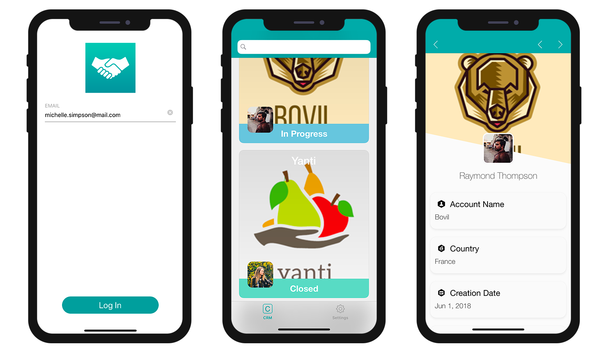
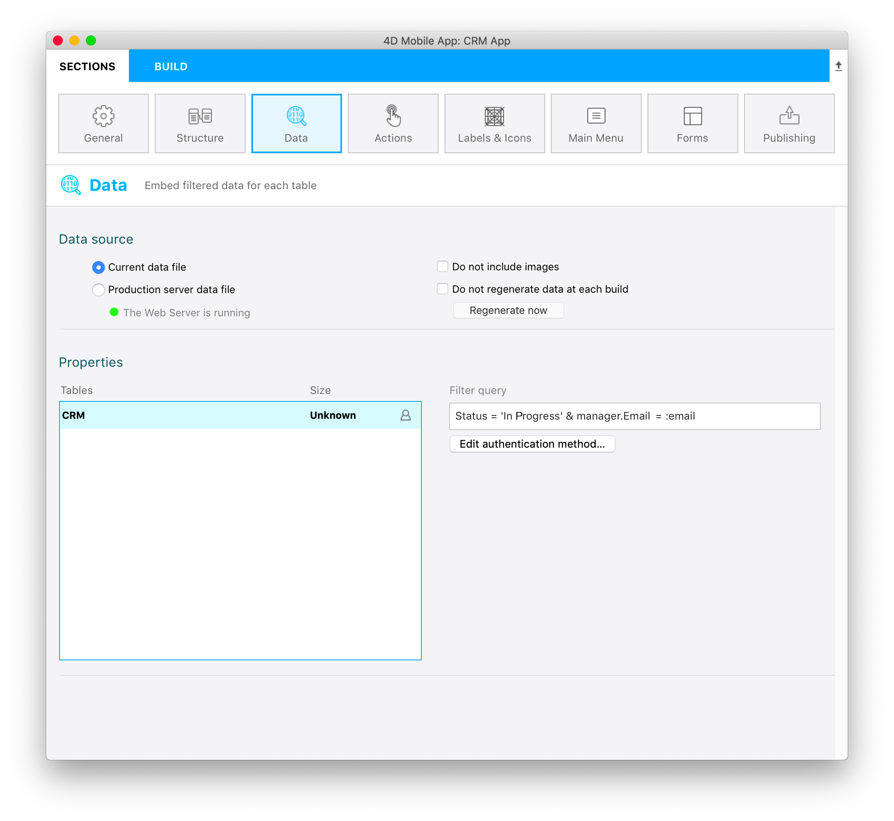

In this tutorial, we'll show how to create [**filter queries**](../../project-definition/data.md#filter-queries) to display filtered content in the generated mobile app.

Imagine que es un gestor de cuentas y quiere consultar sus contratos *En curso* simplemente conectándose a su aplicación con su dirección de correo electrónico.

Primero, desde la sección Datos definiremos un **filtro de búsqueda básico** para mostrar solo los contratos *En curso*. Luego, vamos a aplicar un **filtro basado en información del usuario** que dependerá del correo electrónico del administrador de la cuenta.

## Descargue el proyecto Starter

Antes de comenzar, asegúrese de descargar el **proyecto Starter** que incluye un archivo **4DforiOSQueries.4dbase** (una base de datos de demostración y un proyecto de aplicación móvil listo para usar)

<div className="center-button">
<a className="button button--primary"
href="https://github.com/4d-go-mobile/tutorial-RestrictedQueries/releases/latest/download/tutorial-RestrictedQueries.zip">Starter project</a>
</div>

The database includes:

* a **CRM table** with all the data we want to display in the generated iOS app
* an **AccountManager table** with basic information about the account managers (email and name).


You're now ready to define your first filter query.

Open the mobile project by clicking on **Open** > **Mobile Project...** and select **CRM app** > **project.4dmobileapp**.


## Definir un Filter Query

Por el momento, si genera la aplicación del proyecto Starter e introduce "michelle.simpson@mail.com" como correo electrónico de inicio de sesión (uno de los administradores de cuentas), verá **todos los contratos y estados de los administradores** (*Closed* y *In Progress*).



As we discussed above, we want the account managers to access their *In Progress* contracts by logging into their mobile app with their email. Para hacer esto:

* Acceda a la **sección "Datos"**
* Haga clic derecho en el campo **Filtro de búsqueda** para que aparezcan los **botones Campos, Comparadores y Operadores**.
* Haga clic en el botón **Campos** y seleccione **Estado**.
* Haga clic en el botón **Comparadores** y seleccione **Igual a**.
* Como desea mostrar los contratos *abiertos*, ingrese **En progreso**
* Recuerde validar su búsqueda haciendo clic en el botón **Validar**, de lo contrario no podrá crear su aplicación.

Debería obtener este resultado:


> **NOTES**
> 
> * Se muestra un icono de **filtro** a la derecha de cada tabla cuando se le aplica un filtro básico.
> * Para este tipo de filtros de búsqueda, puede optar por integrar los datos en la aplicación o cargar los datos después de iniciar sesión marcando la casilla de verificación **Integrar los datos en la aplicación**.
> * El tamaño se calculará en la primera generación para que pueda visualizar el **tamaño de sus datos**.

Si genera su aplicación e ingresa "michelle.simpson@mail.com" como correo electrónico de inicio de sesión, verá que todos los contratos *In Progress* se muestran en el simulador.


¡No es exactamente lo que esperábamos! What we want now is for each account manager to visualize only their own *In Progress* contracts, so let's complete our query.


## Filtro de búsqueda usuario

Now let's filter our app content [depending on a user information](../../project-definition/data.md#filter-queries-with-user-information), in this case, the account manager's login email address.

* Acceda a la **sección "Datos"**.
* Haga clic derecho en el campo **Filtro de búsqueda** para que aparezcan los **botones Campos, Comparadores y Operadores**.
* Haga clic en el botón **Operadores** y seleccione **AND**.
* Ahora defina la información del usuario que desea obtener del método de base de datos, **:email**.
* Recuerde validar la consulta haciendo clic en el botón **Validar**. De lo contrario, no podrá crear su aplicación.



```4d
Status = 'In Progress' & manager. Email = :email 
```

La búsqueda filtrará los datos en función del estado **In Progress** Y de la **dirección de correo electrónico del administrador de cuentas** (accesible desde la tabla AccountManager gracias a la relación *Muchos a Uno* en el nombre del gerente).

> **NOTA**
> 
> * Se muestra un **icono usuario** a la derecha de cada tabla cuando se le aplica un filtro de información de usuario.
> * As soon as a query is based on user information and validated, you need to edit the [`On Mobile app authentication method`](../../4d/on-mobile-app-authentication.md). Para hacerlo, haga clic con el botón derecho en el botón **Edit authentication method** para abrir la ventana de edición del método de base de datos.

Agregue la siguiente línea en el método de base de datos:

```4d
$response.userInfo:=New object("email";$request.email)
```

Esto permitirá recuperar la dirección de correo electrónico de inicio de sesión del administrador y mostrar los datos según ese criterio.


Ahora, si crea su aplicación e ingresa "michelle.simpson@mail.com" como correo electrónico de inicio de sesión, encontrará todos los contratos *"In progress"* de Michelle Simpson.


