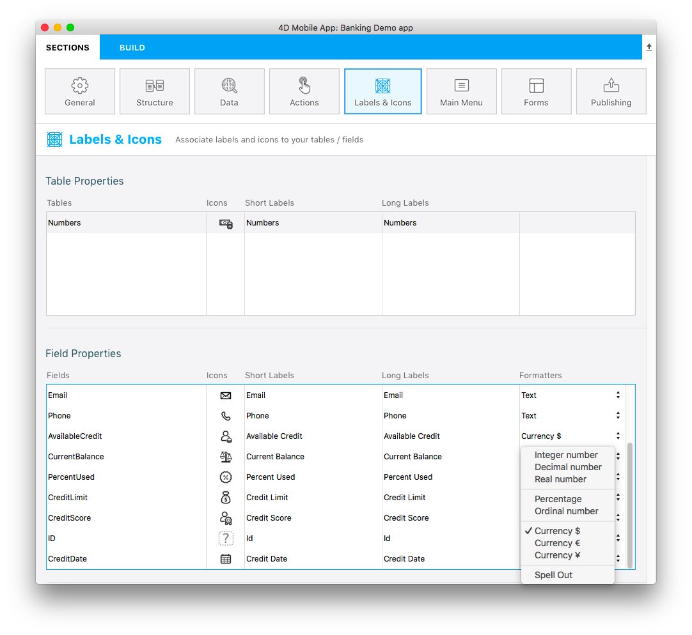

> **OBJETIVOS**
> 
> Use built-in formatters.

In this tutorial, we'll show you how to apply built-in [formatters](../../project-definition/labels-and-icons.md#formatters) to your fields.

## Descargue el proyecto Starter

Comencemos descargando el proyecto Starter:

<a className="button button--primary"
href="https://github.com/4d-go-mobile/tutorial-DataFormatter/releases/latest/download/tutorial-DataFormatter.zip">Descargar</a>

## Abrir un proyecto móvil

Go to **Labels & Icons** in Sections, you'll see that a Formats column is available in the Field Properties area:

From here, you can select specific formats depending on your needs. You can choose between [multiple built-in formats](../../project-definition/labels-and-icons.md#selecting-a-formatter).

Vamos a definir el campo Available Credit como Currency:

Hagamos el mismo proceso para todos los otros campos:

* Establezca el formato **Currency $** para el campo Current Balance
* Establezca el formato **Porcentaje** para el campo Percent Used
* Establezca el formato **No o Sí** para el campo Credit Limit
* Defina el formato **Fecha corta** para el campo Credit Date

## Crear y ejecutar su proyecto

Aquí está el resultado final en su aplicación iOS con un formulario de lista de tareas "Task" y de un formulario detallado "Numbers".

¡Listo! ¡Listo! Your fields are well formatted according to its defined type in **Labels & Icons**.