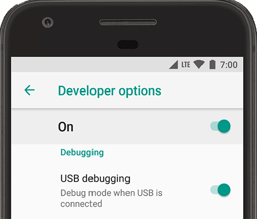

To make sure your development machine and your phone are linked, only one action is needed on the smartphone and another one in the [project editor](from-project-editor.md).

On your device, you need to [enable **USB Debugging**](https://developer.android.com/studio/debug/dev-options#enable) in the Developer Options settings.

:::consejo

If you can’t find the Developer Options item in your settings, simply click 7 times on the build number.

:::

If you can’t find it or if you don’t understand it, simply read [this Android user guide](https://developer.android.com/studio/debug/dev-options), which explains how to do it depending on the Android versions.

:::nota notas

- To connect and debug with a Google device using Windows, you need to install the [Google USB driver](https://developer.android.com/studio/run/win-usb).

- If you're developing on macOS , then you shouldn't need a USB driver.

- For the other devices, download and manually install a [OEM USB driver](https://developer.android.com/studio/run/oem-usb) corresponding to your device.

:::

