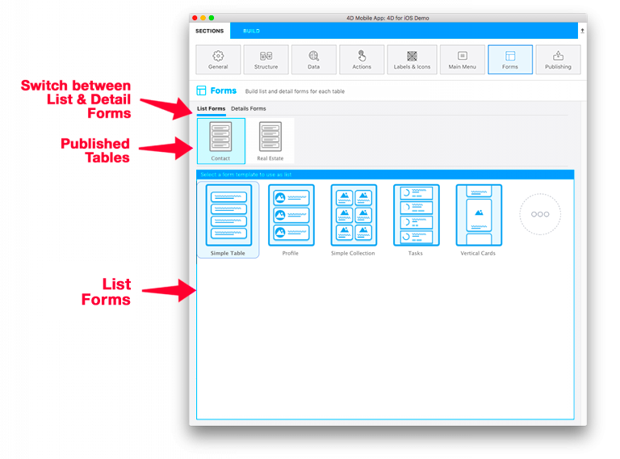

La página Formularios le permite seleccionar ambos formularios Lista y detallados para cada tabla publicada. Puede seleccionar un formulario lista y un formulario detallado por tabla publicada.

El editor de 4D mobile ofrece varias plantillas con efectos de transición personalizados para generar aplicaciones móviles nuevas y modernas. Simple, las plantillas vacías se utilizan de forma predeterminada para los formularios Lista y los formularios de detallados de una aplicación.

Aquí está el desglose de esta pantalla, de arriba a abajo:

* **Formularios Lista/Formularios detallados:** permiten cambiar entre los formulario Lista y los formularios detallados para cada tabla.
* **Las tablas publicadas:** muestra todas las tablas publicadas en la sección [Estructura](structure.md).
* **Formularios:** lista de formularios disponibles. Permite cambiar entre la selección de la plantilla y la definición del contenido. En el área de definición del contenido, puede mostrar consejos que den información adicional sobre los campos del formulario.

## Formularios lista

Cuando se selecciona una plantilla de formulario lista para una tabla, aparece la pantalla de definición del contenido. Luego puede arrastrar y soltar los campos de la lista directamente en la plantilla que se muestra a la derecha.

:::nota

En formularios lista, no se pueden añadir más campos que los incluidos en la plantilla.

:::

La mayoría de los formularios lista incluyen los campos opcionales **Búsqueda** y **Sección**. También puede activar el **escáner de códigos de barras**.

### Buscar

Un campo **búsqueda** permite filtrar dinámicamente el contenido de la lista en función de los caracteres introducidos.

#### Búsqueda multicriterios

Puede soltar más de un campo en el campo de búsqueda, en cuyo caso el campo muestra "Búsqueda multicriterio":

En este caso, la aplicación buscará los caracteres introducidos en todos los campos utilizando el operador "OR". Para eliminar un campo de la lista, haga clic en el botón de eliminación del campo de búsqueda para seleccionar el campo o los campos a eliminar:

### Sección

Un campo sección agrupará y ordenará las entidades en la lista dependiendo de su valor para este campo.

### Escáner de código de barras

Para activar la búsqueda por código de barras, haga clic en la lupa situada junto al campo de búsqueda y seleccione la opción **Activar escáner de código de barras**.

La búsqueda de códigos de barras permite dos funcionalidades:

* Filtrar el formulario lista escaneando un código de barras que contiene un valor texto. Esto llena la barra de búsqueda y abre el formulario detallado si sólo queda un valor después de filtrar.
* Mostrar formularios específicos listados y detallados con sólo escanear un código de barras cuyos valores son **Esquemas URL** o **Enlaces Universales** cuando la funcionalidad [**deep linking**](../special-features/deep-linking.md) está activa.

## Formularios detallados

As with the List Form definition, select a template and configure the fields. In detail forms, you can add as many fields as you want onto your detail form.

You have several ways to add your fields in Detail forms:

* Arrastrar y soltar un campo en cualquier lugar de la vista más a la derecha para agregarlo y mostrarlo justo después del último campo añadido o entre cualquier otro campo que ya se muestre.

* Doble clic en un campo. Su campo se agregará al final de la lista.

* Haga clic derecho en un campo disponible en la tabla Campos de la izquierda y seleccione **Añadir campos que faltan** en el menú contextual.

You can reorder your fields at any moment using drag and drop in the detail form.

:::consejo

If you want to try another template after dispatching your fields, just select it: previously selected fields are automatically moved for you to the new template in appropriate areas, according to the template and field types.

:::

## Galería

When you select a template in the form section, a "More" icon is available for both list and detail forms.

Just click on that icon to display a list of additional templates from the 4D mobile Gallery:

Then, the only thing you have to do is selecting the template that suits your needs and the mobile editor will handle all the installation process. So you can directly start working on the template, as it is ready-to-use.

A github icon is displayed at the top left of a template icon in the Forms template picker to indicate that it comes from Github:

:::consejo

The Gallery is also directly available on Github.
- [**galería de plantillas de formularios lista**](https://4d-for-ios.github.io/gallery/#/type/list-detail/picker/0)
- [**galería de plantillas de formularios detallados**](https://4d-for-ios.github.io/gallery/#/type/form-detail/picker/0)

:::

## Crear sus propias plantillas

If you want to customize a downloaded template or create your own templates, **several tutorials** can guide you through these tasks:

- [**Personalización de una plantilla de formulario**](../tutorials/gallery/update-gallery-template.md)
- [**Creación de formularios Lista**](../tutorials/creating-list-forms/list-form-template.md)
- [**Creación de formularios detallados**](../tutorials/creating-detail-forms/detail-form-template.md)