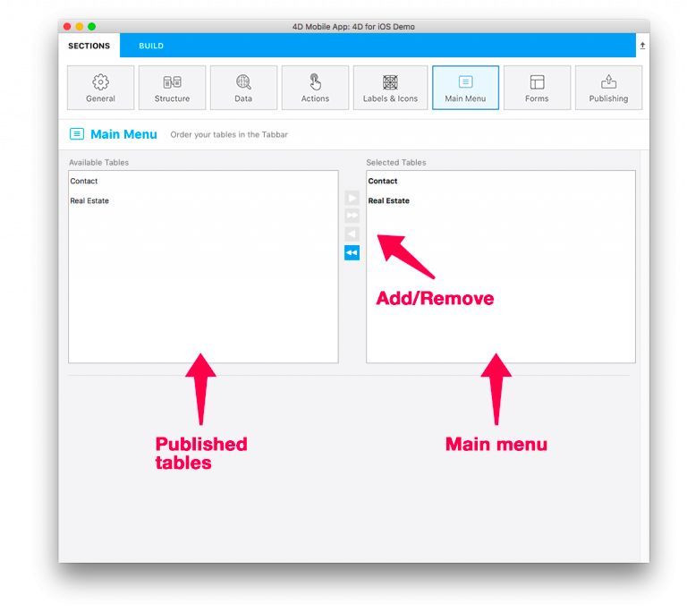

Esta página le permite seleccionar y ordenar las tablas que estarán disponibles en la barra de navegación de su aplicación.

Por defecto, todas las tablas seleccionadas en la página [Estructura ](structure.md) se añadirán al menú de su aplicación.

Puede utilizar los botones **Añadir**/**Quitar** y arrastrar y soltar para añadir, eliminar y reordenar tablas.

* En la lista **Tablas disponibles**, encuentra todas las tablas que publicó en la [Structure](structure.md)

* La lista **Tablas seleccionadas** incluye todas las tablas a las que se podrá acceder desde el menú de su aplicación.

