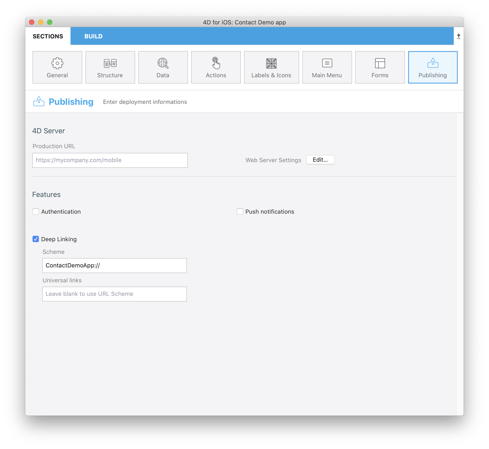

:::información 4D for Android

This feature is currently not available in 4D for Android.

:::

Gracias a la funcionalidad **deep linking**, puede compartir el contenido que está viendo en ese momento con todos sus colegas. Here's an illustration demonstrating deep linking:


Hay dos maneras de implementar "deep linking" en IOS: **"URL scheme"** y **"Universal Links"**. While URL schemes are a well-known method for deep linking, Universal links are the new way that Apple has implemented to easily connect your webpage and your app under the same link.


## Comparación de los modos deep linking

### Esquema URL

Here is a comparison between the two options which are available in the project editor:

| VENTAJAS                            | DESVENTAJAS                                    |
| ----------------------------------- | ---------------------------------------------- |
| Fácil de implementar                | Siempre requiere permiso                       |
| No se requiere un backend adicional | No funciona si la aplicación no está instalada |
|                                     | No funciona en Android                         |

### Enlaces universales

| VENTAJAS                            | DESVENTAJAS                             |
| ----------------------------------- | --------------------------------------- |
| No requiere permiso                 | Se necesita un backend estático con SSL |
| No abre el navegador                | Más complejo de implementar             |
| Compatible con Android              |                                         |
| Fallback URL if app isn't installed |                                         |

## Esquema URL personalizado

At the simplest level, URL schemes allow users to open an app from other apps. But the true power of URL schemes is in the ability to perform specific actions as your app opens.


### Esquema de URL personalizado en el editor de proyetos

It's very simple to include an URL scheme to your mobile app. Let's see an example:

1. Seleccione la acción predefinida **Share** de la página [**Action** ](../project-definition/actions.md) y seleccione el alcance:
    *   entidad - para compartir el contenido de un formulario detallado
    *   tabla - para compartir un formulario listado
2. Marcar la funcionalidad **Deep Linking** en la sección **Publishing** del editor de proyectos
3. La información del esquema URL se llena automáticamente con el nombre de la aplicación que ha definido previamente en la página [**General**](../project-definition/general.md). Sin embargo, aún puede editarlo:



4. Llene su método **On Mobile App Action**, por ejemplo:

```4d

// Método base On Mobile App Action

// var $1 : Object  // Información suministrada por la aplicación móvil
var $0 : Object  // Información devuelta a la aplicación móvil

var $action : Object
$action:=MobileAppServer.Action.new($1)

Case of 

    : ($1.action="shareContact")

        $0:=$action.shareContext()

    Else 

        $0:=New object("success"; False;"statusText"; "Enviar acción desconocida al servidor")

End case 

```

5. Creación de la aplicación.


### Utilizar esquemas URL en su aplicación móvil

1. Haga clic en el botón **Action** para mostrar todas sus acciones disponibles actualmente
2. Seleccione la acción **Share** que previamente definió en el editor de proyectos
3. Aparece una nueva vista que le permite comenzar a compartir el contenido
4. Seleccione el método de intercambio a utilizar
5. Envíelo.

## Enlaces universales

Universal links provide several key benefits that aren't available with custom URL schemes. Specifically, universal links are:

* **Unique**: a diferencia de los esquemas de URL personalizados, otras aplicaciones no pueden reclamar los enlaces universales porque utilizan enlaces HTTP o HTTPS estándar a su sitio web.

* **Secure**: cuando los usuarios instalan su aplicación, iOS verifica que su sitio web permita que su aplicación abra URLs en su nombre. Sólo usted puede crear y subir el archivo que otorga este permiso a su servidor web, por lo que la asociación de su sitio web con su aplicación es segura.

* **Flexible**: los enlaces universales funcionan incluso cuando su aplicación no está instalada. En este caso, al presionar un enlace a su sitio web se abre el contenido en Safari.

* **Simple**: una sola URL funciona tanto para su sitio web como para su aplicación.

* **Private**: otras aplicaciones pueden comunicarse con su aplicación sin necesidad de saber si su aplicación está instalada.

### Enlaces universales en el editor de proyectos

To include Universal links into your app, the process is quite similiar to the URL Schemes process:

1. Seleccione la acción predefinida **Share** de la página [**Action** ](../project-definition/actions.md) y seleccione el alcance:
    *   entidad - para compartir un contenido de un formulario detallado
    *   tabla - para compartir un formulario listado
2. Activar la funcionalidad **Deep Linking** en la sección **Publishing** en el editor de proyectos
3. Introduzca la URL de su sitio web en el campo **Universal links**
4. Llene su método **On Mobile App Action**, por ejemplo:

```4d

// Método base On Mobile App Action

// var $1 : Object  // Información suministrada por la aplicación móvil
var $0 : Object  // Información devuelta a la aplicación móvil

var $action : Object
$action:=MobileAppServer.Action.new($1)

Case of 

    : ($1.action="shareContact")

        $0:=$action.shareContext()

    Else 

        $0:=New object("success"; False;"statusText"; "Enviar acción desconocida al servidor")

End case 

```

5. Creación de la aplicación.
6. Activar los enlaces universales del método **On Web Connection**, por ejemplo:

```4d
// Método base On Web Connection

// Var $1; $2; $3; $4; $5; $6 : Text
Var $handler : Object

$handler:=MobileAppServer.WebHandler.new()
Case of
    : ($handler.handle($1; $2; $3; $4; $5; $6))
        // Gestionado por el código móvil por defecto
    Else
        // Su código web
End case

```

:::nota

To create a universal link, make sure you use standard ports (80 or 443).

:::

## Deep Linking y notificaciones Push

Algo genial sobre Deep Linking es que es completamente compatible con [notificaciones push](push-notification.md). Esto significa que puede enviar enlaces deep a sus usuarios y llevarlos directamente a la página correcta.

Como puede ver, esta función abre un gran abanico de posibilidades. Deep linking es una funcionalidad crucial en las aplicaciones de hoy en día, especialmente ya que los usuarios consumen el contenido más y más rápidamente. Esta funcionalidad los lleva directamente al lugar deseado. Así que recomendamos que lo utilicen en sus aplicaciones móviles.

:::consejo

Consulte la documentación del componente [**4D Mobile App Server**](https://github.com/4d-for-ios/4D-Mobile-App-Server/blob/master/Documentation/Classes/PushNotification.md) para obtener más información sobre cómo combinar las notificaciones push y deep linking.

:::


